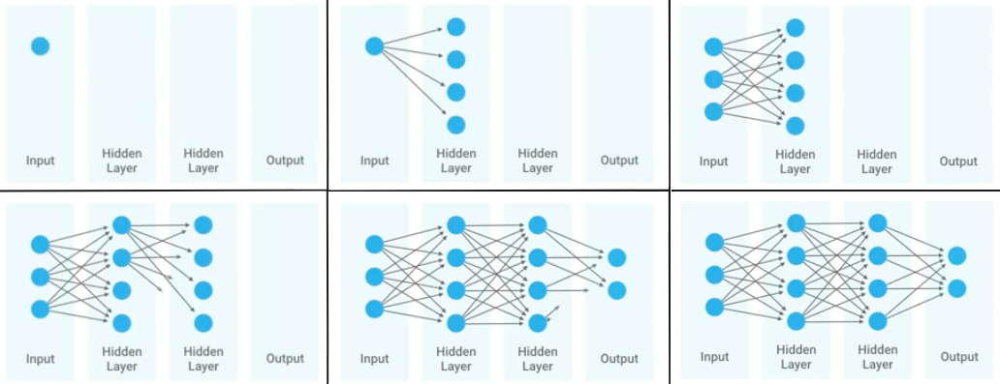
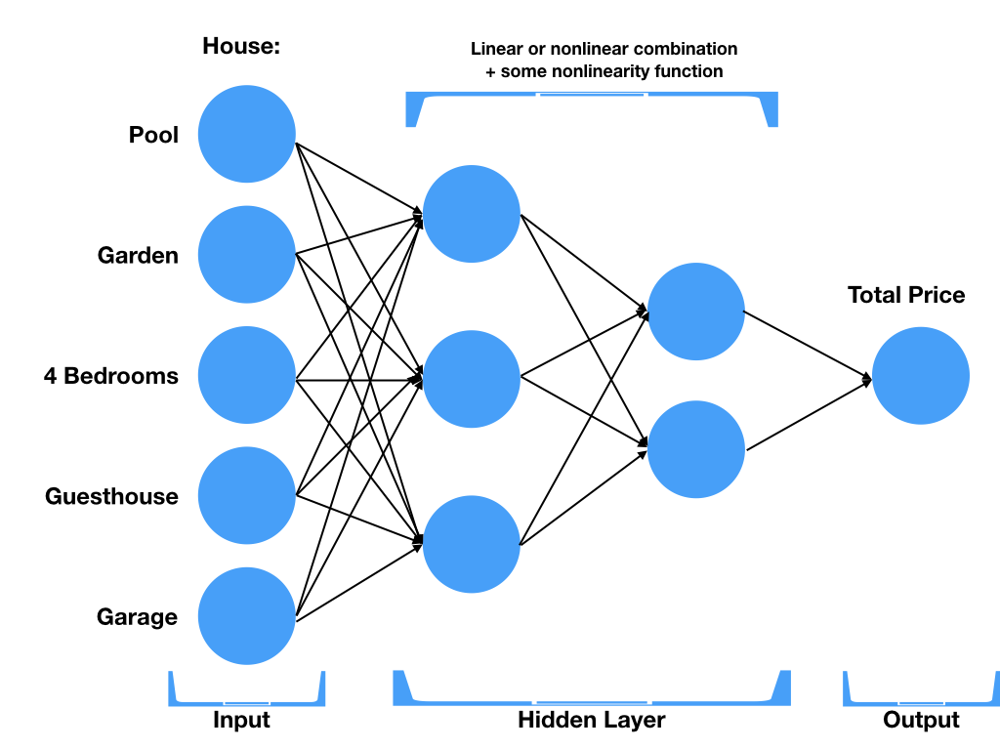
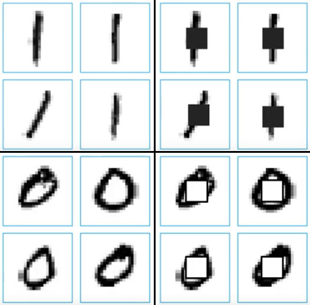

**************
Neural Network
**************

What Is a Neural Network?
=========================
It’s a technique for building a computer program that learns from data. It is based very loosely on how we think the human brain works. First, a collection of software "neurons" are created and connected together, allowing them to send messages to each other. Next, the network is asked to solve a problem, which it attempts to do over and over, each time strengthening the connections that lead to success and diminishing those that lead to failure. For a more detailed introduction to neural networks, `Michael Nielsen’s Neural Networks <http://neuralnetworksanddeeplearning.com/index.html>`_ and `Deep Learning <http://www.deeplearningbook.org/>`_ is a good place to start. For a more technical overview, try Deep Learning by Ian Goodfellow, Yoshua Bengio, and Aaron Courville.

    Neural Network

Przykład praktyczny
-------------------
* Wyobraźmy sobie ofertę domu.
* Każdy z elementów oferty ma swoje atrybuty:

    - basen
    - 4 sypialnie
    - ogród
    - domek dla gości
    - garaż

* Wpływa na cenę domu
* Wewnątrz sieci, neurony składają się z pewnych liniowych lub nieliniowych zależności pomiędzy poszczególnymi atrybutami oferty
* Cena domu wpłwa na sumę wszyskich kombinacji elementów poprzedniego stopnia.

    Neural Network

Tools
=====
* TensorFlow (Google) - http://playground.tensorflow.org/

Inception
---------
* One of Google's best image classifiers
* Open Source
* Trained on 1.2 milion images
* Training took 2 weeks on 8GPU machine

Działanie na sieciach neuronowych
=================================

Construction
------------
* Ilość neuronów
* Poziom zagłębień

Learning
--------

Optimizing
----------

Retraining
----------
* Also known as Transfer Learning
* Saves a lot of time
* Uses prior work

Overfitting
-----------
* gdy sieć neuronowa jest tak dobrze nauczona, że dane które przychodzą mają problem z byciem dobrze sklasyfikowanymi

Przetwarzanie obrazów na przykładzie rozpoznawania odręcznie napisanych cyfr (MNIST)
====================================================================================
.. figure:: img/deep-neural-networks-mnist-overview.png
    :scale: 50%
    :align: center

    Handwritten digits recognition also known as MNIST is equivalent to "hello world" in visual Machine Learning world.

Flattening image
----------------
.. figure:: img/features-images.png
    :scale: 75%
    :align: center

    In Image processing files and image pixels are features.

* Używanie "raw pixels" as features
* Classifier does the rest
* Flatten image: 2D array -> 1D by unstacking rows and lining them up (reshape array):

    .. code-block:: python

        import matplotlib.pyplot as plt

        def display(i):
            img = test_data[i]
            plt.title('Example %d. Label: %d' % (i, test_labels[i]))
            plt.imshow(img.reshape((28,28)), cmap=plt.cm.gray_r)

.. figure:: img/deep-neural-networks-mnist-segmented.png
    :scale: 75%
    :align: center

    Segmented Digit

Weight adjusted by gradient descent
-----------------------------------
* Begin with random weight
* Gradually adjust to better values
* Evaluate accuracy

    Compare middle image pixel.

Visualize weights
-----------------
.. figure:: img/deep-neural-networks-mnist-weights.png
    :scale: 75%
    :align: center

    Visualize the the weights in the TensorFlow Basic MNIST

Przykłady praktyczne
====================

Deep Neural Network with Iris dataset
-------------------------------------
.. code-block:: python

    import os
    import requests
    import numpy as np
    import tensorflow as tf

    # Data sets
    IRIS_TRAINING = "../_data/iris_training.csv"
    IRIS_TRAINING_URL = "http://download.tensorflow.org/data/iris_training.csv"

    IRIS_TEST = "../_data/iris_test.csv"
    IRIS_TEST_URL = "http://download.tensorflow.org/data/iris_test.csv"

    # If the training and test sets aren't stored locally, download them.
    if not os.path.exists(IRIS_TRAINING):
        data = requests.get(IRIS_TRAINING_URL).text
        with open(IRIS_TRAINING, "w") as file:
            file.write(data)

    if not os.path.exists(IRIS_TEST):
        data = requests.get(IRIS_TEST_URL).text
        with open(IRIS_TEST, "w") as file:
            file.write(data)

    # Load datasets.
    training_set = tf.contrib.learn.datasets.base.load_csv_with_header(
        filename=IRIS_TRAINING,
        target_dtype=np.int,
        features_dtype=np.float32)

    test_set = tf.contrib.learn.datasets.base.load_csv_with_header(
        filename=IRIS_TEST,
        target_dtype=np.int,
        features_dtype=np.float32)

    # Specify that all features have real-value data
    feature_columns = [tf.contrib.layers.real_valued_column("", dimension=4)]

    # Build 3 layer DNN with 10, 20, 10 units respectively.
    classifier = tf.contrib.learn.DNNClassifier(
        feature_columns=feature_columns,
        hidden_units=[10, 20, 10],
        n_classes=3,
        model_dir="/tmp/iris_model")

    # Define the training inputs
    def get_train_inputs():
        x = tf.constant(training_set.data)
        y = tf.constant(training_set.target)
        return x, y

    # Fit model.
    classifier.fit(input_fn=get_train_inputs, steps=2000)

    # Define the test inputs
    def get_test_inputs():
        x = tf.constant(test_set.data)
        y = tf.constant(test_set.target)
        return x, y

    # Evaluate accuracy.
    accuracy_score = classifier.evaluate(input_fn=get_test_inputs, steps=1)["accuracy"]

    print(f"\nTest Accuracy: {accuracy_score:f}\n")
    # output: Test Accuracy: 0.966667

    # Classify two new flower samples.
    def new_samples():
        return np.array(
            [[6.4, 3.2, 4.5, 1.5],
             [5.8, 3.1, 5.0, 1.7]], dtype=np.float32)

    predictions = list(classifier.predict(input_fn=new_samples))

    print(f"New Samples, Class Predictions: {predictions}\n")
    # output: New Samples, Class Predictions: [1, 1]

Image Classification using ``TensorFlow for Poets``
---------------------------------------------------
* https://codelabs.developers.google.com/codelabs/tensorflow-for-poets/#1

.. code-block:: console

    # download around 218MB of data
    $ curl -O http://download.tensorflow.org/example_images/flower_photos.tgz
    $ tar xzf flower_photos.tgz
    $ ls flower_photos

.. warning:: Training on this much data can take 30+ minutes on a small computer. If you want to reduce data:

    .. code-block:: console

        $ ls flower_photos/roses | wc -l
        $ rm flower_photos/*/[3-9]*
        $ ls flower_photos/roses | wc -l

.. code-block:: python

    from sklearn import metrics
    from sklearn import model_selection
    import tensorflow as tf
    from tensorflow.contrib import learn

    # Load dataset
    iris = learn.datasets.load_dataset('iris')
    x_train, x_test, y_train, y_test = model_selection.train_test_split(
        iris.data,
        iris.target,
        test_size=0.2,
        random_state=42
    )

    # Build 3 layer Deep Neural Network (DNN) with 10, 20, 10 units respectively.
    classifier = learn.DNNClassifier(hidden_units=[10, 20, 10], n_classes=3)

    # Fit and predict.
    classifier.fit(x_train, y_train, steps=200)
    score = metrics.accuracy_score(y_test, classifier.predict(x_test))

    print(f'Accuracy {score:f}')

.. code-block:: console

    $ curl -O https://raw.githubusercontent.com/tensorflow/tensorflow/r1.1/tensorflow/examples/image_retraining/retrain.py

    $ python retrain.py \
      --bottleneck_dir=bottlenecks \
      --how_many_training_steps=500 \
      --model_dir=inception \
      --summaries_dir=training_summaries/basic \
      --output_graph=retrained_graph.pb \
      --output_labels=retrained_labels.txt \
      --image_dir=flower_photos

    [...]
    2017-07-01 11:10:43.635017: Step 499: Train accuracy = 88.0%
    2017-07-01 11:10:43.635265: Step 499: Cross entropy = 0.455413
    2017-07-01 11:10:44.201455: Step 499: Validation accuracy = 92.0% (N=100)

    Final test accuracy = 87.3% (N=331)

    $ curl -L https://goo.gl/3lTKZs > label_image.py

    $ python label_image.py flower_photos/daisy/21652746_cc379e0eea_m.jpg
    daisy (score = 0.98659)
    sunflowers (score = 0.01068)
    dandelion (score = 0.00204)
    tulips (score = 0.00063)
    roses (score = 0.00007)

    $ python label_image.py flower_photos/roses/2414954629_3708a1a04d.jpg
    roses (score = 0.84563)
    tulips (score = 0.13727)
    dandelion (score = 0.00897)
    sunflowers (score = 0.00644)
    daisy (score = 0.00169)

Handwritten digits recognition (MNIST) with ``tf.contrib.learn``
----------------------------------------------------------------
.. code-block:: python

    import numpy as np
    import matplotlib.pyplot as plt
    %matplotlib inline
    import tensorflow as tf

    learn = tf.contrib.learn
    tf.logging.set_verbosity(tf.logging.ERROR)

    # Import the dataset
    mnist = learn.datasets.load_dataset('mnist')
    data = mnist.train.images
    labels = np.asarray(mnist.train.labels, dtype=np.int32)
    test_data = mnist.test.images
    test_labels = np.asarray(mnist.test.labels, dtype=np.int32)

    # There are 55k examples in train, and 10k in eval. You may wish to limit the size to experiment faster.
    max_examples = 10000
    data = data[:max_examples]
    labels = labels[:max_examples]

    def display(i):
        img = test_data[i]
        plt.title('Example %d. Label: %d' % (i, test_labels[i]))
        plt.imshow(img.reshape((28,28)), cmap=plt.cm.gray_r)

    # You can display output:
    # display(0)
    # display(1)
    # display(8)
    # print len(data[0])

    # Fit a Linear Classifier
    feature_columns = learn.infer_real_valued_columns_from_input(data)

    # n_classes = 10 because we have 10 digits
    classifier = learn.LinearClassifier(feature_columns=feature_columns, n_classes=10)
    classifier.fit(data, labels, batch_size=100, steps=1000)

    # Evaluate accuracy
    classifier.evaluate(test_data, test_labels)
    print(classifier.evaluate(test_data, test_labels)["accuracy"])
    # output: 0.9141

    # Classify a few examples

    # here's one it gets right
    print ("Predicted %d, Label: %d" % (classifier.predict(test_data[0]), test_labels[0]))
    display(0)

    # and one it gets wrong
    print ("Predicted %d, Label: %d" % (classifier.predict(test_data[8]), test_labels[8]))
    display(8)

    # Visualize learned weights
    weights = classifier.weights_
    f, axes = plt.subplots(2, 5, figsize=(10,4))
    axes = axes.reshape(-1)
    for i in range(len(axes)):
        a = axes[i]
        a.imshow(weights.T[i].reshape(28, 28), cmap=plt.cm.seismic)
        a.set_title(i)
        a.set_xticks(()) # ticks be gone
        a.set_yticks(())
    plt.show()

Zadania praktyczne
==================

Kto jest na zdjęciu?
--------------------
Stwórz zbiór obrazów zawierający tylko twarze osób:

    - twoje,
    - twojego przyjaciela/przyjacółki.

Postaraj się aby zdjęcia były na wprost. Naucz algorytm ich rozpoznawania i przedstaw Mu jakąś nową twarz (twoją lub przyjaciela i zobacz czy potrafi rozpoznać i z jaką dokładnością.
