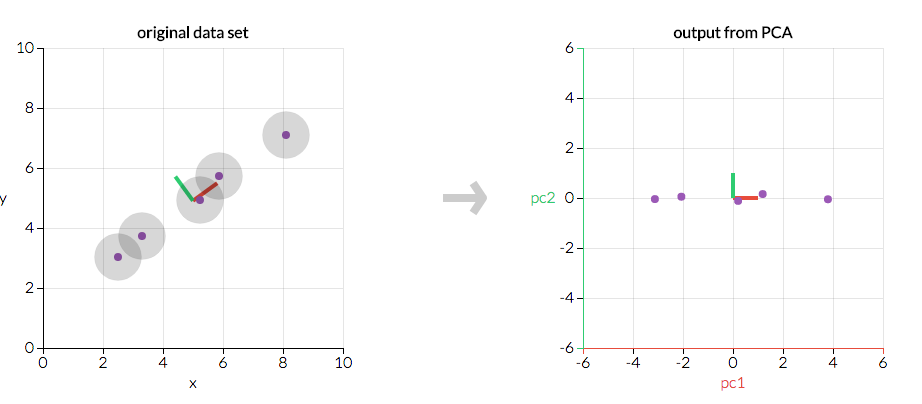

**********************************
Principal Component Analysis (PCA)
**********************************

What is Principal Component Analysis?
=====================================
Principal component analysis (PCA) is a technique used to emphasize variation and bring out strong patterns in a dataset. It's often used to make data easy to explore and visualize

2D example
==========
First, consider a dataset in only two dimensions, like (height, weight). This dataset can be plotted as points in a plane. But if we want to tease out variation, PCA finds a new coordinate system in which every point has a new (x,y) value. The axes don't actually mean anything physical; they're combinations of height and weight called "principal components" that are chosen to give one axes lots of variation.

    PCA is useful for eliminating dimensions. If we're going to only see the data along one dimension, though, it might be better to make that dimension the principal component with most variation. We don't lose much by dropping PC2 since it contributes the least to the variation in the data set.
