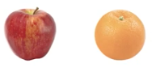

*******************
Supervised Learning
*******************

#. Collect Training Data
#. Train Classifier
#. Make Predictions

.. figure:: img/classification-1.png
    :align: center

    Klasyfikacja wiadomości jako spam

Przykład: Apple vs. Orange
--------------------------

Jak odróżnić jabłko od pomarańczy?

    Apple vs. Oranges

* ilość pixeli pomarańczowych i ich stosunek do zielonych/czerwonych
* co z czarno białymi zdjęciami?
* co ze zdjęciami bez jabłek i pomarańczy

======  =======  ======
Weight  Texture  Label
======  =======  ======
170g    Bumpy    Orange
150g    Bumpy    Orange
140g    Smooth   Apple
130g    Smooth   Apple
======  =======  ======

**Training Data table contains features and lables**

.. code-block:: python

    # Imput to the classifier
    features = [
       [170, 'bumpy'],
       [150, 'bumpy'],
       [140, 'smooth'],
       [130, 'smooth'],
    ]

    # Output that we want from classifier
    labels = ['apple', 'apple', 'orange', 'orange']

.. warning:: Scikit-learn uses real-valued features

    .. code-block:: python

        # Imput to the classifier
        # 0: bumpy
        # 1: smooth
        features = [
            [140, 1],
            [130, 1],
            [150, 0],
            [170, 0],
        ]

        # Output that we want from classifier
        # 0: apple
        # 1: orange
        labels = [0, 0, 1, 1]

.. figure:: img/decision-tree.png
    :align: center

    Drzewo decyzyjne

.. code-block:: python

    from sklearn import tree

    # Imput to the classifier
    # as of Scikit-learn uses real-valued features, we use:
    # 0: bumpy
    # 1: smooth
    #
    # features = [
    #    [140, 'smooth'],
    #    [130, 'smooth'],
    #    [150, 'bumpy'],
    #    [170, 'bumpy'],
    # ]

    features = [
        [140, 1],
        [130, 1],
        [150, 0],
        [170, 0],
    ]

    # Output that we want from classifier
    # as of Scikit-learn uses real-valued features, we use:
    # 0: apple
    # 1: orange
    #
    # labels = ['apple', 'apple', 'orange', 'orange']
    labels = [0, 0, 1, 1]

    # create decision tree
    clf = tree.DecisionTreeClassifier()

    # fit - synonim to "find patterns in data"
    clf = clf.fit(features, labels)

    # use classifier to predict
    output = clf.predict([[160, 0]])

    print(output)
    # should be: [1]

Visualizing a Decision Tree
===========================

Zadania praktyczne
==================

Supervised Learning: Samochody
------------------------------

Stwórz Classifier dla podanych poniżej danych testowych

==========  =====  ==========
Horsepower  Seats  Label
==========  =====  ==========
300         2      sports-car
450         2      sports-car
200         8      minivan
150         9      minivan
==========  =====  ==========
