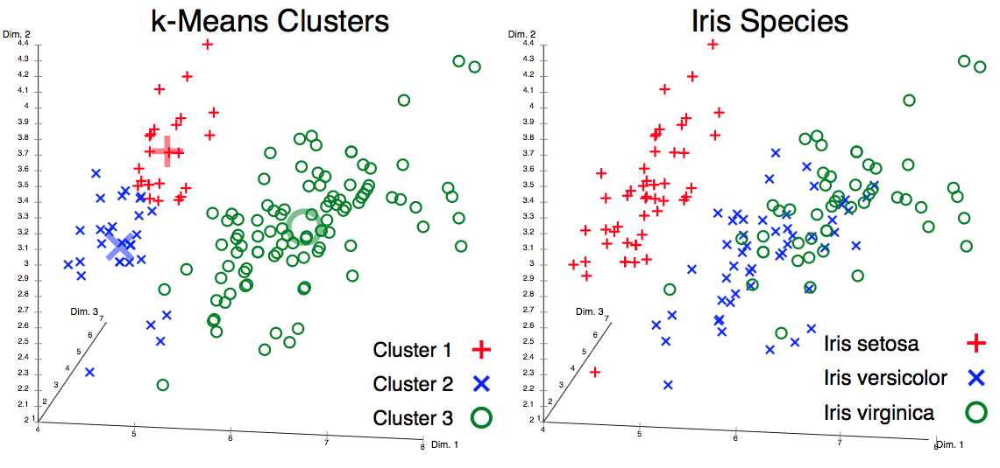
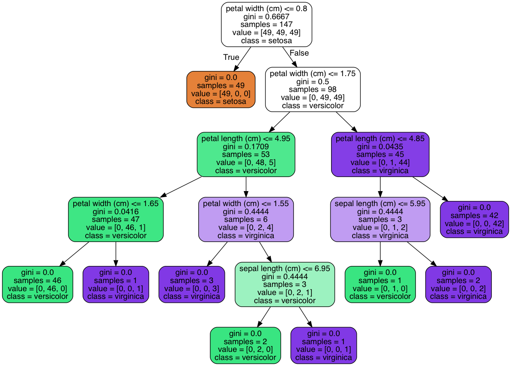

*******************
Supervised Learning
*******************

#. Collect Training Data
#. Train Classifier
#. Make Predictions

    Klasyfikacja wiadomości jako spam

Przykład: Apple vs. Orange
--------------------------

Jak odróżnić jabłko od pomarańczy?

.. figure:: img/classification-apple-orange.png
    :align: center

    Apple vs. Oranges classification using orange and green pixel count.

* ilość pixeli pomarańczowych i ich stosunek do zielonych/czerwonych
* co z czarno białymi zdjęciami?
* co ze zdjęciami bez jabłek i pomarańczy

.. code-block:: python

    def detect_colors(image):
        # lots of code

    def detect_edges(image):
        # lots of code

    def analyze_shapes(image):
        # lots of code

    def guess_texture(image):
        # lots of code

    def define_fruit(image):
        # lots of code

    def handle_probability(image):
        # lots of code

======  =======  ======
Weight  Texture  Label
======  =======  ======
170g    Bumpy    Orange
150g    Bumpy    Orange
140g    Smooth   Apple
130g    Smooth   Apple
======  =======  ======

**Training Data table contains features and lables**

.. code-block:: python

    # Imput to the classifier
    features = [
       [170, 'bumpy'],
       [150, 'bumpy'],
       [140, 'smooth'],
       [130, 'smooth'],
    ]

    # Output that we want from classifier
    labels = ['apple', 'apple', 'orange', 'orange']

.. warning:: Scikit-learn uses real-valued features

    .. code-block:: python

        # Imput to the classifier
        # 0: bumpy
        # 1: smooth
        features = [
            [140, 1],
            [130, 1],
            [150, 0],
            [170, 0],
        ]

        # Output that we want from classifier
        # 0: apple
        # 1: orange
        labels = [0, 0, 1, 1]

.. figure:: img/decision-tree.png
    :align: center

    Drzewo decyzyjne

.. code-block:: python

    from sklearn import tree

    # Imput to the classifier
    # as of Scikit-learn uses real-valued features, we use:
    # 0: bumpy
    # 1: smooth
    #
    # features = [
    #    [140, 'smooth'],
    #    [130, 'smooth'],
    #    [150, 'bumpy'],
    #    [170, 'bumpy'],
    # ]

    features = [
        [140, 1],
        [130, 1],
        [150, 0],
        [170, 0],
    ]

    # Output that we want from classifier
    # as of Scikit-learn uses real-valued features, we use:
    # 0: apple
    # 1: orange
    #
    # labels = ['apple', 'apple', 'orange', 'orange']
    labels = [0, 0, 1, 1]

    # create decision tree
    clf = tree.DecisionTreeClassifier()

    # fit - synonim to "find patterns in data"
    clf = clf.fit(features, labels)

    # use classifier to predict
    output = clf.predict([[160, 0]])

    print(output)
    # should be: [1]

Visualizing a Decision Tree
===========================

* http://scikit-learn.org/stable/datasets/

The Iris flower data set or Fisher's Iris data set is a multivariate data set introduced by the British statistician and biologist Ronald Fisher in his 1936 paper The use of multiple measurements in taxonomic problems as an example of linear discriminant analysis.

.. figure:: img/iris-flowers.png
    :scale: 75%
    :align: center

The data set consists of 50 samples from each of three species of Iris (Iris setosa, Iris virginica and Iris versicolor). Four features were measured from each sample: the length and the width of the sepals and petals, in centimetres. Based on the combination of these four features, Fisher developed a linear discriminant model to distinguish the species from each other.

Based on Fisher's linear discriminant model, this data set became a typical test case for many statistical classification techniques in machine learning such as support vector machines.

.. figure:: img/iris-dataset-scatterplot.png
    :scale: 50%
    :align: center

    Scatterplot of the Iris data set

    Unsatisfactory k-means clustering result (the data set does not cluster into the known classes) and actual species visualized using ELKI

.. code-block:: python

    >>> from sklearn.datasets import load_iris
    >>> iris = load_iris()

    >>> print(iris.feature_names)
    ['sepal length (cm)', 'sepal width (cm)', 'petal length (cm)', 'petal width (cm)']

    >>> print(iris.target_names)
    ['setosa' 'versicolor' 'virginica']

    >>> print(iris.data[0])
    [5.1  3.5  1.4  0.2]

    >>> print(iris.target[0])
    0

.. code-block:: python

    import numpy
    from sklearn.datasets import load_iris
    from sklearn import tree

    iris = load_iris()

    # select test indexes
    # dataset is ordered so 0, 50, 100 is a first of each kind
    test_idx = [0, 50, 100]

    # training data
    train_target = numpy.delete(iris.target, test_idx)
    train_data = numpy.delete(iris.data, test_idx, axis=0)

    # testing data
    test_target = iris.target[test_idx]
    test_data = iris.data[test_idx]

    # create and train classifier
    clf = tree.DecisionTreeClassifier()
    clf.fit(train_data, train_target)

    print(test_target)
    # Output: [0 1 2]

    output = clf.predict(test_data)
    print(output)
    # Output: [0 1 2]

    print(test_data[0], test_target[0])
    # output: [ 5.1  3.5  1.4  0.2] 0

    print(iris.feature_names)
    # output: ['sepal length (cm)', 'sepal width (cm)', 'petal length (cm)', 'petal width (cm)']

    print(iris.target_names)
    # output: ['setosa' 'versicolor' 'virginica']

    # Vizualization of Decision Tree Classifier
    from sklearn.externals.six import StringIO
    import pydotplus

    dot_data = StringIO()
    tree.export_graphviz(
        decision_tree=clf,
        out_file=dot_data,
        feature_names=iris.feature_names,
        class_names=iris.target_names,
        filled=True,
        rounded=True,
        impurity=True
    )

    graph = pydotplus.graph_from_dot_data(dot_data.getvalue())
    graph.write_pdf('/tmp/iris.pdf')

    Vizualization of Decision Tree Classifier

What Makes a Good Feature?
==========================

* Using one feature?

.. code-block:: python

    import numpy as np
    import matplotlib.pyplot as plt

    greyhounds = 500
    labradors = 500

    # in inches + variation +4 inches
    greyhounds_height = 28 + 4 * np.random.randn(greyhounds)
    labradors_height = 24 + 4 * np.random.randn(labradors)

    plt.hist(
        [greyhounds_height, labradors_height],
        stacked=True,
        color=['red', 'blue']
    )

    plt.show()

.. figure:: img/dogs-hist.png
    :scale: 50%
    :align: center

    Dogs height Classification Probability

* How many features do you need?
* What features are good?

.. figure:: img/dogs-bad-features.png
    :scale: 50%
    :align: center

    Is this a good feature for classifier? Why?

Zadania praktyczne
==================

Supervised Learning: Samochody
------------------------------

Stwórz Classifier dla podanych poniżej danych testowych

==========  =====  ==========
Horsepower  Seats  Label
==========  =====  ==========
300         2      sports-car
450         2      sports-car
200         8      minivan
150         9      minivan
==========  =====  ==========
