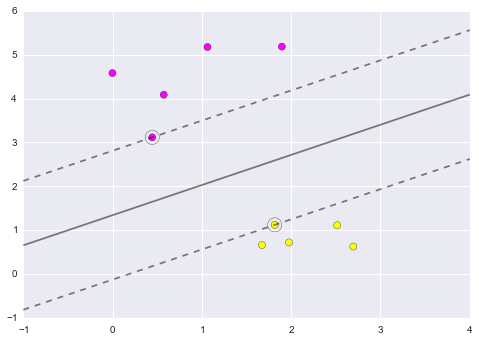
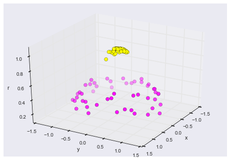

***********************
Support Vector Machines
***********************

What is Support Vector Machine?
===============================
There are many supervised learning algorithms available; here we'll go into brief detail one of the most powerful and interesting methods: **Support Vector Machines (SVM)**.

A Support Vector Machine (SVM) is a discriminative classifier formally defined by a separating hyperplane. In other words, given labeled training data (supervised learning), the algorithm outputs an optimal hyperplane which categorizes new examples.

Given a set of training examples, each marked as belonging to one or the other of two categories, an SVM training algorithm builds a model that assigns new examples to one category or the other, making it a non-probabilistic binary linear classifier (although methods such as Platt scaling exist to use SVM in a probabilistic classification setting). An SVM model is a representation of the examples as points in space, mapped so that the examples of the separate categories are divided by a clear gap that is as wide as possible. New examples are then mapped into that same space and predicted to belong to a category based on on which side of the gap they fall.

.. figure:: img/support-vector-machines-max-sep-hyperplane-with-margin.png
    :scale: 50%
    :align: center

    Maximum-margin hyperplane and margins for an SVM trained with samples from two classes. Samples on the margin are called the support vectors.

In addition to performing linear classification, SVMs can efficiently perform a non-linear classification using what is called the kernel trick, implicitly mapping their inputs into high-dimensional feature spaces.

When data are not labeled, supervised learning is not possible, and an unsupervised learning approach is required, which attempts to find natural clustering of the data to groups, and then map new data to these formed groups. The clustering algorithm which provides an improvement to the support vector machines is called support vector clustering[2] and is often[citation needed] used in industrial applications either when data are not labeled or when only some data are labeled as a preprocessing for a classification pass.

.. code-block:: python

    import numpy as np
    import matplotlib.pyplot as plt
    from scipy import stats

    # use seaborn plotting defaults
    import seaborn as sns; sns.set()

Motivating Support Vector Machines
==================================
Support Vector Machines (SVMs) are a powerful supervised learning algorithm used for **classification** or for **regression**. SVMs are a discriminative classifier: that is, they draw a boundary between clusters of data.

.. figure:: img/k-nearest-neighbors-curve.png
    :scale: 50%
    :align: center

    SVMs are a discriminative classifier: that is, they draw a boundary between clusters of data.

Let's show a quick example of support vector classification. First we need to create a dataset:

.. code-block:: python

    from sklearn.datasets.samples_generator import make_blobs
    X, y = make_blobs(n_samples=50, centers=2,
                      random_state=0, cluster_std=0.60)
    plt.scatter(X[:, 0], X[:, 1], c=y, s=50, cmap='spring');

.. figure:: img/support-vector-machines-1.png
    :scale: 75%
    :align: center

    A discriminative classifier attempts to draw a line between the two sets of data.

A discriminative classifier attempts to draw a line between the two sets of data. Immediately we see a problem: such a line is ill-posed! For example, we could come up with several possibilities which perfectly discriminate between the classes in this example:

.. code-block:: python

    xfit = np.linspace(-1, 3.5)
    plt.scatter(X[:, 0], X[:, 1], c=y, s=50, cmap='spring')

    for m, b in [(1, 0.65), (0.5, 1.6), (-0.2, 2.9)]:
        plt.plot(xfit, m * xfit + b, '-k')

    plt.xlim(-1, 3.5);

.. figure:: img/support-vector-machines-2.png
    :scale: 75%
    :align: center

    Depending on which you choose, a new data point will be classified almost entirely differently!

These are three very different separaters which perfectly discriminate between these samples. Depending on which you choose, a new data point will be classified almost entirely differently!

How can we improve on this?

Support Vector Machines: Maximizing the Margin
==============================================
Support vector machines are one way to address this. What support vector machined do is to not only draw a line, but consider a region about the line of some given width. Here's an example of what it might look like:

.. code-block:: python

    xfit = np.linspace(-1, 3.5)
    plt.scatter(X[:, 0], X[:, 1], c=y, s=50, cmap='spring')

    for m, b, d in [(1, 0.65, 0.33), (0.5, 1.6, 0.55), (-0.2, 2.9, 0.2)]:
        yfit = m * xfit + b
        plt.plot(xfit, yfit, '-k')
        plt.fill_between(xfit, yfit - d, yfit + d, edgecolor='none', color='#AAAAAA', alpha=0.4)

    plt.xlim(-1, 3.5);

.. figure:: img/support-vector-machines-3.png
    :scale: 75%
    :align: center

    What support vector machined do is to not only draw a line, but consider a region about the line of some given width.

Notice here that if we want to maximize this width, the middle fit is clearly the best. This is the intuition of **support vector machines**, which optimize a linear discriminant model in conjunction with a **margin** representing the perpendicular distance between the datasets.

Fitting a Support Vector Machine
--------------------------------
Now we'll fit a Support Vector Machine Classifier to these points. While the mathematical details of the likelihood model are interesting, we'll let you read about those elsewhere. Instead, we'll just treat the scikit-learn algorithm as a black box which accomplishes the above task.

.. code-block:: python

    >>> from sklearn.svm import SVC # "Support Vector Classifier"

    >>> clf = SVC(kernel='linear')

    >>> clf.fit(X, y)
    SVC(C=1.0, cache_size=200, class_weight=None, coef0=0.0, degree=3, gamma=0.0,
        kernel='linear', max_iter=-1, probability=False, random_state=None,
        shrinking=True, tol=0.001, verbose=False)

To better visualize what's happening here, let's create a quick convenience function that will plot SVM decision boundaries for us:

.. code-block:: python

    def plot_svc_decision_function(clf, ax=None):
        """Plot the decision function for a 2D SVC"""

        if ax is None:
            ax = plt.gca()

        x = np.linspace(plt.xlim()[0], plt.xlim()[1], 30)
        y = np.linspace(plt.ylim()[0], plt.ylim()[1], 30)
        Y, X = np.meshgrid(y, x)
        P = np.zeros_like(X)

        for i, xi in enumerate(x):
            for j, yj in enumerate(y):
                P[i, j] = clf.decision_function([xi, yj])

        # plot the margins
        ax.contour(X, Y, P, colors='k',
                   levels=[-1, 0, 1], alpha=0.5,
                   linestyles=['--', '-', '--'])

.. code-block:: python

    plt.scatter(X[:, 0], X[:, 1], c=y, s=50, cmap='spring')
    plot_svc_decision_function(clf);

.. figure:: img/support-vector-machines-4.png
    :scale: 75%
    :align: center

    Notice that the dashed lines touch a couple of the points: these points are the pivotal pieces of this fit, and are known as the *support vectors* (giving the algorithm its name).

Notice that the dashed lines touch a couple of the points: these points are the pivotal pieces of this fit, and are known as the *support vectors* (giving the algorithm its name). In ``scikit-learn``, these are stored in the ``support_vectors_`` attribute of the classifier:

.. code-block:: python

    plt.scatter(X[:, 0], X[:, 1], c=y, s=50, cmap='spring')
    plot_svc_decision_function(clf)
    plt.scatter(clf.support_vectors_[:, 0], clf.support_vectors_[:, 1],
                s=200, facecolors='none');

.. figure:: img/support-vector-machines-5.png
    :scale: 75%
    :align: center

    Support Vector Machines

Let's use IPython's ``interact`` functionality to explore how the distribution of points affects the support vectors and the discriminative fit. (This is only available in IPython 2.0+, and will not work in a static view)

.. code-block:: python

    from IPython.html.widgets import interact

    def plot_svm(N=10):
        X, y = make_blobs(n_samples=200, centers=2,
                          random_state=0, cluster_std=0.60)
        X = X[:N]
        y = y[:N]

        clf = SVC(kernel='linear')
        clf.fit(X, y)

        plt.scatter(X[:, 0], X[:, 1], c=y, s=50, cmap='spring')
        plt.xlim(-1, 4)
        plt.ylim(-1, 6)

        plot_svc_decision_function(clf, plt.gca())
        plt.scatter(clf.support_vectors_[:, 0], clf.support_vectors_[:, 1],
                    s=200, facecolors='none')

    interact(plot_svm, N=[10, 200], kernel='linear');

    Notice the unique thing about SVM is that only the support vectors matter: that is, if you moved any of the other points without letting them cross the decision boundaries, they would have no effect on the classification results!

Notice the unique thing about SVM is that only the support vectors matter: that is, if you moved any of the other points without letting them cross the decision boundaries, they would have no effect on the classification results!

Going further: Kernel Methods
-----------------------------
Where SVM gets incredibly exciting is when it is used in conjunction with kernels. To motivate the need for kernels, let's look at some data which is not linearly separable:

.. code-block:: python

    from sklearn.datasets.samples_generator import make_circles
    X, y = make_circles(100, factor=.1, noise=.1)

    clf = SVC(kernel='linear').fit(X, y)

    plt.scatter(X[:, 0], X[:, 1], c=y, s=50, cmap='spring')
    plot_svc_decision_function(clf);

.. figure:: img/support-vector-machines-7.png
    :scale: 75%
    :align: center

    Clearly, no linear discrimination will ever separate these data.

Clearly, no linear discrimination will ever separate these data. One way we can adjust this is to apply a **kernel**, which is some functional transformation of the input data.

For example, one simple model we could use is a **radial basis function**

.. code-block:: python

    r = np.exp(-(X[:, 0] ** 2 + X[:, 1] ** 2))

If we plot this along with our data, we can see the effect of it:

.. code-block:: python

    from mpl_toolkits import mplot3d

    def plot_3D(elev=30, azim=30):
        ax = plt.subplot(projection='3d')
        ax.scatter3D(X[:, 0], X[:, 1], r, c=y, s=50, cmap='spring')
        ax.view_init(elev=elev, azim=azim)
        ax.set_xlabel('x')
        ax.set_ylabel('y')
        ax.set_zlabel('r')

    interact(plot_3D, elev=[-90, 90], azip=(-180, 180));

    We can see that with this additional dimension, the data becomes trivially linearly separable!

We can see that with this additional dimension, the data becomes trivially linearly separable! This is a relatively simple kernel; SVM has a more sophisticated version of this kernel built-in to the process. This is accomplished by using `kernel='rbf'` , short for radial basis function:

.. code-block:: python

    clf = SVC(kernel='rbf')
    clf.fit(X, y)

    plt.scatter(X[:, 0], X[:, 1], c=y, s=50, cmap='spring')
    plot_svc_decision_function(clf)
    plt.scatter(clf.support_vectors_[:, 0], clf.support_vectors_[:, 1],
                s=200, facecolors='none');

.. figure:: img/support-vector-machines-9.png
    :scale: 75%
    :align: center

    Here there are effectively :math:`N` basis functions: one centered at each point!

Here there are effectively :math:`N` basis functions: one centered at each point! Through a clever mathematical trick, this computation proceeds very efficiently using the "Kernel Trick", without actually constructing the matrix of kernel evaluations.

We'll leave SVMs for the time being and take a look at another classification algorithm: Random Forests.

.. note:: Source: https://github.com/jakevdp/sklearn_pycon2015/blob/master/notebooks/03.1-Classification-SVMs.ipynb
