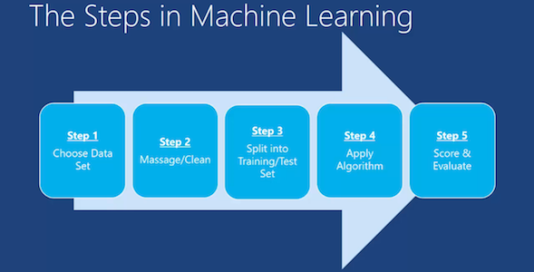

********************************
Wprowadzenie do Machine Learning
********************************

Czym jest uczenie maszynowe?
============================
Machine learning was defined in 1959 by Arthur Samuel as the "field of study that gives computers the ability to learn without being explicitly programmed." This means imbuing knowledge to machines without hard-coding it.

Co trzeba wiedzieć przed rozpoczęciem pracy?
============================================

Elementy języka Python i biblioteki standardowej
------------------------------------------------
* :ref:`Types`
* :ref:`Data Structures`
* :ref:`Control Flow Statements`
* :ref:`Loops`
* :ref:`Function Basics`
* :ref:`Print Formatting`
* :ref:`Operators`
* :ref:`Mathematics`
* :ref:`Files`
* :ref:`CSV Serialization`
* :ref:`Object Oriented Programming`
* :ref:`Installing Packages`
* :ref:`Software Engineering Conventions`
* :ref:`Performance Optimization`

Środowisko
----------
#. Python 3.6+
#. Libs manually installed via ``requirements.txt``

    * ``numpy``
    * ``pandas``
    * ``scikit-learn``
    * ``matplotlib``
    * ``jupyter``

Biblioteki zewnętrzne do nauczania maszynowego
----------------------------------------------
``Scikit-learn``
    A set of python modules for machine learning and data mining. It features various classification, regression and clustering algorithms including support vector machines, random forests, gradient boosting, k-means and DBSCAN, and is designed to interoperate with the Python numerical and scientific libraries NumPy and SciPy.

        - Simple and efficient tools for data mining and data analysis
        - Accessible to everybody, and reusable in various contexts
        - Built on NumPy, SciPy, and matplotlib
        - Open source, commercially usable - BSD license

    * `Scikit-learn Github <https://github.com/scikit-learn/scikit-learn>`_
    * `Scikit-learn Website <http://scikit-learn.org>`_
    * `Przykłady <https://github.com/scikit-learn/scikit-learn/tree/master/examples>`_

``TensorFlow``
    TensorFlow is an open source software library for numerical computation using data flow graphs. Nodes in the graph represent mathematical operations, while the graph edges represent the multidimensional data arrays (tensors) that flow between them. This flexible architecture lets you deploy computation to one or more CPUs or GPUs in a desktop, server, or mobile device without rewriting code. TensorFlow also includes TensorBoard, a data visualization toolkit.

    TensorFlow was originally developed by researchers and engineers working on the Google Brain team within Google's Machine Intelligence Research organization for the purposes of conducting machine learning and deep neural networks research. The system is general enough to be applicable in a wide variety of other domains, as well.

    * `TensorFlow Github <https://github.com/tensorflow/tensorflow>`_
    * `TensorFlow website <https://tensorflow.org/>`_
    * `TensorFlow MOOC on Udacity <https://www.udacity.com/course/deep-learning--ud730>`_

``PyMC3``
    PyMC3 is a Python package for Bayesian statistical modeling and Probabilistic Machine Learning which focuses on advanced Markov chain Monte Carlo and variational fitting algorithms. Its flexibility and extensibility make it applicable to a large suite of problems.

    * `PyMC3 Github <https://github.com/pymc-devs/pymc3>`_
    * `PyMC3 tutorial <http://pymc-devs.github.io/pymc3/notebooks/getting_started.html>`_
    * `Quick start <http://pymc-devs.github.io/pymc3/notebooks/api_quickstart.html>`_

Biblioteki do obsługi danych
----------------------------
``Pandas``
    pandas is a Python package providing fast, flexible, and expressive data structures designed to make working with "relational" or "labeled" data both easy and intuitive. It aims to be the fundamental high-level building block for doing practical, real world data analysis in Python. Additionally, it has the broader goal of becoming the most powerful and flexible open source data analysis / manipulation tool available in any language. It is already well on its way toward this goal. Here are just a few of the things that pandas does well:

        - Easy handling of missing data (represented as NaN) in floating point as well as non-floating point data
        - Size mutability: columns can be inserted and deleted from DataFrame and higher dimensional objects
        - Automatic and explicit data alignment: objects can be explicitly aligned to a set of labels, or the user can simply ignore the labels and let Series, DataFrame, etc. automatically align the data for you in computations
        - Powerful, flexible group by functionality to perform split-apply-combine operations on data sets, for both aggregating and transforming data
        - Make it easy to convert ragged, differently-indexed data in other Python and NumPy data structures into DataFrame objects
        - Intelligent label-based slicing, fancy indexing, and subsetting of large data sets
        - Intuitive merging and joining data sets
        - Flexible reshaping and pivoting of data sets
        - Hierarchical labeling of axes (possible to have multiple labels per tick)
        - Robust IO tools for loading data from flat files (CSV and delimited), Excel files, databases, and saving/loading data from the ultrafast HDF5 format
        - Time series-specific functionality: date range generation and frequency conversion, moving window statistics, moving window linear regressions, date shifting and lagging, etc.

    * http://pandas.pydata.org/

``NumPy``
    NumPy is the fundamental package for scientific computing with Python. It contains among other things:

        - a powerful N-dimensional array object
        - sophisticated (broadcasting) functions
        - tools for integrating C/C++ and Fortran code
        - useful linear algebra, Fourier transform, and random number capabilities

    Besides its obvious scientific uses, NumPy can also be used as an efficient multi-dimensional container of generic data. Arbitrary data-types can be defined. This allows NumPy to seamlessly and speedily integrate with a wide variety of databases.

    * http://www.numpy.org/

Math, Plots, Graphs
-------------------
``SciPy``
    SciPy (pronounced "Sigh Pie") is open-source software for mathematics, science, and engineering. It includes modules for statistics, optimization, integration, linear algebra, Fourier transforms, signal and image processing, ODE solvers, and more. It is also the name of a very popular conference on scientific programming with Python.

    The SciPy library depends on NumPy, which provides convenient and fast N-dimensional array manipulation. The SciPy library is built to work with NumPy arrays, and provides many user-friendly and efficient numerical routines such as routines for numerical integration and optimization. Together, they run on all popular operating systems, are quick to install, and are free of charge. NumPy and SciPy are easy to use, but powerful enough to be depended upon by some of the world's leading scientists and engineers. If you need to manipulate numbers on a computer and display or publish the results.

    SciPy builds on the NumPy array object and is part of the NumPy stack which includes tools like Matplotlib, pandas and SymPy, and an expanding set of scientific computing libraries. This NumPy stack has similar users to other applications such as MATLAB, GNU Octave, and Scilab. The NumPy stack is also sometimes referred to as the SciPy stack.

    * https://www.scipy.org/
    * https://github.com/scipy/scipy

``Matplotlib``
    Matplotlib is a Python 2D plotting library which produces publication-quality figures in a variety of hardcopy formats and interactive environments across platforms. Matplotlib can be used in Python scripts, the Python and IPython shell (à la MATLAB or Mathematica), web application servers, and various graphical user interface toolkits.

    It provides an object-oriented API for embedding plots into applications using general-purpose GUI toolkits like Tkinter, wxPython, Qt, or GTK+. There is also a procedural "pylab" interface based on a state machine (like OpenGL), designed to closely resemble that of MATLAB, though its use is discouraged. SciPy makes use of matplotlib.

    * https://github.com/matplotlib/matplotlib
    * http://matplotlib.org/

``PyDotPlus``
    PyDotPlus is an improved version of the old pydot project that provides a Python Interface to Graphviz’s Dot language.

    * https://github.com/carlos-jenkins/pydotplus
    * http://pydotplus.readthedocs.io/

``Graphviz``
    Graphviz is open source graph visualization software. Graph visualization is a way of representing structural information as diagrams of abstract graphs and networks. It has important applications in networking, bioinformatics,  software engineering, database and web design, machine learning, and in visual interfaces for other technical domains.

    The Graphviz layout programs take descriptions of graphs in a simple text language, and make diagrams in useful formats, such as images and SVG for web pages; PDF or Postscript for inclusion in other documents; or display in an interactive graph browser.  Graphviz has many useful features for concrete diagrams, such as options for colors, fonts, tabular node layouts, line styles, hyperlinks, and custom shapes.

    * http://www.graphviz.org/

Other
-----
``Jupyter``
    The Jupyter Notebook is an open-source web application that allows you to create and share documents that contain live code, equations, visualizations and explanatory text. Uses include: data cleaning and transformation, numerical simulation, statistical modeling, machine learning and much more.

    Jupyter notebook is a language-agnostic HTML notebook application for Project Jupyter. In 2015, Jupyter notebook was released as a part of The Big Split™ of the IPython codebase. IPython 3 was the last major monolithic release containing both language-agnostic code, such as the IPython notebook, and language specific code, such as the IPython kernel for Python. As computing spans across many languages, Project Jupyter will continue to develop the language-agnostic Jupyter notebook in this repo and with the help of the community develop language specific kernels which are found in their own discrete repos.

    * http://jupyter.org/
    * http://jupyter.readthedocs.io/en/latest/install.html
    * https://github.com/jupyter/notebook

Datasets
--------
More in chapter: :ref:`Datasets`.

Ważne pytania przed przystąpieniem do tworzenia algorytmu
=========================================================
* How does this work in real world?
* How much training data do you need?
* How is the tree created?
* What makes a good feature?

    Machine Learning Steps

Czyszczenie Danych
==================
* Bardzo ważny temat
* Rzadko kto o tym wspomina!

.. code-block:: text

    ul. Jana III Sobieskiego 12 m. 19
    ul. Jana 3 Sobieskiego 12/19
    Jana III Sobieskiego 12 apt. 19
    Sobieskiego 12/19
    os. Jana III Sobieskiego 12/19

.. code-block:: text

    12/12/17
    2017-12-12
    Dec 12, 2017
    Dec 12th, 2017
    12.12.2017

Praca z bibliotekami
====================

Przykład pracy z ``scikit-learn``
---------------------------------
#. Import the class you plan to use
#. Instanciate the estimator

    - Estimator is the ``scikit-learn`` word for model
    - Instanciate means create an object from the class
    - Name of the object does not matter
    - Can specify the tunning parameters also known as "hyperparameters" during this step
    - All parameters not specified are set to their defaults

#. Fit the model with data (aka "model training")

    - Models is learning the relationship between :math:`X` and :math:`Y` (features and labels)
    - Occurs in-place (aka change object state - mutate object)

#. Predict the response for a new observation

    - New observations are called "out-of-sample" data
    - Uses the information it learned during the model training process
    - Returns a ``NumPy`` array
    - Can predict for multiple observations at once

.. code-block:: python

    # Import the class you plan to use
    from sklearn.neighbours import KNeighboursClassifier()

    # Instanciate the estimator
    model = KNeighboursClassifier(n_neighbours=1)

    # Fit the model with data (aka "model training")
    model.fit(features, labels)

    # Predict the response for a new observation
    model.predict([3, 5, 4, 2])
    # array([2])

    # Can predict for multiple observations at once
    model.predict([
        [3, 5, 4, 2],
        [5, 4, 3, 2],
    ])
    # array([2, 1])

.. code-block:: python

    from sklearn.neighbours import KNeighboursClassifier()

    model = KNeighboursClassifier(n_neighbours=5)
    model.fit(features, labels)

    model.predict([
        [3, 5, 4, 2],
        [5, 4, 3, 2],
    ])
    # array([1, 1])

.. code-block:: python

    from sklearn.linear_model import LogisticsRegression()

    model = LogisticsRegression()
    model.fit(features, labels)

    model.predict([
        [3, 5, 4, 2],
        [5, 4, 3, 2],
    ])
    # array([2, 0])

Przykład pracy z ``PyMC3``
--------------------------
#. Sparametryzuj swój problem używając rozkładów statystycznych
#. Uzasadnij strukturę swojego modelu
#. Napisz swój model używając PyMC3 i dokonaj obliczeń
#. Zinterpretuj wynik bazując na rozkładach wynikowych
#. (opcjonalnie) z nowymi wynikami dostosuj swój model statystyczny

Kategorie algorytmów uczenia maszynowego
========================================

Supervised Learning
-------------------
Also known as:

    - Supervised Learning

Input data is called training data and has a known label or result such as spam/not-spam or a stock price at a time.

A model is prepared through a training process in which it is required to make predictions and is corrected when those predictions are wrong. The training process continues until the model achieves a desired level of accuracy on the training data.

Example problems are classification and regression.

.. figure:: img/algorithms-supervised.png
    :scale: 100%
    :align: center

    Supervised Learning - Z nadzorem

* Drzewa decyzyjne
* K najbliższych sąsiadów (ang. K Nearest Neighbors)
* Regresja liniowa (ang. Linear Regression)
* Regresja logistyczna
* Support Vector Machines (SVM)
* Naive Bayes
* Sztuczne sieci neuronowe (ang. neural networks)

Unsupervised Learning
-----------------------------------
Also known as:

    - Bez nadzoru

Input data is not labeled and does not have a known result.

A model is prepared by deducing structures present in the input data. This may be to extract general rules. It may be through a mathematical process to systematically reduce redundancy, or it may be to organize data by similarity.

Example problems are clustering, dimensionality reduction and association rule learning.

.. figure:: img/algorithms-unsupervised.png
    :scale: 100%
    :align: center

    Unsupervised Learning - Bez nadzoru

* Klastrowanie (ang. flat clustering, hierarchical clustering)
* Principal Component Analysis (PCA)
* Sztuczne sieci neuronowe (ang. neural networks)

Semi-Supervised Learning
------------------------
Also known as:

    - Reinforcement learning

Input data is a mixture of labeled and unlabelled examples.

There is a desired prediction problem but the model must learn the structures to organize the data as well as make predictions.

Example problems are classification and regression.

Example algorithms are extensions to other flexible methods that make assumptions about how to model the unlabeled data.

.. figure:: img/algorithms-semisupervised.png
    :scale: 100%
    :align: center

    Semi-Supervised Learning

* połączenie obu światów
* nie wszystkie dane są olabelkowane
* przyszłość machine learning
* ze względu na wolumen danych, nie wszystkie mogą mieć olabelkowane
* man (human) in the loop:

    * ekspert labelkuje część danych
    * komputer dokonuje wstępnej analizy części danych
    * przedstawia iterację człowiekowi
    * człowiek interaktywnie poprawia i określa jakość oznaczania
    * komputer dokonuje kolejnej analizy
