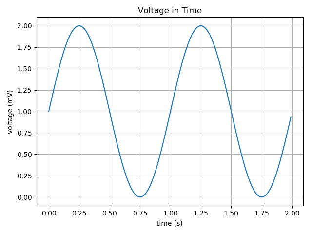

``matplotlib``
==============
* biblioteka zewnętrzna ``pip install matplotlib``

.. note:: Moduł jest szczegółowo opisany w :ref:`Matplotlib`.

Moduł ``matplotlib`` pozwala na rysowanie wykresów i diagramów. Jest to bardzo rozbudowana biblioteka z setkami opcji konfiguracyjnych. Najczęściej używanym modułem biblioteki ``matplotlib`` jest moduł ``pyplot``, który implementuje szereg funkcji umożliwiających rysowanie wykresów 2d.

``Matplotlib`` and ``Jupyter``
------------------------------
* To display ``matplotlib`` figures inline, you have run at least once per kernel run:

    .. code-block:: text

        %matplotlib inline

Points
------
.. figure:: img/matplotlib-01.png
    :scale: 50%
    :align: center

    Points chart

.. literalinclude:: src/matplotlib-01.py
    :language: python
    :caption: Matplotlib example

Sinusoid on grid
----------------

    Sinusoid on grid

.. literalinclude:: src/matplotlib-02.py
    :language: python
    :caption: Matplotlib example

Multiple charts
---------------
.. figure:: img/matplotlib-03.png
    :scale: 50%
    :align: center

    Multiple charts

.. literalinclude:: src/matplotlib-03.py
    :language: python
    :caption: Matplotlib example
