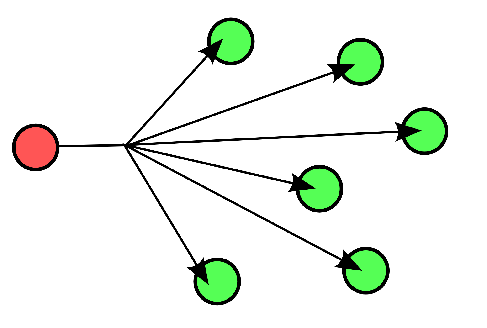

*******
Routing
*******

Unicast is the dominant form of message delivery on the Internet.
Routing schemes differ in how they deliver messages :cite:`DefinitionRouting`:

.. glossary::

    unicast
        delivers a message to a single specific node

    broadcast
        delivers a message to all nodes in the network

    multicast
        delivers a message to a group of nodes that have expressed interest in receiving the message

    anycast
        delivers a message to any one out of a group of nodes, typically the one nearest to the source

    geocast
        delivers a message to a group of nodes based on geographic location

Unicast
=======
In computer networking, unicast refers to a one-to-one transmission from one point in the network to another point; that is, one sender and one receiver, each identified by a network address :cite:`DefinitionUnicast`.

.. figure:: img/routing-unicast.png
    :scale: 15%
    :align: center

    Unicast routing delivery scheme :cite:`RoutingUnicast`

Broadcast
=========
In computer networking, telecommunication and information theory, broadcasting is a method of transferring a message to all recipients simultaneously. Broadcasting can be performed as a high level operation in a program, for example broadcasting in Message Passing Interface, or it may be a low level networking operation, for example broadcasting on Ethernet :cite:`DefinitionBroadcast`.

All-to-all communication is a computer communication method in which each sender transmits messages to all receivers within a group. In networking this is often accomplished using multicast. This is in contrast with the point-to-point method in which each sender communicates with one receiver :cite:`DefinitionBroadcast`.

    Broadcast routing delivery scheme :cite:`RoutingBroadcast`

.. code-block:: python

    from socket import *

    s = socket(AF_INET, SOCK_DGRAM)
    s.setsockopt(SOL_SOCKET, SO_BROADCAST, 1)
    s.sendto('Hello World!', ('255.255.255.255',12345))

.. code-block:: python

    from socket import *

    s = socket(AF_INET, SOCK_DGRAM)
    s.bind(('', 12345))

    m = s.recvfrom(1024)
    print(m[0])

Multicast
=========
In computer networking, multicast is group communication[1] where data transmission is addressed to a group of destination computers simultaneously. Multicast can be one-to-many or many-to-many distribution.[2] Multicast should not be confused with physical layer point-to-multipoint communication :cite:`DefinitionMulticast`.

Group communication may either be application layer multicast[1] or network assisted multicast, where the latter makes it possible for the source to efficiently send to the group in a single transmission. Copies are automatically created in other network elements, such as routers, switches and cellular network base stations, but only to network segments that currently contain members of the group. Network assisted multicast may be implemented at the data link layer using one-to-many addressing and switching such as Ethernet multicast addressing, Asynchronous Transfer Mode (ATM), point-to-multipoint virtual circuits (P2MP)[3] or Infiniband multicast. Network assisted multicast may also be implemented at the Internet layer using IP multicast. In IP multicast the implementation of the multicast concept occurs at the IP routing level, where routers create optimal distribution paths for datagrams sent to a multicast destination address :cite:`DefinitionMulticast`.

Multicast is often employed in Internet Protocol (IP) applications of streaming media, such as IPTV and multipoint videoconferencing :cite:`DefinitionMulticast`.

.. figure:: img/routing-multicast.png
    :scale: 15%
    :align: center

    Multicast routing delivery scheme :cite:`RoutingMulticast`

.. code-block:: python
    :caption: Receive multicast package

    import socket
    import struct

    MCAST_GRP = '224.1.1.1'
    MCAST_PORT = 5007

    sock = socket.socket(socket.AF_INET, socket.SOCK_DGRAM, socket.IPPROTO_UDP)
    sock.setsockopt(socket.SOL_SOCKET, socket.SO_REUSEADDR, 1)  # use ``socket.SO_REUSEPORT`` on macOS
    sock.bind((MCAST_GRP, MCAST_PORT))

    mreq = struct.pack("4sl", socket.inet_aton(MCAST_GRP), socket.INADDR_ANY)

    sock.setsockopt(socket.IPPROTO_IP, socket.IP_ADD_MEMBERSHIP, mreq)

    while True:
        print(sock.recv(10240))

.. code-block:: python
    :caption: Send multicast package

    import socket

    MCAST_GRP = '224.1.1.1'
    MCAST_PORT = 5007
    MULTICAST_TTL = 2

    sock = socket.socket(socket.AF_INET, socket.SOCK_DGRAM, socket.IPPROTO_UDP)
    sock.setsockopt(socket.IPPROTO_IP, socket.IP_MULTICAST_TTL, MULTICAST_TTL)
    sock.sendto('Hello World!', (MCAST_GRP, MCAST_PORT))

Anycast
=======
Anycast is a network addressing and routing methodology in which a single destination address has multiple routing paths to two or more endpoint destinations. Routers will select the desired path on the basis of number of hops, distance, lowest cost, latency measurements or based on the least congested route. Anycast networks are widely used for content delivery network (CDN) products to bring their content closer to the end user :cite:`DefinitionAnycast`.

.. figure:: img/routing-anycast.png
    :scale: 15%
    :align: center

    Anycast routing delivery scheme :cite:`RoutingAnycast`

Geocast
=======
Geocast refers to the delivery of information to a group of destinations in a network identified by their geographical locations. It is a specialized form of multicast addressing used by some routing protocols for mobile ad hoc networks :cite:`DefinitionGeocast`.

.. figure:: img/routing-geocast.png
    :scale: 15%
    :align: center

    Geocast routing delivery scheme :cite:`RoutingGeocast`
