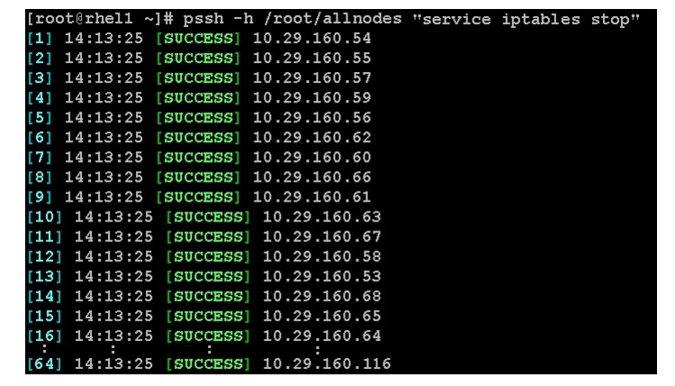

************
SSH Protocol
************

``paramiko``
============
.. code-block:: python

    import paramiko

    client = paramiko.SSHClient()

    client.connect('example.com', username='tester')
    # Traceback (most recent call last):
    #   ...
    # paramiko.ssh_exception.SSHException: Server 'example.com' not found in known_hosts

.. code-block:: python

    import paramiko

    client = paramiko.SSHClient()

    client.load_system_host_keys()
    client.load_host_keys('/home/brandon/.ssh/known_hosts')
    client.connect('example.com', username='test')

Password Auth
-------------
.. code-block:: python

    client.connect('example.com', username='brandon', password=mypass)
    client.connect('my.example.com')

Public/Private Key Auth
-----------------------
.. code-block:: python

    client.connect('my.example.com', key_filename='/home/brandon/.ssh/id_sysadmin')

Running commands
----------------
.. code-block:: python

    import sys
    import getpass
    import paramiko

    hostname = sys.argv[1]
    username = sys.argv[2]
    password = getpass.getpass()

    client = paramiko.SSHClient()
    client.set_missing_host_key_policy(paramiko.AutoAddPolicy)
    client.connect(hostname, username=username, password=password)

    commands = [
        'echo "Hello, world!"',
        'uname',
        'uptime',
    ]

    for command in commands:
        stdin, stdout, stderr = client.exec_command(command)
        stdin.close()
        print(repr(stdout.read()))
        stdout.close()
        stderr.close()

    client.close

SFTP
----
.. code-block:: python

    import sys
    import paramiko

    host = "example.com"
    port = 22
    password = "THEPASSWORD"
    username = "THEUSERNAME"

    transport = paramiko.Transport((host, port))
    transport.connect(username = username, password = password)
    sftp = paramiko.SFTPClient.from_transport(transport)

    path_local = 'README.txt'
    path_remote = '/tmp/README.txt'

    sftp.put(path_local, path_remote)

    sftp.close()
    transport.close()

``pysftp``
==========
.. code-block:: console

    pip install pysftp

.. code-block:: python

    import pysftp
    import sys

    host = "example.com"
    port = 22
    password = "THEPASSWORD"
    username = "THEUSERNAME"

    path_local = 'README.txt'
    path_remote = '/tmp/README.txt'

    with pysftp.Connection(host, username=username, password=password) as sftp:
        sftp.put(path_local, path_remote)

``fabric``
==========
* http://www.fabfile.org/
* https://pypi.python.org/pypi/Fabric3

.. code-block:: console

    pip install fabric

Example
-------
.. code-block:: python

    from fabric.api import *

    env.hosts = ['THEHOST.com']
    env.user = 'THEUSER'
    env.password = 'THEPASSWORD'

    def put_file(file):
        put(file, './THETARGETDIRECTORY/')

.. code-block:: console

    fab -f fab_putfile.py put_file:file=./path/to/my/file

Local
-----
.. code-block:: python

    from fabric.api import local

    def prepare_deploy():
        local("./manage.py test my_app")
        local("git add -p && git commit")
        local("git push")

.. code-block:: console

    $ fab prepare_deploy
    [localhost] run: ./manage.py test my_app
    Creating test database...
    Creating tables
    Creating indexes
    ..........................................
    ----------------------------------------------------------------------
    Ran 42 tests in 9.138s

    OK
    Destroying test database...

    [localhost] run: git add -p && git commit

    <interactive Git add / git commit edit message session>

    [localhost] run: git push

    <git push session, possibly merging conflicts interactively>

    Done.

Organization
------------
.. code-block:: python

    from fabric.api import local

    def test():
        local("./manage.py test my_app")

    def commit():
        local("git add -p && git commit")

    def push():
        local("git push")

    def prepare_deploy():
        test()
        commit()
        push()

Failure handling
----------------
.. code-block:: python

    from fabric.api import local, settings, abort
    from fabric.contrib.console import confirm

    def test():
        with settings(warn_only=True):
            result = local('./manage.py test my_app', capture=True)

        if result.failed and not confirm("Tests failed. Continue anyway?"):
            abort("Aborting at user request.")

Executing on remote host
------------------------
.. code-block:: python

    from fabric import SerialGroup

    result = SerialGroup('web1', 'web2').run('hostname')
    # web1
    # web2

    # it's a dict!
    result.items()
    # [
    #   (<Connection host=web1>, <Result cmd='hostname' exited=0>),
    #   ...
    # ]

.. code-block:: python

    from fabric.api import *
    from fabric.contrib.console import confirm

    env.hosts = ['my_server']

    def test():
        with settings(warn_only=True):
            result = local('./manage.py test my_app', capture=True)

        if result.failed and not confirm("Tests failed. Continue anyway?"):
            abort("Aborting at user request.")

    def commit():
        local("git add -p && git commit")

    def push():
        local("git push")

    def prepare_deploy():
        test()
        commit()
        push()

    def deploy():
        code_dir = '/srv/django/myproject'

        with settings(warn_only=True):
            if run("test -d %s" % code_dir).failed:
                run("git clone user@vcshost:/path/to/repo/.git %s" % code_dir)

        with cd(code_dir):
            run("git pull")
            run("touch app.wsgi")

.. code-block:: python

    from fabric.api import *

    def deploy():
        sudo("~/install_script.py")
        sudo("mkdir /var/www/new_docroot", user="www-data")
        sudo("ls /home/jdoe", user=1001)
        result = sudo("ls /tmp/")

        with settings(sudo_user='mysql'):
            sudo("whoami")
            # 'mysql'

Host
----
.. code-block:: python

    from fabric.api import hosts

    @hosts(['127.0.0.1', 'localhost'])
    def whoami():
        sudo('whoami')

``pssh``
========
* Running commands in parallel across many hosts
* https://linux.die.net/man/1/pssh

.. figure:: img/ssh-pssh-2.jpg
    :align: center
    :scale: 50%

.. figure:: img/ssh-pssh-3.png
    :align: center
    :scale: 75%
