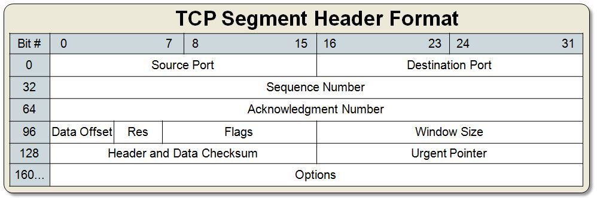
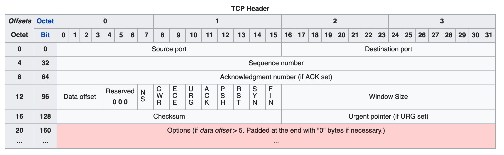
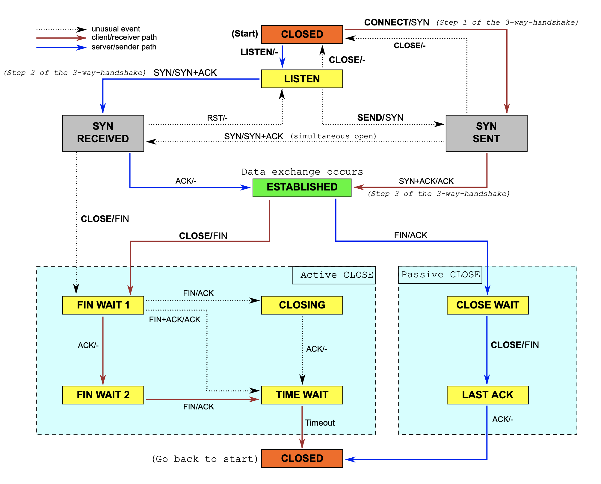

*******
TCP/UDP
*******

TCP
===

    TCP packet

Header
------

    TCP Header

Handshake
---------
.. figure:: img/tcp-handshake-simple.jpg
    :scale: 100%
    :align: center

    TCP Hanshake Simple

    TCP Hanshake

.. figure:: img/tcp-detailed.png
    :scale: 50%
    :align: center

    TCP Hanshake Detailed

UDP
===
.. figure:: img/udp.jpg
    :scale: 75%
    :align: center

    UDP packet
