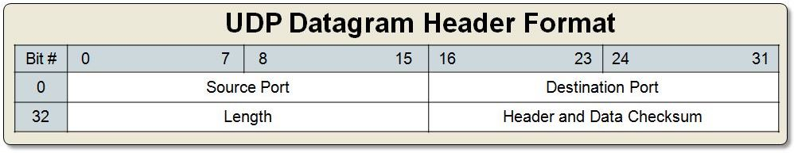
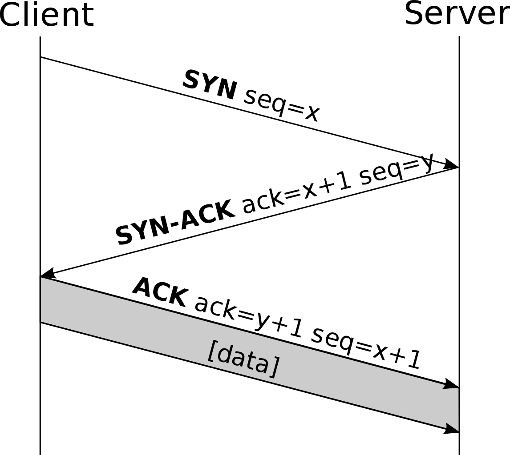

*******
TCP/UDP
*******

UDP
===
* ``socket.SOCK_DGRAM``

    UDP packet

TCP
===
* ``socket.SOCK_STREAM``

Header
------
.. figure:: img/tcp.jpg
    :width: 75%
    :align: center

    TCP packet

.. figure:: img/tcp-header.png
    :width: 75%
    :align: center

    TCP packet

Handshake
---------
.. figure:: img/tcp-handshake-simple.jpg
    :width: 75%
    :align: center

    TCP Handshake Simple

    TCP Handshake

.. figure:: img/tcp-handshake-detailed.png
    :width: 75%
    :align: center

    TCP Handshake Detailed
