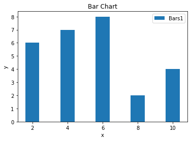

Bar Chart
=========
* used to display single values

Simple Chart
------------
.. code-block:: python

    import matplotlib.pyplot as plt

    x = [2, 4, 6, 8, 10]
    y = [6, 7, 8, 2, 4]

    plt.bar(x, y, label='Bars1')

    plt.xlabel('x')
    plt.ylabel('y')
    plt.title('Bar Chart')
    plt.legend()

    plt.show()

Multiple data
-------------
.. code-block:: python

    import matplotlib.pyplot as plt

    x1 = [2, 4, 6, 8, 10]
    y1 = [6, 7, 8, 2, 4]

    x2 = [1, 3, 5, 7, 9]
    y2 = [7, 8, 2, 4, 2]

    plt.bar(x1, y1, label='Bars1', color='blue')
    plt.bar(x2, y2, label='Bars2', color='#ff0000')

    plt.xlabel('x')
    plt.ylabel('y')
    plt.title('Bar Chart')
    plt.legend()

    plt.show()

.. figure:: img/simple-bar-2.png
    :align: center
    :width: 50%
