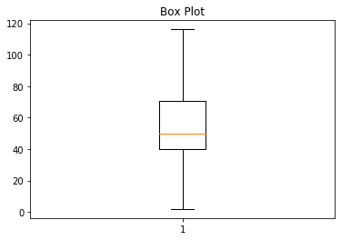
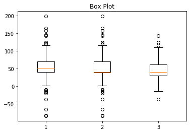

Box Chart
=========

Simple Box Charts
-----------------
.. code-block:: python

    import numpy as np
    import matplotlib.pyplot as plt

    # Fixing random state for reproducibility
    np.random.seed(0)

    # fake up some data
    spread = np.random.rand(50) * 100
    center = np.ones(25) * 50
    flier_high = np.random.rand(10) * 100 + 100
    flier_low = np.random.rand(10) * -100
    data = np.concatenate((spread, center, flier_high, flier_low), 0)

    plt.boxplot(data)
    plt.title('Box Plot')

    plt.show()

.. figure:: img/chart-box-simple.png
    :width: 75%
    :align: center

Hide Outliers
-------------
.. code-block:: python

    import numpy as np
    import matplotlib.pyplot as plt

    # Fixing random state for reproducibility
    np.random.seed(19680801)

    # fake up some data
    spread = np.random.rand(50) * 100
    center = np.ones(25) * 40
    flier_high = np.random.rand(10) * 100 + 100
    flier_low = np.random.rand(10) * -100
    d2 = np.concatenate((spread, center, flier_high, flier_low))
    data.shape = (-1, 1)
    d2.shape = (-1, 1)
    data = [data, d2, d2[::2,0]]

    plt.boxplot(data)
    plt.title('Box Plot')

    plt.show()

Multiple Box Charts
-------------------
.. code-block:: python

    import numpy as np
    import matplotlib.pyplot as plt

    # Fixing random state for reproducibility
    np.random.seed(19680801)

    # fake up some data
    spread = np.random.rand(50) * 100
    center = np.ones(25) * 40
    flier_high = np.random.rand(10) * 100 + 100
    flier_low = np.random.rand(10) * -100
    d2 = np.concatenate((spread, center, flier_high, flier_low))
    data.shape = (-1, 1)
    d2.shape = (-1, 1)
    data = [data, d2, d2[::2,0]]

    plt.boxplot(data)
    plt.title('Box Plot')

    plt.show()

