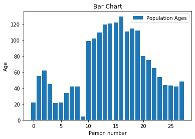
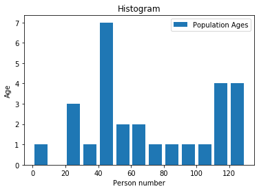

Histogram
=========

* used to display number of elements in specific groups

Using bar chart for histogram data
----------------------------------
* Not effective

.. code-block:: python

    import matplotlib.pyplot as plt

    # Population Ages
    y = [22, 55, 62, 45, 21, 22, 34, 42, 42, 4, 99, 102,
         110, 120, 121, 122, 130, 111, 115, 112, 80, 75,
         65, 54, 44, 43, 42, 48]

    x = [x for x,y in enumerate(y)]

    plt.bar(x, y, label='Population Ages')

    plt.xlabel('Person number')
    plt.ylabel('Age')
    plt.title('Bar Chart')
    plt.legend()

    plt.show()

Histogram chart
---------------
* Bins are groups (segments)

.. code-block:: python

    import matplotlib.pyplot as plt

    population_ages = [22, 55, 62, 45, 21, 22, 34, 42, 42, 4, 99, 102,
                       110, 120, 121, 122, 130, 111, 115, 112, 80, 75,
                       65, 54, 44, 43, 42, 48]

    bins = [0, 10, 20, 30, 40, 50, 60, 70, 80, 90, 100, 110, 120, 130]

    plt.hist(population_ages,
             bins=bins,               # age groups (segments)
             histtype='bar',          # type of the histogram
             rwidth=0.8,              # width of a bar
             label='Population Ages')

    plt.xlabel('Person number')
    plt.ylabel('Age')
    plt.title('Histogram')
    plt.legend()

    plt.show()

Examples
========

Simple
------
.. code-block:: python

    ages = np.random.randint(size=50, low=0, high=130)

    # age groups
    bins = [0, 10, 20, 30, 40, 50, 60, 70, 80, 100, 110, 120, 130]

    plt.hist(ages, bins, histtype='bar', rwidth=0.8)

.. figure:: img/matplotlib-plt-hist.png
    :width: 75%
    :align: center

    Histogram

Normal Distribution
-------------------
.. code-block:: python

    import matplotlib.pyplot as plt
    import numpy as np
    np.random.seed(0)

    mu, sigma = 100, 15
    x = mu + sigma * np.random.randn(10000)

    # the histogram of the data
    n, bins, patches = plt.hist(x, 50, normed=1, facecolor='g', alpha=0.75)

    plt.xlabel('Smarts')
    plt.ylabel('Probability')
    plt.title('Histogram of IQ')
    plt.text(60, .025, r'$\mu=100,\ \sigma=15$')
    plt.axis([40, 160, 0, 0.03])
    plt.grid(True)
    plt.show()

.. figure:: img/matplotlib-plt-hist-text.png
    :width: 75%
    :align: center

    Working with text
