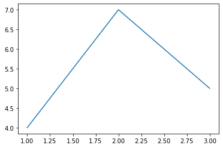
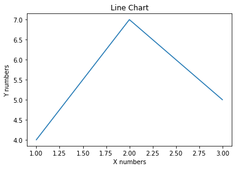

**********
Line Chart
**********

Simple line
===========
.. code-block:: python

    import matplotlib.pyplot as plt

    x = [1, 2, 3]
    y = [4, 7, 5]

    plt.plot(x, y)
    plt.show()

Name axis and chart
===================
.. code-block:: python

    import matplotlib.pyplot as plt

    x = [1, 2, 3]
    y = [4, 7, 5]

    plt.plot(x, y)

    plt.xlabel('X numbers')
    plt.ylabel('Y numbers')
    plt.title('Line Chart')

    plt.show()

Subtitles
=========
.. code-block:: python

    import matplotlib.pyplot as plt

    x = [1, 2, 3]
    y = [4, 7, 5]

    plt.plot(x, y)

    plt.xlabel('X numbers')
    plt.ylabel('Y numbers')
    plt.title('Line Chart\nThis will be the subtitle')

    plt.show()

.. figure:: img/simple-line-3.png
    :align: center
    :width: 50%

Legend
======
.. code-block:: python

    import matplotlib.pyplot as plt

    x1 = [1, 2, 3]
    y1 = [4, 7, 5]

    x2 = [1, 2, 3]
    y2 = [10, 14, 12]

    plt.plot(x1, y1, label='First line', color='c')  # c - cyan
    plt.plot(x2, y2, label='Second line', color='red')

    plt.xlabel('X numbers')
    plt.ylabel('Y numbers')
    plt.title('Line Chart')
    plt.legend()

    plt.show()

.. figure:: img/simple-line-4.png
    :align: center
    :width: 50%

Examples
========

Exponential functions
---------------------
.. code-block:: python

    x = np.linspace(0, 2, 100)

    plt.plot(x, x, label='linear')
    plt.plot(x, x**2, label='quadratic')
    plt.plot(x, x**3, label='cubic')

    plt.title('Exponential functions')
    plt.xlabel('x')
    plt.ylabel('y')

    plt.legend()
    plt.show()

.. figure:: img/matplotlib-exponentials.png
    :scale: 100%
    :align: center

Sin wave
--------
.. code-block:: python

    import matplotlib.pyplot as plt
    import numpy as np

    x = np.arange(0, 10, 0.2)
    y = np.sin(x)

    plt.plot(x, y)
    plt.show()

.. figure:: img/matplotlib-sin-wave.png
    :scale: 75%
    :align: center

    Sin wave
