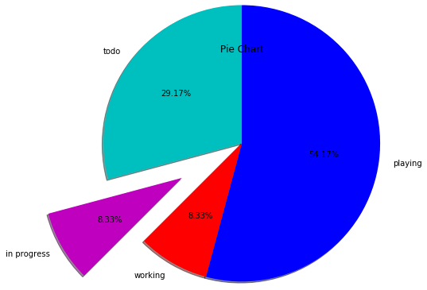

*********
Pie Chart
*********

* Display sections in whole group
* Automaticly calculate percentage
* optional features:

    * slice labels
    * auto-labeling the percentage
    * offsetting a slice with "explode"
    * drop-shadow
    * custom start angle

Simple Chart
============
.. code-block:: python

    import matplotlib.pyplot as plt

    days = [1, 2, 3, 4, 5]

    todo        = [4, 3, 3, 2, 0]
    in_progress = [6, 6, 5, 5, 2]
    in_tests    = [0, 1, 2, 2, 5]
    done        = [0, 0, 0, 1, 3]

    slices = [7, 2, 2, 13]
    status = ['todo', 'in progress', 'working', 'playing']
    colors = ['c', 'm', 'r', 'b']

    plt.pie(
        x=slices,            # data
        labels=status,       # name of the slices
        colors=colors,       # colors
        startangle=90,       # angle at which start plotting
        shadow=True,         # drop shadow outline?
        explode=[0,1,0,0],   # which piece to explode out from the chart
        autopct='%1.2f%%',   # number formatting
        radius=2,            # size of the chart
    )

    plt.title('Pie Chart')

    plt.show()

Donut Pie Chart
===============
.. code-block:: python

    fig, ax = plt.subplots()

    size = 0.3
    vals = np.array([[60., 32.], [37., 40.], [29., 10.]])

    cmap = plt.get_cmap("tab20c")
    outer_colors = cmap(np.arange(3)*4)
    inner_colors = cmap(np.array([1, 2, 5, 6, 9, 10]))

    ax.pie(vals.sum(axis=1), radius=1, colors=outer_colors,
           wedgeprops=dict(width=size, edgecolor='w'))

    ax.pie(vals.flatten(), radius=1-size, colors=inner_colors,
           wedgeprops=dict(width=size, edgecolor='w'))

    ax.set(aspect="equal", title='Pie plot with `ax.pie`')
    plt.show()

.. figure:: img/matplotlib-plt-pie-nested.png
    :scale: 100%
    :align: center

    Pie chart
