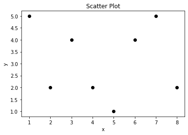
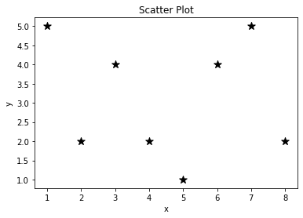
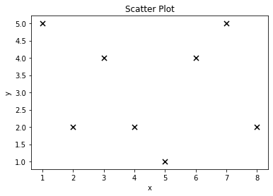
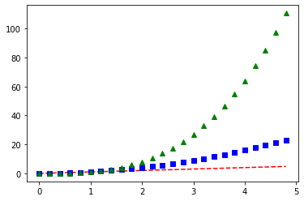
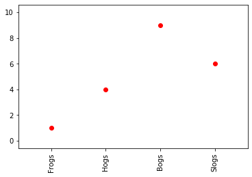

************
Scatter Plot
************

* Used to show correlation

Simple Points
=============
.. code-block:: python

    import matplotlib.pyplot as plt

    x = [1, 2, 3, 4]
    y = [1, 2, 3, 4]

    plt.plot(x, y, 'o')
    plt.show()

.. figure:: img/chart-scatter-points.png
    :scale: 100%
    :align: center

Point Scatter
=============
.. code-block:: python

    import matplotlib.pyplot as plt

    x = [1, 2, 3, 4, 5, 6, 7, 8]
    y = [5, 2, 4, 2, 1, 4, 5, 2]

    plt.scatter(x, y, label='my points', color='black')

    plt.xlabel('x')
    plt.ylabel('y')
    plt.title('Scatter Plot')

    plt.show()

Star Markers
============
.. code-block:: python

    import matplotlib.pyplot as plt

    x = [1, 2, 3, 4, 5, 6, 7, 8]
    y = [5, 2, 4, 2, 1, 4, 5, 2]

    plt.scatter(
        x=x,
        y=y,
        label='my points',
        color='black',
        marker='*',        # type of the points
        s=100,             # size
    )

    plt.xlabel('x')
    plt.ylabel('y')
    plt.title('Scatter Plot')

    plt.show()

Cross markers
=============
.. code-block:: python

    import matplotlib.pyplot as plt

    x = [1, 2, 3, 4, 5, 6, 7, 8]
    y = [5, 2, 4, 2, 1, 4, 5, 2]

    plt.scatter(
        x=x,
        y=y,
        label='my points',
        color='black',
        marker='x',        # type of the points
        s=50,             # size
    )

    plt.xlabel('x')
    plt.ylabel('y')
    plt.title('Scatter Plot')

    plt.show()

Examples
========
.. code-block:: python

    import matplotlib.pyplot as plt

    x = [1,2,3,4,5,6,7,8]
    y = [4,7,6,2,7,4,5,2]

    plt.scatter(x, y, marker='*', color='red', s=500)   # ``s`` = size
    plt.scatter(y, x, marker='o', color='blue')

    plt.show()

.. figure:: img/matplotlib-plt-scatter.png
    :scale: 100%
    :align: center

Multiple Points
---------------
.. literalinclude:: src/matplotlib-points-multiple.py
    :language: python
    :caption: Multiple Points

Points with Labels
------------------
.. literalinclude:: src/matplotlib-points-labels.py
    :language: python
    :caption: Points with Labels

