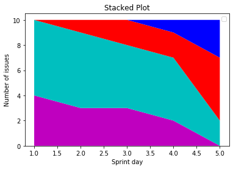
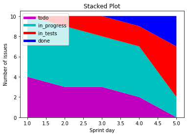

Stacked Plot
============

* Display sections in whole group

No labels
---------
.. code-block:: python

    import matplotlib.pyplot as plt

    days = [1, 2, 3, 4, 5]

    todo        = [4, 3, 3, 2, 0]
    in_progress = [6, 6, 5, 5, 2]
    in_tests    = [0, 1, 2, 2, 5]
    done        = [0, 0, 0, 1, 3]

    plt.stackplot(days, todo, in_progress, in_tests, done, colors=['m', 'c', 'r', 'b'])

    plt.xlabel('Sprint day')
    plt.ylabel('Number of issues')
    plt.title('Stacked Plot')
    plt.legend()

    plt.show()

With labels
-----------
.. code-block:: python

    import matplotlib.pyplot as plt

    days = [1, 2, 3, 4, 5]

    todo        = [4, 3, 3, 2, 0]
    in_progress = [6, 6, 5, 5, 2]
    in_tests    = [0, 1, 2, 2, 5]
    done        = [0, 0, 0, 1, 3]

    plt.plot([], [], color='m', linewidth=5, label='todo')
    plt.plot([], [], color='c', linewidth=5, label='in_progress')
    plt.plot([], [], color='r', linewidth=5, label='in_tests')
    plt.plot([], [], color='b', linewidth=5, label='done')

    plt.stackplot(days, todo, in_progress, in_tests, done, colors=['m', 'c', 'r', 'b'])

    plt.xlabel('Sprint day')
    plt.ylabel('Number of issues')
    plt.title('Stacked Plot')
    plt.legend(loc='upper left')

    plt.show()

Stack plot
----------
.. code-block:: python

    import matplotlib.pyplot as plt

    days = [1, 2, 3, 4, 5]
    labels = ['To Do', 'In Progress', 'In Test', 'In Review', 'Done']

    # how many issues were in each status on given day
    todo        = [10, 8, 6, 4, 2]
    in_progress = [2, 3, 4, 3, 2]
    in_test     = [7, 8, 7, 2, 2]
    in_review   = [8, 5, 7, 8, 1]
    done        = [0, 2, 4, 6, 12]

    plt.stackplot(days, todo, in_progress, in_test, in_review, done, labels=labels)
    plt.legend(loc='upper left')

    plt.show()

.. figure:: img/matplotlib-plt-stackplot.png
    :scale: 100%
    :align: center

    Stack plot
