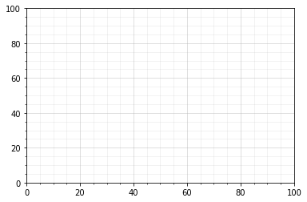
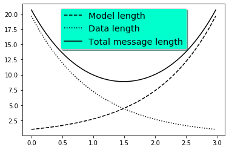
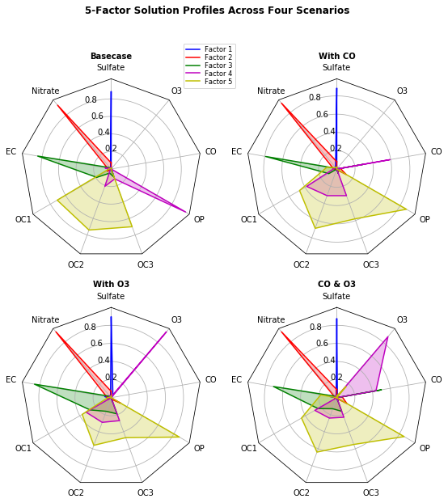

*******************
Matplotlib Examples
*******************

Examples
========
.. code-block:: python

    import numpy as np
    import matplotlib.pyplot as plt

    # evenly sampled time at 200ms intervals
    t = np.arange(0., 5., 0.2)

    # red dashes, blue squares and green triangles
    plt.plot(t, t, 'r--', t, t**2, 'bs', t, t**3, 'g^')
    plt.show()

.. code-block:: python

    import numpy as np
    import matplotlib.pyplot as plt

    # evenly sampled time at 200ms intervals
    t = np.arange(0., 5., 0.2)

    # red dashes, blue squares and green triangles
    plt.plot(t, t, 'r--')
    plt.plot(t, t**2, 'bs')
    plt.plot(t, t**3, 'g^')

    plt.show()

.. figure:: img/matplotlib-multiple.png
    :width: 75%
    :align: center

    Multiple lines on one chart

Gallery
=======
* https://matplotlib.org/gallery/index.html

Scales
======
.. literalinclude:: src/matplotlib-scales.py
    :language: python
    :caption: Scales

.. figure:: img/example-scales.png
    :width: 75%
    :align: center

Grid
====
.. literalinclude:: src/matplotlib-grid-extra.py
    :language: python
    :caption: Grid

Legend using pre-defined labels
===============================
.. literalinclude:: src/matplotlib-legend.py
    :language: python
    :caption: Legend using pre-defined labels

Radar Chart
===========
.. literalinclude:: src/matplotlib-radar-chart.py
    :language: python
    :caption: Radar Chart

