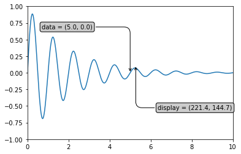

****************
Advanced Styling
****************

Label rotation
==============
.. literalinclude:: src/matplotlib-tick-rotation.py
    :language: python
    :caption: Lablel rotation

.. figure:: img/matplotlib-tick-rotation.png
    :width: 75%
    :align: center

    Lablel rotation

Grid
====
.. literalinclude:: src/matplotlib-grid-simple.py
    :language: python
    :caption: Grid Simple

.. figure:: img/matplotlib-grid-simple.png
    :width: 75%
    :align: center

    Grid Simple

.. literalinclude:: src/matplotlib-grid-extra.py
    :language: python
    :caption: Grid Extra

.. figure:: img/matplotlib-grid-extra.png
    :width: 75%
    :align: center

    Grid Extra

Trend line
==========
.. literalinclude:: src/matplotlib-trendline.py
    :language: python
    :caption: Trend line

.. figure:: img/matplotlib-trendline.png
    :width: 75%
    :align: center

    Trend line

Error bars
==========
.. literalinclude:: src/matplotlib-plt-errorbar.py
    :language: python
    :caption: Error bars

.. figure:: img/matplotlib-plt-errorbar.png
    :width: 75%
    :align: center

    Error bars

Colorbar
========
.. literalinclude:: src/matplotlib-colorbar.py
    :language: python
    :caption: Colorbar

.. figure:: img/matplotlib-colorbar.png
    :width: 75%
    :align: center

    Colorbar

Changing colors
===============
.. code-block:: python

    ax.spines['bottom'].set_color('#dddddd')
    ax.spines['top'].set_color('#dddddd')
    ax.spines['right'].set_color('red')
    ax.spines['left'].set_color('red')

.. code-block:: python

    ax.tick_params(axis='x', colors='red')
    ax.tick_params(axis='y', colors='red')

.. code-block:: python

    ax.yaxis.label.set_color('red')
    ax.xaxis.label.set_color('red')

.. code-block:: python

    ax.title.set_color('red')

Using mathematical expressions in text
======================================
.. code-block:: python

    plt.title(r'$\sigma_i=15$')

Annotations
===========

Single Annotation
-----------------
.. code-block:: python

    import matplotlib.pyplot as plt
    import numpy as np

    ax = plt.subplot(111)

    t = np.arange(0.0, 5.0, 0.01)
    s = np.cos(2*np.pi*t)
    line, = plt.plot(t, s, lw=2)

    plt.annotate('local max',
        xy=(2, 1),
        xytext=(3, 1.5),
        arrowprops={'facecolor': 'black', 'shrink': 0.05},
    )

    plt.ylim(-2,2)
    plt.show()

.. figure:: img/style-annotations-simple.png
    :width: 75%
    :align: center

Multiple Annotations
--------------------
.. literalinclude:: src/matplotlib-annotate-multiple.py
    :language: python
    :caption: Multiple Annotations

