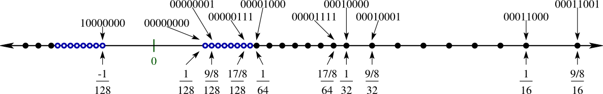

*********
Precision
*********

Rationale
=========
.. doctest::

    >>> 0.1
    0.1

    >>> 0.2
    0.2

    >>> 0.3
    0.3

    >>> 0.1 + 0.2 == 0.3
    False

    >>> 0.1 + 0.2
    0.30000000000000004

    >>> round(0.1+0.2, 16) == 0.3
    True

    >>> round(0.1+0.2, 17) == 0.3
    False

IEEE 754 standard
=================
.. doctest::

    >>> 1.234 == 1234 * 10e-4
    True

    >>> 1234 * 10e-4
    1.234

.. figure:: img/numpy-precision-float-anatomy.png
    :width: 75%
    :align: center

    What is ``float`` as defined by IEEE 754 standard

.. figure:: img/numpy-precision-float-expression.png
    :width: 75%
    :align: center

    Points chart

.. figure:: img/numpy-precision-float-mantissa-1.png
    :width: 75%
    :align: center

    How computer store ``float``?
    As defined by IEEE 754 standard

.. figure:: img/numpy-precision-float-mantissa-2.png
    :width: 75%
    :align: center

    How to read/write ``float`` from/to memory?

    Normalized Line

Solutions
=========
* Round values to 4 decimal places (generally acceptable)
* Store values as ``int``, do operation and then divide. For example instead of 1.99 USD, store price as 199 US cents
* Use ``Decimal`` type
* ``Decimal`` type is much slower

 .. code-block:: python
    :caption: Problem

    candy = 0.10      # price in dollars
    cookie = 0.20     # price in dollars

    result = candy + cookie
    print(result)
    # 0.30000000000000004

 .. code-block:: python
    :caption: Round values to 4 decimal places (generally acceptable)

    candy = 0.10      # price in dollars
    cookie = 0.20     # price in dollars

    result = round(candy + cookie, 4)
    print(result)
    # 0.3

 .. code-block:: python
    :caption: Store values as ``int``, do operation and then divide.

    candy = 10        # price in cents
    cookie = 20       # price in cents

    result = (candy + cookie) / 100   # divide by 100 (number of cents in dollar)
    print(result)
    # 0.30

.. code-block:: python
    :caption: Use ``Decimal`` type

    from decimal import Decimal

    candy = Decimal('0.10')     # price in dollars
    cookie = Decimal('0.20')    # price in dollars

    result = candy + cookie
    print(result)
    # 0.30
