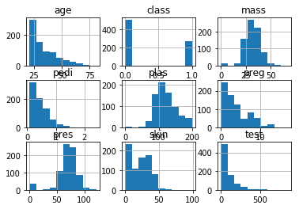

******
Pandas
******

.. todo:: convert tables to CSV
.. todo:: https://www.shanelynn.ie/summarising-aggregation-and-grouping-data-in-python-pandas/

Pandas is a Python package providing fast, flexible, and expressive data structures designed to make working with "relational" or "labeled" data both easy and intuitive. It aims to be the fundamental high-level building block for doing practical, real world data analysis in Python. Additionally, it has the broader goal of becoming the most powerful and flexible open source data analysis / manipulation tool available in any language. It is already well on its way toward this goal. Here are just a few of the things that pandas does well:

    - Easy handling of missing data (represented as NaN) in floating point as well as non-floating point data
    - Size mutability: columns can be inserted and deleted from DataFrame and higher dimensional objects
    - Automatic and explicit data alignment: objects can be explicitly aligned to a set of labels, or the user can simply ignore the labels and let Series, DataFrame, etc. automatically align the data for you in computations
    - Powerful, flexible group by functionality to perform split-apply-combine operations on data sets, for both aggregating and transforming data
    - Make it easy to convert ragged, differently-indexed data in other Python and NumPy data structures into DataFrame objects
    - Intelligent label-based slicing, fancy indexing, and subsetting of large data sets
    - Intuitive merging and joining data sets
    - Flexible reshaping and pivoting of data sets
    - Hierarchical labeling of axes (possible to have multiple labels per tick)
    - Robust IO tools for loading data from flat files (CSV and delimited), Excel files, databases, and saving/loading data from the ultrafast HDF5 format
    - Time series-specific functionality: date range generation and frequency conversion, moving window statistics, moving window linear regressions, date shifting and lagging, etc.

    * http://pandas.pydata.org/

* http://pandas.pydata.org/
* http://pandas.pydata.org/pandas-docs/stable/10min.html
* http://pandas.pydata.org/pandas-docs/stable/index.html
* https://github.com/pandas-dev/pandas/blob/master/doc/cheatsheet/Pandas_Cheat_Sheet.pdf

Podstawowymi strukturami danych w Pandas jest Series (seria) i DataFrame (obiekt tabeli); zobacz dokumentacje po więcej informacji.

.. code-block:: python

    import pandas as pd
    import numpy as np

TL;DR
=====
.. csv-table:: Pandas most commonly used functions
    :header-rows: 1

    "``DataFrame.at()``", "Access a single value for a row/column label pair"
    "``DataFrame.iat()``", "Access a single value for a row/column pair by integer position"
    "``DataFrame.loc()``", "Access a group of rows and columns by label(s)"
    "``DataFrame.iloc()``", "Access a group of rows and columns by integer position(s)"
    "", ""
    "", ""
    "", ""
    "", ""
    "", ""
    "", ""

Import and Export
=================

Import data to ``DataFrame``
----------------------------
* Also works with URLs!!
* SQL functions uses SQLAlchemy, which supports many RDBMS

.. code-block:: python

    pd.read_csv()
    pd.read_excel()
    pd.read_html()
    pd.read_json()
    pd.read_sas()
    pd.read_sql()        # Read SQL query or database table into a DataFrame
    pd.read_sql_query()  # Read SQL query into a DataFrame
    pd.read_sql_table()  # Read SQL database table into a DataFrame

Export ``DataFrame``
--------------------
* Also works with URLs!!
* SQL functions uses SQLAlchemy, which supports many RDBMS

.. code-block:: python

    DataFrame.to_csv()
    DataFrame.to_excel()
    DataFrame.to_html()
    DataFrame.to_json()
    DataFrame.to_latex()
    DataFrame.to_dict()
    DataFrame.to_sql()

Display Output
==============
* Set options for whole script:

    .. code-block:: python

        pd.set_option('display.height',1000)
        pd.set_option('display.max_rows',500)
        pd.set_option('display.max_columns',500)
        pd.set_option('display.width',1000)

* Unlimited for whole script:

    .. code-block:: python

        pd.set_option('display.max_columns', None)
        pd.set_option('display.max_rows', None)

* Use config only with context:

    .. code-block:: python

        with pd.option_context('display.max_rows', None, 'display.max_columns', 3):
            print(df)

Vizualization
=============

Hist
----
.. code-block:: python

    import matplotlib.pyplot as plt
    import pandas as pd

    url = 'https://raw.githubusercontent.com/AstroMatt/book-python/master/numerical-analysis/data/iris-clean.csv'
    data = pd.read_csv(url)

    data.hist()
    plt.show()

    Vizualization using hist

Density
-------
.. code-block:: python

    import matplotlib.pyplot as plt
    import pandas as pd

    url = 'https://raw.githubusercontent.com/AstroMatt/book-python/master/numerical-analysis/data/iris-clean.csv'
    data = pd.read_csv(url)

    data.plot(kind='density', subplots=True, layout=(3,3), sharex=False)
    plt.show()

.. figure:: img/matplotlib-pd-density.png
    :scale: 100%
    :align: center

    Vizualization using density

Box
---
.. code-block:: python

    import matplotlib.pyplot as plt
    import pandas as pd

    url = 'https://raw.githubusercontent.com/AstroMatt/book-python/master/numerical-analysis/data/iris-clean.csv'
    data = pd.read_csv(url)

    data.plot(kind='box', subplots=True, layout=(3,3), sharex=False, sharey=False)
    plt.show()

.. figure:: img/matplotlib-pd-box.png
    :scale: 100%
    :align: center

    Vizualization using density

Scatter matrix
--------------
* The in ``pandas`` version ``0.22`` plotting module has been moved from ``pandas.tools.plotting`` to ``pandas.plotting``
* As of version ``0.19``, the ``pandas.plotting`` library did not exist

.. code-block:: python

    import matplotlib.pyplot as plt
    import pandas as pd
    from pandas.plotting import scatter_matrix

    url = 'https://raw.githubusercontent.com/AstroMatt/book-python/master/numerical-analysis/data/iris-clean.csv'
    data = pd.read_csv(url)

    scatter_matrix(data)
    plt.show()

.. figure:: img/matplotlib-pd-scatter-matrix.png
    :scale: 100%
    :align: center

    Vizualization using density

Descriptive statistics
======================
.. csv-table:: Descriptive statistics
    :header-rows: 1

    "Function", "Description"
    "``count``", "Number of non-null observations"
    "``sum``", "Sum of values"
    "``mean``", "Mean of values"
    "``mad``", "Mean absolute deviation"
    "``median``", "Arithmetic median of values"
    "``min``", "Minimum"
    "``max``", "Maximum"
    "``mode``", "Mode"
    "``abs``", "Absolute Value"
    "``prod``", "Product of values"
    "``std``", "Unbiased standard deviation"
    "``var``", "Unbiased variance"
    "``sem``", "Unbiased standard error of the mean"
    "``skew``", "Unbiased skewness (3rd moment)"
    "``kurt``", "Unbiased kurtosis (4th moment)"
    "``quantile``", "Sample quantile (value at %)"
    "``cumsum``", "Cumulative sum"
    "``cumprod``", "Cumulative product"
    "``cummax``", "Cumulative maximum"
    "``cummin``", "Cumulative minimum"

Assignments
===========
