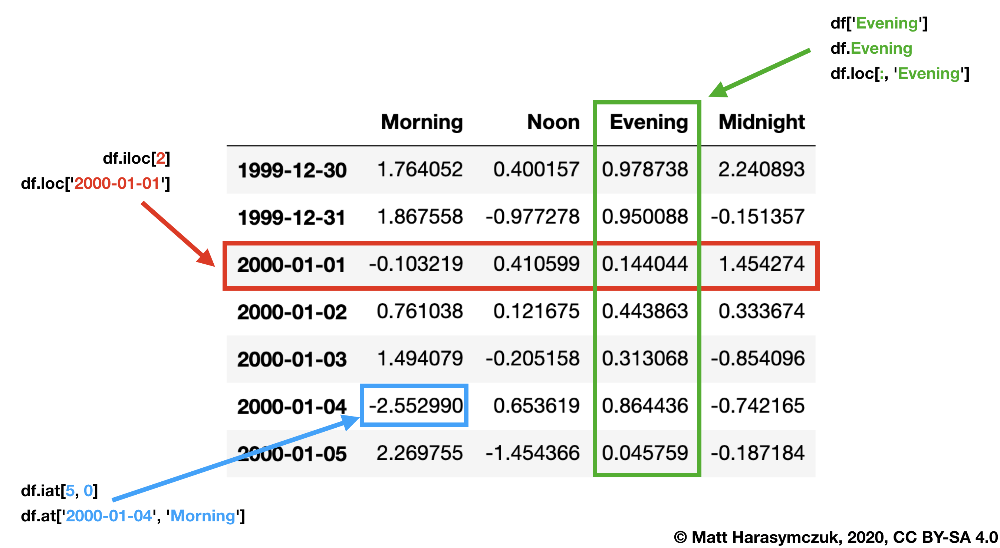

*************
DataFrame Loc
*************

* ``loc`` - uses fancy indexing
* ``iloc`` - only index numbers
* ``df.loc`` - start and stop are included!!
* ``df.iloc`` - behaves like Python slices

.. code-block:: python

    import pandas as pd
    import numpy as np
    np.random.seed(0)

    df = pd.DataFrame(
        columns = ['Morning', 'Noon', 'Evening', 'Midnight'],
        index = pd.date_range('1999-12-30', periods=7),
        data = np.random.randn(7, 4))

    df
    #              Morning      Noon   Evening  Midnight
    # 1999-12-30  1.764052  0.400157  0.978738  2.240893
    # 1999-12-31  1.867558 -0.977278  0.950088 -0.151357
    # 2000-01-01 -0.103219  0.410599  0.144044  1.454274
    # 2000-01-02  0.761038  0.121675  0.443863  0.333674
    # 2000-01-03  1.494079 -0.205158  0.313068 -0.854096
    # 2000-01-04 -2.552990  0.653619  0.864436 -0.742165
    # 2000-01-05  2.269755 -1.454366  0.045759 -0.187184

All Values in Row
=================

Single row
----------
* Returns the row as a ``pd.Series``

.. code-block:: python

    df.loc['2000-01-01']
    # Morning    -0.103219
    # Noon        0.410599
    # Evening     0.144044
    # Midnight    1.454274
    # Name: 2000-01-01 00:00:00, dtype: float64

Range of rows
-------------
* Returns the rows as a ``pd.DataFrame``

.. code-block:: python

    df.loc['2000-01-02':'2000-01-04']
    #              Morning      Noon   Evening  Midnight
    # 2000-01-02  0.761038  0.121675  0.443863  0.333674
    # 2000-01-03  1.494079 -0.205158  0.313068 -0.854096
    # 2000-01-04 -2.552990  0.653619  0.864436 -0.742165

Range of dates
--------------
.. code-block:: python

    df.loc['2000-01']
    #              Morning      Noon   Evening  Midnight
    # 2000-01-01 -0.103219  0.410599  0.144044  1.454274
    # 2000-01-02  0.761038  0.121675  0.443863  0.333674
    # 2000-01-03  1.494079 -0.205158  0.313068 -0.854096
    # 2000-01-04 -2.552990  0.653619  0.864436 -0.742165
    # 2000-01-05  2.269755 -1.454366  0.045759 -0.187184

    df.loc['1999']
    #              Morning      Noon   Evening  Midnight
    # 1999-12-30  1.764052  0.400157  0.978738  2.240893
    # 1999-12-31  1.867558 -0.977278  0.950088 -0.151357

Values in Selected Columns
==========================

Single row and single column
----------------------------
.. code-block:: python

    df.loc['2000-01-05', 'Morning']
    # 2.2697546239876076

Range of rows and single column
-------------------------------
* Note that both the start and stop of the slice are included

.. code-block:: python

    df.loc['1999-12-31':'2000-01-02', 'Noon']
    # 1999-12-31   -0.977278
    # 2000-01-01    0.410599
    # 2000-01-02    0.121675
    # Freq: D, Name: Noon, dtype: float64

Range of rows and single column
-------------------------------
* For Numeric Index, Range Index and String Index works without conversion
* For Datetime index, conversion to ``pd.Timestamp()`` is needed

.. code-block:: python

    df.loc[['2000-01-02','2000-01-04'], 'Noon']
    # KeyError: "None of [Index(['2000-01-02', '2000-01-04'], dtype='object')] are in the [index]"

.. code-block:: python

    date1 = pd.Timestamp('2000-01-02')
    date2 = pd.Timestamp('2000-01-05')

    df.loc[[date1,date2], 'Noon']
    # 2000-01-02    0.121675
    # 2000-01-05   -1.454366
    # Name: Noon, dtype: float64

Single row and selected columns
-------------------------------
.. code-block:: python

    df.loc['2000-01-05', ['Noon', 'Midnight']]
    # Noon       -1.454366
    # Midnight   -0.187184
    # Name: 2000-01-05 00:00:00, dtype: float64

Single row and column range
---------------------------
.. code-block:: python

    df.loc['2000-01-05', 'Noon':'Midnight']
    # Noon       -1.454366
    # Evening     0.045759
    # Midnight   -0.187184
    # Name: 2000-01-05 00:00:00, dtype: float64

Fancy Indexing
==============

Boolean list with the same length as the row axis
-------------------------------------------------
* Print row for given index is ``True``

.. code-block:: python

    df.loc[[True, False, True, False, False, False, True]]
    #              Morning      Noon   Evening  Midnight
    # 1999-12-30  1.764052  0.400157  0.978738  2.240893
    # 2000-01-01 -0.103219  0.410599  0.144044  1.454274
    # 2000-01-05  2.269755 -1.454366  0.045759 -0.187184

Conditional that returns a boolean Series
-----------------------------------------
.. code-block:: python

    df.loc[df['Morning'] < 0]
    #              Morning      Noon   Evening  Midnight
    # 2000-01-01 -0.103219  0.410599  0.144044  1.454274
    # 2000-01-04 -2.552990  0.653619  0.864436 -0.742165

Conditional that returns a boolean Series with column labels specified
----------------------------------------------------------------------
.. code-block:: python

    df.loc[df['Morning'] < 0, 'Evening']
    # 2000-01-01    0.144044
    # 2000-01-04    0.864436
    # Freq: 3D, Name: Evening, dtype: float64

.. code-block:: python

    df.loc[df['Morning'] < 0, ['Morning', 'Evening']]
    #              Morning   Evening
    # 2000-01-01 -0.103219  0.144044
    # 2000-01-04 -2.552990  0.864436

.. code-block:: python

    where = df['Morning'] < 0

    df.loc[where, ['Morning', 'Evening']]
    #              Morning   Evening
    # 2000-01-01 -0.103219  0.144044
    # 2000-01-04 -2.552990  0.864436

.. code-block:: python

    where = df['Morning'] < 0
    select = ['Morning', 'Evening']

    df.loc[where, select]
    #              Morning   Evening
    # 2000-01-01 -0.103219  0.144044
    # 2000-01-04 -2.552990  0.864436

Callable
========

Filtering with callable
-----------------------
.. code-block:: python

    def morning_below_zero(df):
        return df['Morning'] < 0

    df.loc[morning_below_zero]
    #                  Morning      Noon   Evening  Midnight
    # 2000-01-01 -0.103219  0.410599  0.144044  1.454274
    # 2000-01-04 -2.552990  0.653619  0.864436 -0.742165

.. code-block:: python

    df.loc[lambda df: df['Morning'] < 0]
    #              Morning      Noon   Evening  Midnight
    # 2000-01-01 -0.103219  0.410599  0.144044  1.454274
    # 2000-01-04 -2.552990  0.653619  0.864436 -0.742165

Setting Values
==============

Set value for all items matching the list of labels
---------------------------------------------------
.. code-block:: python

    df.loc[df['Morning'] < 0, 'Evening'] = np.inf
    #              Morning      Noon   Evening  Midnight
    # 1999-12-30  1.764052  0.400157  0.978738  2.240893
    # 1999-12-31  1.867558 -0.977278  0.950088 -0.151357
    # 2000-01-01 -0.103219  0.410599       inf  1.454274
    # 2000-01-02  0.761038  0.121675  0.443863  0.333674
    # 2000-01-03  1.494079 -0.205158  0.313068 -0.854096
    # 2000-01-04 -2.552990  0.653619       inf -0.742165
    # 2000-01-05  2.269755 -1.454366  0.045759 -0.187184

Set value for an entire row
---------------------------
.. code-block:: python

    df.loc['2000-01-01'] = np.nan
    #              Morning      Noon   Evening  Midnight
    # 1999-12-30  1.764052  0.400157  0.978738  2.240893
    # 1999-12-31  1.867558 -0.977278  0.950088 -0.151357
    # 2000-01-01       NaN       NaN       NaN       NaN
    # 2000-01-02  0.761038  0.121675  0.443863  0.333674
    # 2000-01-03  1.494079 -0.205158  0.313068 -0.854096
    # 2000-01-04 -2.552990  0.653619       inf -0.742165
    # 2000-01-05  2.269755 -1.454366  0.045759 -0.187184

Set value for an entire column
------------------------------
.. code-block:: python

    df.loc[:, 'Evening'] = 0.0
    #              Morning      Noon  Evening  Midnight
    # 1999-12-30  1.764052  0.400157      0.0  2.240893
    # 1999-12-31  1.867558 -0.977278      0.0 -0.151357
    # 2000-01-01       NaN       NaN      0.0       NaN
    # 2000-01-02  0.761038  0.121675      0.0  0.333674
    # 2000-01-03  1.494079 -0.205158      0.0 -0.854096
    # 2000-01-04 -2.552990  0.653619      0.0 -0.742165
    # 2000-01-05  2.269755 -1.454366      0.0 -0.187184

Set value for rows matching callable condition
----------------------------------------------
.. code-block:: python

    df[df < 0] = -np.inf
    df
    #              Morning      Noon  Evening  Midnight
    # 1999-12-30  1.764052  0.400157      0.0  2.240893
    # 1999-12-31  1.867558      -inf      0.0      -inf
    # 2000-01-01       NaN       NaN      0.0       NaN
    # 2000-01-02  0.761038  0.121675      0.0  0.333674
    # 2000-01-03  1.494079      -inf      0.0      -inf
    # 2000-01-04      -inf  0.653619      0.0      -inf
    # 2000-01-05  2.269755      -inf      0.0      -inf

Assignments
===========
.. todo:: Create assignments
