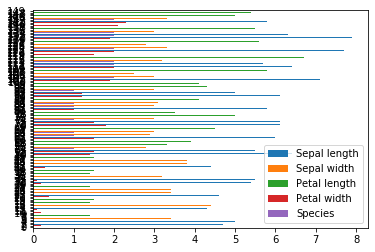

.. _Pandas DataFrame Plotting:

******************
DataFrame Plotting
******************

* https://pandas.pydata.org/pandas-docs/stable/user_guide/visualization.html

Plot kinds
==========
* ``line`` - Line Plot
* ``bar`` - Vertical Bar Plot
* ``barh`` - Horizontal Bar Plot
* ``hist`` - Histogram
* ``box`` - Boxplot
* ``density``, ``kde`` - Kernel Density Estimation Plot
* ``area`` - Area Plot
* ``pie`` - Pie Plot
* ``scatter`` - Scatter Plot
* ``hexbin`` - Hexbin Plot

Parameters
==========
.. list-table:: Parameters
    :header-rows: 1
    :widths: 5, 15, 15, 65

    * - Parameter
      - Type
      - Default
      - Description

    * - ``data``
      - Series or DataFrame
      - None
      - The object for which the method is called

    * - ``x``
      - label or position
      - None
      - Only used if data is a DataFrame

    * - ``y``
      - label, position or list of label, positions
      - None
      - Allows plotting of one column versus another. Only used if data is a DataFrame.

    * - ``kind``
      - str
      - ``line``
      - ``line``, ``bar``, ``barh``, ``hist``, ``box``, ``kde``, ``density``, ``area``, ``pie``, ``scatter``, ``hexbin``

    * - ``figsize``
      - tuple
      - None
      - (width, height) in inches

    * - ``use_index``
      - bool
      - True
      - Use index as ticks for x axis

    * - ``title``
      - str or list
      - None
      - Title to use for the plot. If a string is passed, print the string at the top of the figure. If a list is passed and `subplots` is True, print each item in the list above the corresponding subplot.

    * - ``grid``
      - bool
      - None
      - (matlab style default) Axis grid lines

    * - ``legend``
      - bool or 'reverse'
      - None
      - Place legend on axis subplots

    * - ``style``
      - list or dict
      - None
      - matplotlib line style per column

    * - ``logx``
      - bool or 'sym'
      - False
      - Use log scaling or symlog scaling on x axis

    * - ``logy``
      - bool or 'sym'
      - False
      - Use log scaling or symlog scaling on y axis

    * - ``loglog``
      - bool or 'sym'
      - False
      - Use log scaling or symlog scaling on both x and y axes

    * - ``xticks``
      - sequence
      - None
      - Values to use for the xticks

    * - ``yticks``
      - sequence
      - None
      - Values to use for the yticks

    * - ``xlim``
      - 2-tuple/list
      - None
      -

    * - ``ylim``
      - 2-tuple/list
      - None
      -

    * - ``rot``
      - int
      - None
      - Rotation for ticks (xticks for vertical, yticks for horizontal plots)

    * - ``fontsize``
      - int
      - None
      - Font size for xticks and yticks

    * - ``colormap``
      - str or matplotlib colormap object
      - default None
      - Colormap to select colors from. If string, load colormap with that name from matplotlib.

    * - ``colorbar``
      - bool
      - None
      - If True, plot colorbar (only relevant for 'scatter' and 'hexbin' plots)

    * - ``position``
      - float
      - 0.5 (center)
      - Specify relative alignments for bar plot layout. From 0 (left/bottom-end) to 1 (right/top-end).

    * - ``table``
      - bool, Series or DataFrame
      - False
      - If True, draw a table using the data in the DataFrame and the data will be transposed to meet matplotlib's default layout. If a Series or DataFrame is passed, use passed data to draw a table.

    * - ``yerr``
      - DataFrame, Series, array-like, dict or str
      - None
      - Equivalent to xerr.

    * - ``xerr``
      - DataFrame, Series, array-like, dict or str
      - None
      - Equivalent to yerr.

    * - ``mark_right``
      - bool
      - True
      - When using a secondary_y axis, automatically mark the column labels with "(right)" in the legend.

    * - ``**kwds``
      - keywords
      - None
      - Options to pass to matplotlib plotting method.

Prepare Data
============
.. code-block:: python

    import pandas as pd

    DATA = 'https://raw.githubusercontent.com/AstroMatt/book-python/master/numerical-analysis/pandas/data/iris.csv'

    df = pd.read_csv(DATA)
    df.columns = [
        'Sepal length',
        'Sepal width',
        'Petal length',
        'Petal width',
        'Species'
    ]

Generate Plot
=============

Line Plot
---------
* default

.. code-block:: python

    df.plot()

.. code-block:: python

    df.plot(kind='line')

.. figure:: img/plot-line.png
    :align: center
    :scale: 100

    Line Plot

Vertical Bar Plot
-----------------
.. code-block:: python

    df.plot(kind='bar')

.. figure:: img/plot-bar.png
    :align: center
    :scale: 100

    Vertical Bar Plot

Horizontal Bar Plot
-------------------
.. code-block:: python

    df.plot(kind='barh')

    Horizontal Bar Plot

Histogram
---------
.. code-block:: python

    df.plot(kind='hist')

.. figure:: img/plot-hist.png
    :align: center
    :scale: 100

    Histogram

Boxplot
-------
.. code-block:: python

    df.plot(kind='box')

.. figure:: img/plot-box.png
    :align: center
    :scale: 100

    Boxplot

Kernel Density Estimation Plot
------------------------------
.. code-block:: python

    df.plot(kind='density')

.. code-block:: python

    df.plot(kind='kde')

.. figure:: img/plot-density.png
    :align: center
    :scale: 100

    Kernel Density Estimation Plot

Area Plot
---------
.. code-block:: python

    df.plot(kind='area')

.. figure:: img/plot-area.png
    :align: center
    :scale: 100

    Area Plot

Pie Plot
--------
.. code-block:: python

    df.plot(kind='pie')

.. figure:: img/plot-pie.png
    :align: center
    :scale: 100

    Pie Plot

Scatter Plot
------------
.. code-block:: python

    df.plot(kind='scatter')

.. figure:: img/plot-scatter.png
    :align: center
    :scale: 100

    Scatter Plot

Hexbin Plot
-----------
.. code-block:: python

    df.plot(kind='hexbin')

.. figure:: img/plot-hexbin.png
    :align: center
    :scale: 100

    Hexbin Plot

Other
=====

Hist
----
.. code-block:: python

    import matplotlib.pyplot as plt
    import pandas as pd

    DATA = 'https://raw.githubusercontent.com/AstroMatt/book-python/master/numerical-analysis/pandas/data/iris.csv'

    df = pd.read_csv(DATA)
    df.hist()
    plt.show()

.. figure:: img/matplotlib-pd-hist.png
    :scale: 40%
    :align: center

    Visualization using hist

Density
-------
.. code-block:: python

    import matplotlib.pyplot as plt
    import pandas as pd

    DATA = 'https://raw.githubusercontent.com/AstroMatt/book-python/master/numerical-analysis/pandas/data/iris.csv'

    df = pd.read_csv(DATA)
    df.plot(kind='density', subplots=True, layout=(2,2), sharex=False)
    plt.show()

.. figure:: img/matplotlib-pd-density.png
    :scale: 40%
    :align: center

    Visualization using density

Box
---
.. code-block:: python

    import matplotlib.pyplot as plt
    import pandas as pd

    DATA = 'https://raw.githubusercontent.com/AstroMatt/book-python/master/numerical-analysis/pandas/data/iris.csv'

    df = pd.read_csv(DATA)
    df.plot(kind='box', subplots=True, layout=(2,2), sharex=False, sharey=False)
    plt.show()

.. figure:: img/matplotlib-pd-box.png
    :scale: 40%
    :align: center

    Visualization using density

Scatter matrix
--------------
* The in ``pandas`` version ``0.22`` plotting module has been moved from ``pandas.tools.plotting`` to ``pandas.plotting``
* As of version ``0.19``, the ``pandas.plotting`` library did not exist

.. code-block:: python

    import matplotlib.pyplot as plt
    import pandas as pd
    from pandas.plotting import scatter_matrix

    DATA = 'https://raw.githubusercontent.com/AstroMatt/book-python/master/numerical-analysis/pandas/data/iris.csv'

    df = pd.read_csv(DATA)
    scatter_matrix(df)
    plt.show()

.. figure:: img/matplotlib-pd-scatter-matrix.png
    :scale: 40%
    :align: center

    Visualization using density

Assignments
===========

DataFrame Plot
--------------
* Complexity level: medium
* Lines of code to write: 15 lines
* Estimated time of completion: 30 min
* Solution: :download:`solution/df_plot.py`

:English:
    #. Download :download:`data/optima-sensors.xlsx`
    #. Select ``Luminance`` stylesheet
    #. Parse column with dates
    #. Select desired date and location, then resample by hour
    #. Display chart (line) with activity hours in "Sleeping Quarters upper" location
    #. Active is when ``Luminance`` is not zero
    #. Easy: for day 2019-09-28
    #. Advanced: for each day, as subplots

:Polish:
    #. Pobierz :download:`data/optima-sensors.xlsx`
    #. Wybierz arkusz ``Luminance``
    #. Sparsuj kolumny z datami
    #. Wybierz pożądaną datę i lokację, następnie próbkuj co godzinę
    #. Aktywność jest gdy ``Luminance`` jest różna od zera
    #. Wyświetl wykres (line) z godzinami aktywności w dla lokacji "Sleeping Quarters upper"
    #. Łatwe: dla dnia 2019-09-28
    #. Zaawansowane: dla wszystkich dni, jako subploty

:Hint:
    * ``np.sign()`` :ref:`Numpy signum`
    * ``.resample('H')``
    * ``.plot(kind, subplots, layout, sharex)``
