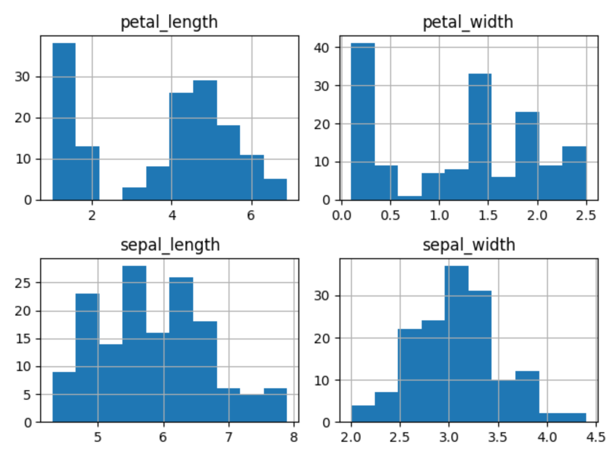
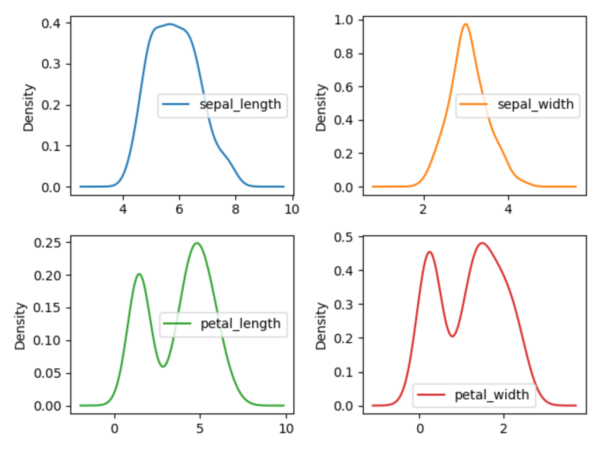

****************
Example Workflow
****************

Working with Excel file
=======================
.. code-block:: python

    import pandas as pd

    df = pd.read_excel(
        io='filename.xls',
        sheet_name=['Sheet 1'],
        encoding='utf-8',
        skiprows=1,
        skip_blank_lines=True,
        parse_dates=['from', 'to'],
    )

    # Rename Columns to match database columns
    df.rename(columns={
        'from': 'date_start',
        'to': 'date_end',
    }, inplace=True)

    # Drop all records where "Name" is empty (NaN)
    df.dropna(subset=['name'], how='all', inplace=True)

    # Add column ``blacklist`` with data
    df['blacklist'] = [True, False, True, False]

    # Change NaN to 0
    df.fillna(0, inplace=True)

    # Select columns
    columns = ['name', 'date_start', 'date_end', 'blacklist']

    # Print output
    print( df[columns] )

Working with dirty CSV
======================
.. code-block:: python

    url = 'https://raw.githubusercontent.com/AstroMatt/book-python/master/numerical-analysis/pandas/data/iris-dirty.csv'

    nrows, nfeatures, *species = pd.read_csv(url, nrows=0).columns
    species = dict(enumerate(species))

    df = pd.read_csv(url, skiprows=1, names=['sepal_length', 'sepal_width',
                                             'petal_length', 'petal_width', 'species'])

    df['species'].replace(species, inplace=True)
    df.plot(kind='density')

Working with CSV
================
.. code-block:: python

    import pandas as pd

    DATA = 'https://raw.githubusercontent.com/AstroMatt/book-python/master/numerical-analysis/pandas/data/iris.csv'

    # Read data
    df = pd.read_csv(DATA)

    # Rename Columns
    df.columns = [
        'Sepal length',
        'Sepal width',
        'Petal length',
        'Petal width',
        'Species'
    ]

    # Get first ``n`` records
    df.head(5)
    #    Sepal length  Sepal width  Petal length  Petal width  Species
    # 0           5.1          3.5           1.4          0.2        0
    # 1           4.9          3.0           1.4          0.2        0
    # 2           4.7          3.2           1.3          0.2        0
    # 3           4.6          3.1           1.5          0.2        0
    # 4           5.0          3.6           1.4          0.2        0

    # Get last ``n`` records
    df.tail(3)
    #      Sepal length  Sepal width  Petal length  Petal width  Species
    # 147           6.5          3.0           5.2          2.0        2
    # 148           6.2          3.4           5.4          2.3        2
    # 149           5.9          3.0           5.1          1.8        2

    # Change column Species values
    df['Species'].replace({
        0: 'setosa',
        1: 'versicolor',
        2: 'virginica'
    }, inplace=True)

    # Shuffle columns and reset indexes (drop column with old index)
    df = df.sample(frac=1.0).reset_index(drop=True)
    #      Sepal length  Sepal width     ...      Petal width     Species
    # 0             5.0          2.0     ...              1.0  versicolor
    # 1             6.4          2.7     ...              1.9   virginica
    # 2             5.6          3.0     ...              1.5  versicolor
    # 3             5.7          2.6     ...              1.0  versicolor
    # 4             6.4          3.1     ...              1.8   virginica
    # 5             4.6          3.6     ...              0.2      setosa
    # 6             5.9          3.0     ...              1.5  versicolor

    # Descriptive Statistics
    df.describe()
    #        Sepal length  Sepal width  Petal length  Petal width
    # count    150.000000   150.000000    150.000000   150.000000
    # mean       5.843333     3.057333      3.758000     1.199333
    # std        0.828066     0.435866      1.765298     0.762238
    # min        4.300000     2.000000      1.000000     0.100000
    # 25%        5.100000     2.800000      1.600000     0.300000
    # 50%        5.800000     3.000000      4.350000     1.300000
    # 75%        6.400000     3.300000      5.100000     1.800000
    # max        7.900000     4.400000      6.900000     2.500000

.. csv-table:: Descriptive statistics
    :header: "Function", "Description"
    :widths: 10, 90

    "``count``", "Number of non-null observations"
    "``sum``", "Sum of values"
    "``mean``", "Mean of values"
    "``mad``", "Mean absolute deviation"
    "``median``", "Arithmetic median of values"
    "``min``", "Minimum"
    "``max``", "Maximum"
    "``mode``", "Mode"
    "``abs``", "Absolute Value"
    "``prod``", "Product of values"
    "``std``", "Unbiased standard deviation"
    "``var``", "Unbiased variance"
    "``sem``", "Unbiased standard error of the mean"
    "``skew``", "Unbiased skewness (3rd moment)"
    "``kurt``", "Unbiased kurtosis (4th moment)"
    "``quantile``", "Sample quantile (value at %)"
    "``cumsum``", "Cumulative sum"
    "``cumprod``", "Cumulative product"
    "``cummax``", "Cumulative maximum"
    "``cummin``", "Cumulative minimum"

Plots
=====

Hist
----
.. code-block:: python

    import matplotlib.pyplot as plt
    import pandas as pd

    DATA = 'https://raw.githubusercontent.com/AstroMatt/book-python/master/numerical-analysis/pandas/data/iris.csv'

    df = pd.read_csv(DATA)
    df.hist()
    plt.show()

    Visualization using hist

Density
-------
.. code-block:: python

    import matplotlib.pyplot as plt
    import pandas as pd

    DATA = 'https://raw.githubusercontent.com/AstroMatt/book-python/master/numerical-analysis/pandas/data/iris.csv'

    df = pd.read_csv(DATA)
    df.plot(kind='density', subplots=True, layout=(2,2), sharex=False)
    plt.show()

    Visualization using density

Box
---
.. code-block:: python

    import matplotlib.pyplot as plt
    import pandas as pd

    DATA = 'https://raw.githubusercontent.com/AstroMatt/book-python/master/numerical-analysis/pandas/data/iris.csv'

    df = pd.read_csv(DATA)
    df.plot(kind='box', subplots=True, layout=(2,2), sharex=False, sharey=False)
    plt.show()

.. figure:: img/matplotlib-pd-box.png
    :width: 75%
    :align: center

    Visualization using density

Scatter matrix
--------------
* The in ``pandas`` version ``0.22`` plotting module has been moved from ``pandas.tools.plotting`` to ``pandas.plotting``
* As of version ``0.19``, the ``pandas.plotting`` library did not exist

.. code-block:: python

    import matplotlib.pyplot as plt
    import pandas as pd
    from pandas.plotting import scatter_matrix

    DATA = 'https://raw.githubusercontent.com/AstroMatt/book-python/master/numerical-analysis/pandas/data/iris.csv'

    df = pd.read_csv(DATA)
    scatter_matrix(df)
    plt.show()

.. figure:: img/matplotlib-pd-scatter-matrix.png
    :width: 75%
    :align: center

    Visualization using density
