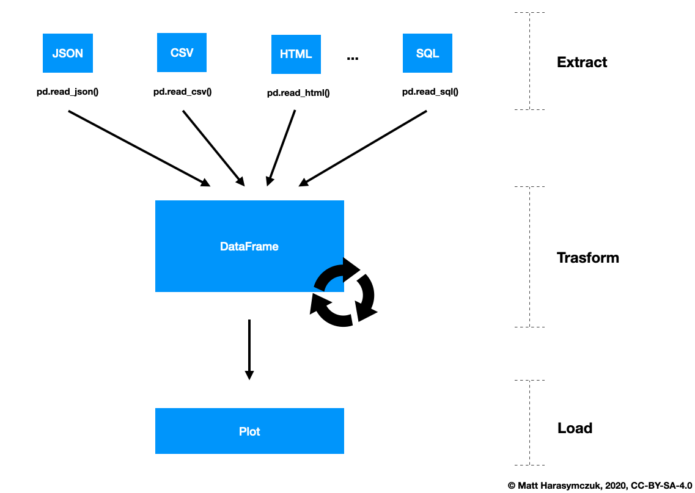

******
Pandas
******

Pandas is a Python package providing fast, flexible, and expressive data structures designed to make working with "relational" or "labeled" data both easy and intuitive. It aims to be the fundamental high-level building block for doing practical, real world data analysis in Python. Additionally, it has the broader goal of becoming the most powerful and flexible open source data analysis / manipulation tool available in any language. It is already well on its way toward this goal. Here are just a few of the things that pandas does well:

    * Easy handling of missing data (represented as NaN) in floating point as well as non-floating point data
    * Size mutability: columns can be inserted and deleted from DataFrame and higher dimensional objects
    * Automatic and explicit data alignment: objects can be explicitly aligned to a set of labels, or the user can simply ignore the labels and let Series, DataFrame, etc. automatically align the data for you in computations
    * Powerful, flexible group by functionality to perform split-apply-combine operations on data sets, for both aggregating and transforming data
    * Make it easy to convert ragged, differently-indexed data in other Python and NumPy data structures into DataFrame objects
    * Intelligent label-based slicing, fancy indexing, and subsetting of large data sets
    * Intuitive merging and joining data sets
    * Flexible reshaping and pivoting of data sets
    * Hierarchical labeling of axes (possible to have multiple labels per tick)
    * Robust IO tools for loading data from flat files (CSV and delimited), Excel files, databases, and saving/loading data from the ultrafast HDF5 format
    * Time series-specific functionality: date range generation and frequency conversion, moving window statistics, moving window linear regressions, date shifting and lagging, etc.

Install
=======
.. code-block:: console

    $ pip install pandas

.. code-block:: console

    $ pip install --upgrade pandas

Import
======
.. code-block:: python

    import pandas as pd

    pd.__version__
    # '1.1.1'

Workflow
========

    Pandas workflow

Read More
=========
* http://pandas.pydata.org/
* http://pandas.pydata.org/pandas-docs/stable/10min.html
* http://pandas.pydata.org/pandas-docs/stable/index.html
* https://github.com/pandas-dev/pandas/blob/master/doc/cheatsheet/Pandas_Cheat_Sheet.pdf

