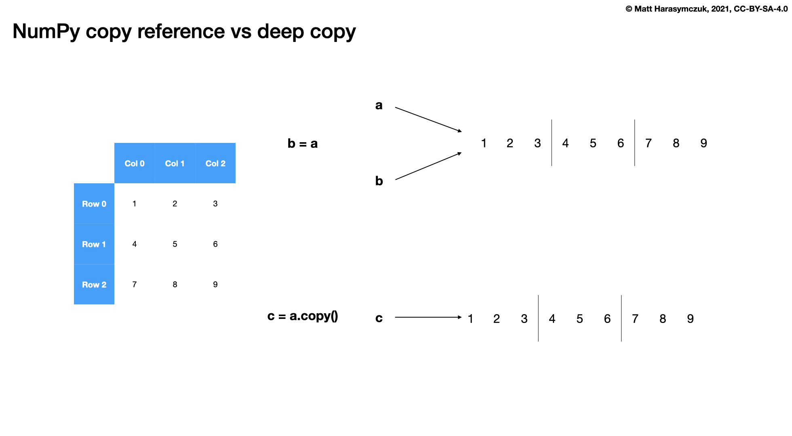
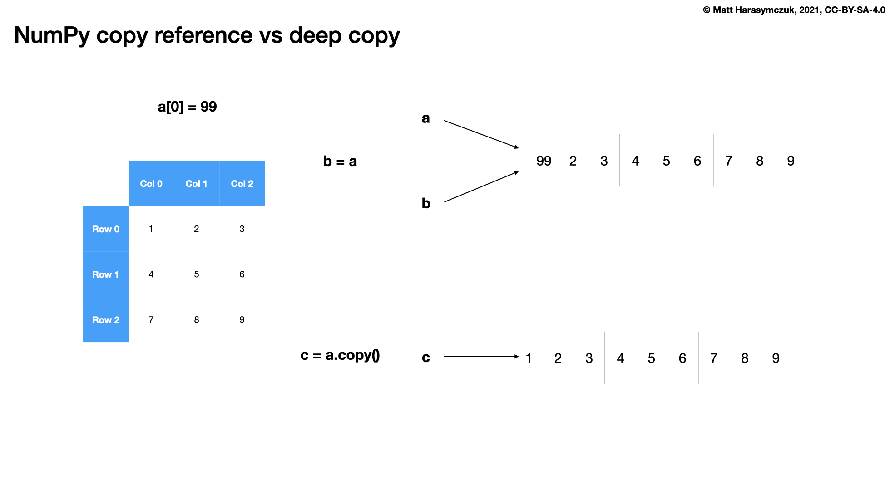

Array Methods
=============

Copy
----
>>> import numpy as np
>>>
>>>
>>> a = np.array([1, 2, 3])
>>> b = a
>>> c = a.copy()
>>>
>>> a[0] = 99
>>>
>>> a
array([99,  2,  3])
>>>
>>> b
array([99,  2,  3])
>>>
>>> c
array([1, 2, 3])

Put
---
>>> import numpy as np

One dimensional:

>>> a = np.array([1, 2, 3, 4, 5, 6])
>>>
>>> a.put([0, 2, 5], 99)
>>> a
array([99,  2, 99,  4,  5, 99])

>>> a = np.array([1, 2, 3, 4, 5, 6])
>>> b = np.array([99, 88, 77, 66, 55, 44, 33, 22])
>>>
>>> a.put([0, 2, 5], b)
>>> a
array([99,  2, 88,  4,  5, 77])

Two dimensional:

* Equivalent to ``a.flat[indexes] = value``

>>> a = np.array([[1, 2, 3],
...               [4, 5, 6],
...               [7, 8, 9]])
>>>
>>> b = np.array([99, 88, 77, 66, 55, 44, 33, 22])
>>>
>>> a.put([0, 2, 5], b)
>>> a
array([[99,  2, 88],
       [ 4,  5, 77],
       [ 7,  8,  9]])

Fill
----
* Modifies inplace

Fill all:

>>> import numpy as np
>>>
>>>
>>> a = np.array([[1, 2, 3],
...               [4, 5, 6],
...               [7, 8, 9]])
>>>
>>> a.fill(0)
>>> a
array([[0, 0, 0],
       [0, 0, 0],
       [0, 0, 0]])

Fill slice:

>>> import numpy as np
>>>
>>>
>>> a = np.array([[1, 2, 3],
...               [4, 5, 6],
...               [7, 8, 9]])
>>>
>>> a[:, 0].fill(0)
>>> a
array([[0, 2, 3],
       [0, 5, 6],
       [0, 8, 9]])

Fill NaN (dtype=np.int):

>>> import numpy as np
>>>
>>>
>>> a = np.array([[1, 2, 3],
...               [4, 5, 6],
...               [7, 8, 9]], dtype=np.int)
>>>
>>> a[:, 0].fill(np.nan)
>>> a
array([[-9223372036854775808,                    2,                    3],
       [-9223372036854775808,                    5,                    6],
       [-9223372036854775808,                    8,                    9]])

Fill NaN (dtype=np.float):

>>> import numpy as np
>>>
>>>
>>> a = np.array([[1, 2, 3],
...               [4, 5, 6],
...               [7, 8, 9]], dtype=np.float)
>>>
>>> a[:, 0].fill(np.nan)
>>> a
array([[nan,  2.,  3.],
       [nan,  5.,  6.],
       [nan,  8.,  9.]])

Transpose
---------
* ``a.transpose()`` or ``a.T``
* ``a.transpose()`` is preferred

>>> import numpy as np

>>> a = np.array([[1, 2, 3],
...               [4, 5, 6]])
>>>
>>> a.transpose()
array([[1, 4],
       [2, 5],
       [3, 6]])
>>>
>>> a.T
array([[1, 4],
       [2, 5],
       [3, 6]])

>>> a = np.array([[1, 2, 3],
...               [4, 5, 6],
...               [7, 8, 9]])
>>>
>>> a.transpose()
array([[1, 4, 7],
       [2, 5, 8],
       [3, 6, 9]])

Signum
------
.. figure:: img/array-methods-signum.png

>>> import numpy as np
>>>
>>>
>>> a = np.array([[-2, -1, 0],
...               [0, 1, 2]])
>>>
>>> np.sign(a)
array([[-1, -1,  0],
       [ 0,  1,  1]])

Use Case - 0x01
---------------
* t1 = 230 lux
* t2 = 218 lux
* t3 = 230 lux
* t4 = 2 lux
* t5 = 0 lux
* t6 = 0 lux
* t7 = 10 lux
* t8 = 0 lux

>>> import numpy as np
>>>
>>>
>>> data = np.array([230, 218, 230, 2, 0, 0, 10, 0])
>>> np.sign(data)
array([1, 1, 1, 1, 0, 0, 1, 0])
>>>
>>> data[data<50] = 0
>>> np.sign(data)
array([1, 1, 1, 0, 0, 0, 0, 0])

Assignments
-----------
.. literalinclude:: assignments/numpy_methods.py
    :caption: :download:`Solution <assignments/numpy_methods.py>`
    :end-before: # Solution
