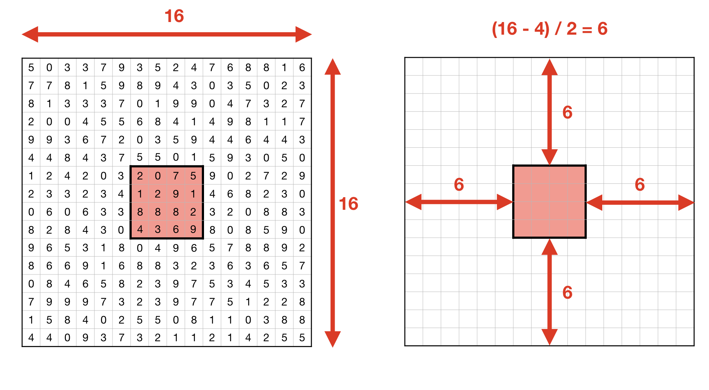

***********
Array Slice
***********

.. todo:: Split chapters GetItem and Slice by __getitem__ argument type.

Recap
=====
.. code-block:: python

    import numpy as np

    data = np.array([1, 2, 3, 4, 5, 6, 7, 8, 9])

    data[start:stop:step]
    # start = 0         # default: 0
    # stop = len(data)  # default: len(data)
    # step = 1          # default: 1

.. code-block:: python

    import numpy as np

    data = np.array([1, 2, 3, 4, 5, 6, 7, 8, 9])

    data[1:5:2]
    # start = 1
    # stop = 5
    # step = 2

    data[:5:2]
    # start = 0
    # stop = 5
    # step = 2

    data[1::2]
    # start = 1
    # stop = len(data)
    # step = 2

    data[1:5]
    # start = 1
    # stop = 5
    # step = 1

    data[::2]
    # start = 0
    # stop = len(data)
    # step = 2

    data[:]
    # start = 0
    # stop = len(data)
    # step = 1

    # a[1:5, 2]
    # a[1:5:2, 2:6:3]

Rationale
=========
.. code-block:: python

    a[ 0 ]
    a[ [0,1] ]
    a[ [True,False] ]
    a[ 0:1 ]
    a[ 0:1:2 ]

    a[ 0 ]             # int
    a[ [0,1] ]         # list[int]
    a[ [True,False] ]  # list[bool]
    a[ [[True,False], [True, False]] ]  # list[list[bool]]
    a[ 0:1 ]           # slice(start,stop)
    a[ 0:1:2 ]         # slice(start,stop,step)

    a[ 0,1 ]           # tuple[int]
    a[ (0,1) ]         # tuple[int]
    a[ [0,1],[2,3] ]   # tuple[list[int]]
    a[ :,: ]           # tuple[slice]
    a[ [True,False],[False,True] ]    # tuple[list[bool]]

1-dimensional Array:

    * int
    * list[int]
    * list[bool]
    * list[list[bool]]
    * slice(start,stop)
    * slice(start,stop,step)

2-dimensional Array:

    * tuple[int]
    * tuple[list[int]]
    * tuple[slice]
    * tuple[list[bool]]

1-dimensional Array
===================
1-dimensional Array:

.. code-block:: python

    import numpy as np

    a = np.array([1, 2, 3, 4, 5, 6, 7, 8, 9])

    a[1:5]
    # array([2, 3, 4, 5])
    a[3:8]
    # array([4, 5, 6, 7, 8])

    a[0:5]
    # array([1, 2, 3, 4, 5])
    a[:5]
    # array([1, 2, 3, 4, 5])
    a[5:9]
    # array([6, 7, 8, 9])

    a[5:len(a)]
    # array([6, 7, 8, 9])
    a[5:]
    # array([6, 7, 8, 9])
    a[-2:]
    # array([8, 9])
    a[-5:]
    # array([5, 6, 7, 8, 9])
    a[-6:-2]
    # array([4, 5, 6, 7])

    a[3:8:2]
    # array([4, 6, 8])
    a[-8:-3:2]
    # array([2, 4, 6])
    a[::2]
    # array([1, 3, 5, 7, 9])
    a[1::2]
    # array([2, 4, 6, 8])

    a[0:len(a)]
    # array([1, 2, 3, 4, 5, 6, 7, 8, 9])
    a[0:]
    # array([1, 2, 3, 4, 5, 6, 7, 8, 9])
    a[:len(a)]
    # array([1, 2, 3, 4, 5, 6, 7, 8, 9])
    a[:]
    # array([1, 2, 3, 4, 5, 6, 7, 8, 9])

2-dimensional Array
===================
Rows:

.. code-block:: python

    import numpy as np

    a = np.array([[1, 2, 3],
                  [4, 5, 6],
                  [7, 8, 9]])

    a[:]
    # array([[1, 2, 3],
    #        [4, 5, 6],
    #        [7, 8, 9]])

    a[1:]
    # array([[4, 5, 6],
    #        [7, 8, 9]])

    a[:1]
    # array([[1, 2, 3]])

    a[1:3]
    # array([[4, 5, 6],
    #        [7, 8, 9]])

    a[::2]
    # array([[1, 2, 3],
    #        [7, 8, 9]])

    a[1::2]
    # array([[4, 5, 6]])

Columns:

.. code-block:: python

    import numpy as np

    a = np.array([[1, 2, 3],
                  [4, 5, 6],
                  [7, 8, 9]])

    a[:, 0]
    # array([1, 4, 7])

    a[:, 1]
    # array([2, 5, 8])

    a[:, 2]
    # array([3, 6, 9])

    a[:, -1]
    # array([3, 6, 9])

    a[:, 0:1]
    # array([[1],
    #        [4],
    #        [7]])

    a[:, 0:2]
    # array([[1, 2],
    #        [4, 5],
    #        [7, 8]])

    a[:, :2]
    # array([[1, 2],
    #        [4, 5],
    #        [7, 8]])

    a[:, ::2]
    # array([[1, 3],
    #        [4, 6],
    #        [7, 9]])

    a[:, 1::2]
    # array([[2],
    #        [5],
    #        [8]])

Rows and Columns:

.. code-block:: python

    import numpy as np

    a = np.array([[1, 2, 3],
                  [4, 5, 6],
                  [7, 8, 9]])

    a[0:1, 0:1]
    # array([[1]])

    a[0:1, 0:2]
    # array([[1, 2]])

    a[0:1, 0:3]
    # array([[1, 2, 3]])

    a[0:2, 0:2]
    # array([[1, 2],
    #        [4, 5]])

    a[-1:, -2:]
    # array([[8, 9]])

    a[::2, ::2]
    # array([[1, 3],
    #        [7, 9]])

    a[1::2, 1::2]
    # array([[5]])

    a[[2,1], ::2]
    # array([[7, 9],
    #        [4, 6]])

Assignments
===========

.. literalinclude:: assignments/numpy_slice_1.py
    :caption: :download:`Solution <assignments/numpy_slice_1.py>`
    :end-before: # Solution

.. literalinclude:: assignments/numpy_slice_2.py
    :caption: :download:`Solution <assignments/numpy_slice_2.py>`
    :end-before: # Solution

    Inner 4x4 elements
