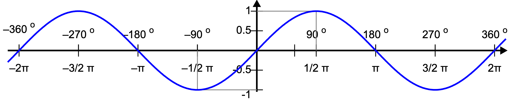
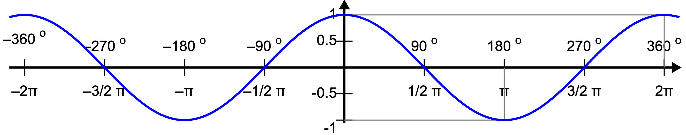
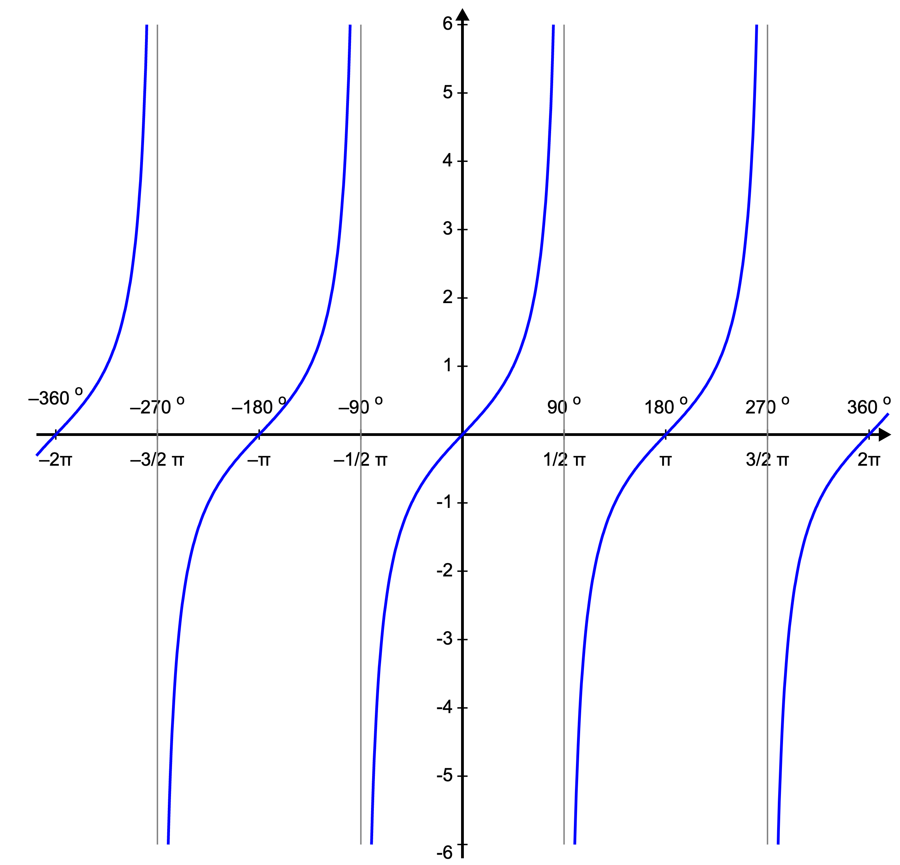
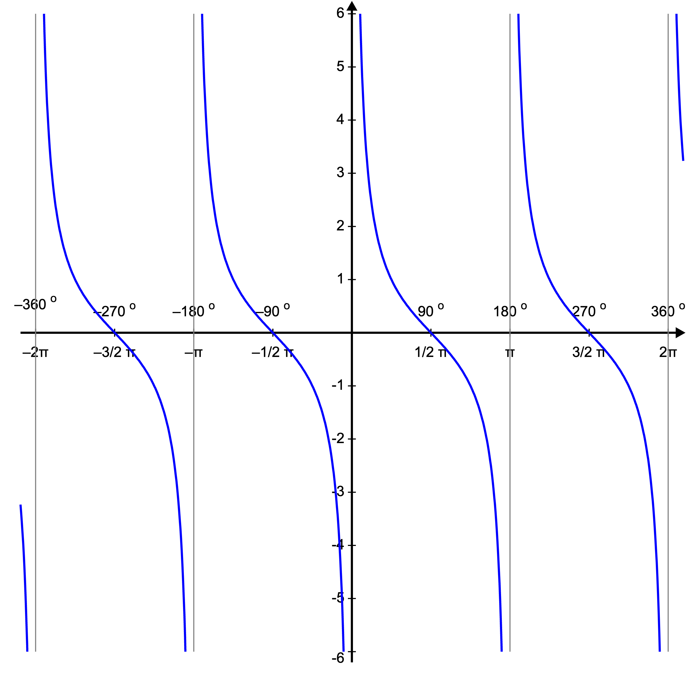

Trigonometry
============

.. glossary::

    Universal Functions
    ufunc
        Mathematical operations optimized to work on ``np.array()``:

        >>> import numpy as np
        >>> a = np.array([1, 2, 3])
        >>>
        >>> np.sin(a)
        array([0.84147098, 0.90929743, 0.14112001])

SetUp
-----
>>> import numpy as np

Unit conversion
---------------

Degrees:

* ``np.deg2rad()``
* ``np.degrees()``

Radians:

* ``np.rad2deg()``
* ``np.radians()``

Trigonometric Functions
-----------------------
* ``np.sin()``
* ``np.cos()``
* ``np.tan()``
* ctg = 1/tan

    Sinusoid - sin(x) function

    Cosinusoid - cos(x) function

    Tangensoid - tan(x) function

    Cotangensoid - ctg(x) function, also 1/tan(x)

Arcus Functions
---------------
* ``np.arcsin()``
* ``np.arccos()``
* ``np.arctan()``

Hyperbolic Functions
--------------------
* ``np.sinh()``
* ``np.cosh()``
* ``np.tanh()``

Arcus Hyperbolic Functions
--------------------------
* ``np.arcsinh()``
* ``np.arccosh()``
* ``np.arctanh()``

Assignments
-----------
.. literalinclude:: assignments/numpy_trigonometry_a.py
    :caption: :download:`Solution <assignments/numpy_trigonometry_a.py>`
    :end-before: # Solution
