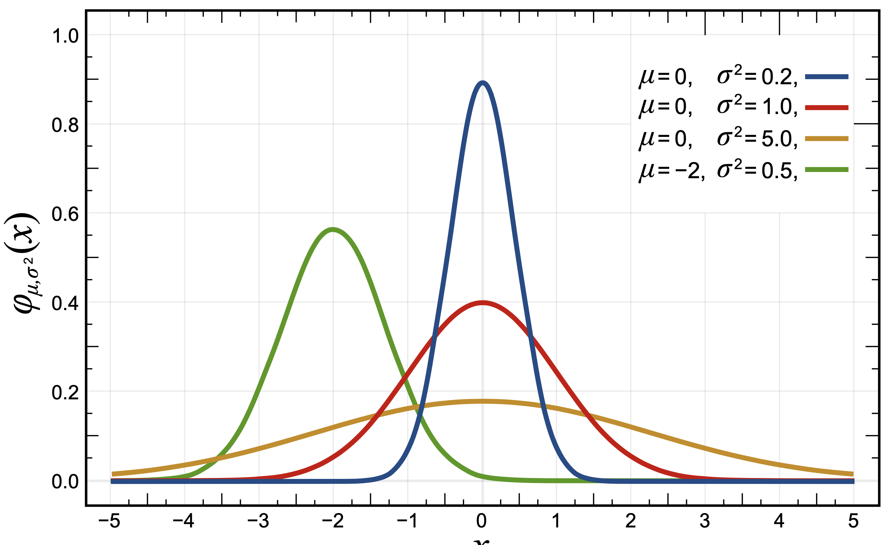

Array Random
============

Continuous Uniform Distribution
-------------------------------
* Results are from the "continuous uniform" distribution over the stated interval

.. figure:: img/random-distribution-uniform.png

    Continuous Uniform Distribution :cite:`NumpyUniformDistribution`

>>> import numpy as np
>>> np.random.seed(0)

Random ``float`` in the half-open interval ``[0.0, 1.0)``:

>>> np.random.rand(5)
array([0.5488135 , 0.71518937, 0.60276338, 0.54488318, 0.4236548 ])

>>> np.random.rand(2,3)
array([[0.64589411, 0.43758721, 0.891773  ],
       [0.96366276, 0.38344152, 0.79172504]])

>>> np.random.rand(3,2)
array([[0.52889492, 0.56804456],
       [0.92559664, 0.07103606],
       [0.0871293 , 0.0202184 ]])

Normal (Gaussian) Distribution
------------------------------
* Draw pseudorandom samples from a normal (Gaussian) distribution

    Normal (Gaussian) distribution :cite:`NumpyNormalDistribution`

Defaults:

    * μ - ``loc=0.0``
    * σ - ``scale=1.0``

>>> import numpy as np
>>> np.random.seed(0)

Draw pseudorandom samples from a normal (Gaussian) distribution:

>>> np.random.normal()
1.764052345967664

>>> np.random.normal(0.0, 1.0)
0.4001572083672233

>>> np.random.normal(loc=0.0, scale=1.0)
0.9787379841057392

>>> np.random.normal(size=5)
array([ 2.2408932 ,  1.86755799, -0.97727788,  0.95008842, -0.15135721])

>>> np.random.normal(loc=0.0, scale=1.0, size=(2,3))
array([[-0.10321885,  0.4105985 ,  0.14404357],
       [ 1.45427351,  0.76103773,  0.12167502]])

Poisson Distribution
--------------------
* Draw samples from a Poisson distribution

.. figure:: img/random-distribution-poisson.png

    Poisson distribution :cite:`NumpyPoissonDistribution`

>>> import numpy as np
>>> np.random.seed(0)

Draw samples from a Poisson distribution:

>>> np.random.poisson(6.0)
11

>>> np.random.poisson(lam=6.0)
4

>>> np.random.poisson(lam=6.0, size=5)
array([9, 7, 8, 5, 5])

>>> np.random.poisson(lam=6.0, size=(2,3))
array([[5, 5, 7],
       [3, 5, 6]])

Assignments
-----------
.. literalinclude:: assignments/numpy_random_a.py
    :caption: :download:`Solution <assignments/numpy_random_a.py>`
    :end-before: # Solution

.. literalinclude:: assignments/numpy_random_b.py
    :caption: :download:`Solution <assignments/numpy_random_b.py>`
    :end-before: # Solution

.. literalinclude:: assignments/numpy_random_c.py
    :caption: :download:`Solution <assignments/numpy_random_c.py>`
    :end-before: # Solution
