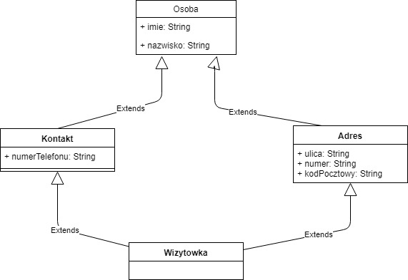

.. _OOP Advanced:

************
OOP Advanced
************

``__new__()`` and ``__init__()``
================================
``__call__()`` method invokes the following:

    * ``__new__()``
    * ``__init__()``

``__new__()``
-------------
* the constructor
* solely for creating the object
* ``cls`` as it's first parameter
* when calling ``__new__()`` you actually don't have an instance yet, therefore no ``self`` exists at that moment

``__init__()``
--------------
* the initializer
* for initializing object with data
* ``self`` as it's first parameter
* ``__init__()`` is called after ``__new__()`` and the instance is in place, so you can use ``self`` with it
* it's purpose is just to alter the fresh state of the newly created instance

Example usage
-------------
.. code-block:: python
    :emphasize-lines: 4,5

    class A:
        def __new__(cls):
            print("A.__new__() called")
            return super().__new__(cls)

        def __init__(self):
            print("A.__init__() called")

    A()
    # A.__new__() called
    # A.__init__() called

Missing ``return`` from constructor
-----------------------------------
.. code-block:: python
    :emphasize-lines: 4

    class B:
        def __new__(cls):
            print("B.__new__() called")

        def __init__(self):
            print("B.__init__() called")  # -> is actually never called

    print B()
    # B.__new__() called
    # None

The instantiation is evaluated to ``None`` since we don't return anything from the constructor.

Return invalid from constructor
-------------------------------
.. code-block:: python

    class C:
        def __new__(cls):
            print("C.__new__() called")
            return 29

    print C()
    # C.__new__() called
    # 29

Return invalid from initializer
-------------------------------
.. code-block:: python

    class D:
        def __init__(self):
            print("C.__new__() called")
            return 33

    D()
    # TypeError: __init__ should return None

Why?
----
* Factory method
* Could be used to implement Singleton

.. code-block:: python

    class One:
        name = 'Twardowski'

    class Two:
        def __new__(cls):
            return One()

    a = Two()

    print(a)
    # <__main__.One object at 0x11ca09588>

    a.__class__.__name__
    # 'One'

Stringify objects
=================
* ``__repr__()`` jest dla developerów (być jednoznacznym)
* ``__str__()`` dla użytkowników (być czytelnym)
* ``__format__()`` - do zaawansowanego formatowania

.. code-block:: python
    :caption: Using ``__repr__()`` on a class

    class Point:
        def __init__(self, x, y):
            self.x = x
            self.y = y

        def __str__(self):
            return f'({self.x}, {self.y})'

        def __repr__(self):
            return f'Point(x={self.x}, y={self.y})'

     point = Point(2, 4)

     point
     # 'Point(x=2, y=4)'

     repr(point)
     # 'Point(x=2, y=4)'

     str(point)
     # '(2, 4)'

     print(point)
     # (2, 4)

``__format__()``
----------------
.. code-block:: python

    class Point:
        def __init__(self, x, y, z=0):
            self.x = x
            self.y = y
            self.z = z

        def __format__(self, format):
            if format == '2D':
                return f"({self.x}, {self.y})"
            elif format == '3D':
                return f"({self.x}, {self.y}, {self.z})"
            else:
                raise ValueError

    p = Point(x=1, y=2)
    print(f'{p:2D}')

Case Study
----------
* ``__repr__``

    .. code-block:: python

        import datetime

        datetime.datetime.now()
        # datetime.datetime(2019, 1, 5, 20, 15, 0, 684972)

* ``__str__``

    .. code-block:: python

        import datetime

        print(datetime.datetime.now())
        # 2019-01-05 20:15:00.927387

What should be in the class and what not?
=========================================
* Jeżeli metoda w swoim ciele ma ``self`` i z niego korzysta to powinna być w klasie
* Jeżeli metoda nie ma w swoim ciele ``self`` to nie powinna być w klasie
* Jeżeli metoda nie ma w swoim ciele ``self`` ale wybitnie pasuje do klasy, to można ją tam zamieścić oraz dodać dekorator ``@staticmethod``

``@staticmethod``
-----------------
* Using class as namespace
* Will not pass instance as a first argument
* ``self`` is not required

.. code-block:: python
    :caption: Functions on a high level of a module lack namespace

    def add(a, b):
        return a + b

    def sub(a, b):
        return a - b

    add(1, 2)
    sub(8, 4)

.. code-block:: python
    :caption: When ``add`` and ``sub`` are in ``Calculator`` class (namespace) they get instance (``self``) as a first argument. Instantiating Calculator is not needed, as of functions do not read or write to instance variables.

    class Calculator:

        def add(self, a, b):
            return a + b

        def sub(self, a, b):
            return a - b

    Calculator.add(10, 20)  # TypeError: add() missing 1 required positional argument: 'b'
    Calculator.sub(8, 4)    # TypeError: add() missing 1 required positional argument: 'b'

    calc = Calculator()
    calc.add(1, 2)          # 3
    calc.sub(8, 4)          # 4

.. code-block:: python
    :caption: Class ``Calculator`` is a namespace for functions. ``@staticmethod`` remove instance (``self``) argument to method.

    class Calculator:

        @staticmethod
        def add(a, b):
            return a + b

        @staticmethod
        def sub(a, b):
            return a - b

    Calculator.add(1, 2)
    Calculator.sub(8, 4)

``@classmethod``
----------------
.. code-block:: python

    class User:
        def __init__(self, first_name, last_name):
            self.first_name = first_name
            self.last_name = last_name

        def __str__(self):
            return f'{self.first_name} {self.last_name}'

        def to_json(self):
            import json
            return json.dumps(self.__dict__)

        @classmethod
        def from_json(cls, data):
            import json
            data = json.loads(data)
            return cls(**data)

    user = User('Jan', 'Twardowski')
    # Jan Twardowski

    DATA = user.to_json()
    # '{"first_name": "Jan", "last_name": "Twardowski"}'

    user = User.from_json(DATA)
    # Jan Twardowski

Dynamically creating fields
===========================
.. literalinclude:: src/oop-init-dynamic.py
    :language: python
    :caption: Funkcja inicjalizująca, która automatycznie dodaje pola do naszej klasy w zależności od tego co zostanie podane przy tworzeniu obiektu

Setter and Getter
=================

Accessing class fields
----------------------
.. literalinclude:: src/oop-accessor-fields.py
    :language: python
    :caption: Accessing class fields

.. literalinclude:: src/oop-getter.py
    :language: python
    :caption: Case Study uzasadnionego użycia gettera w kodzie

``@property``, ``@x.setter``, ``@x.deleter``
--------------------------------------------
* ``@propery`` - for defining getters
* ``@kola.setter`` - for defining setter
* ``@kola.deleter`` - for defining deleter
* Blokowanie możliwości edycji pola klasy
* Dodawanie logowania przy ustawianiu wartości

.. literalinclude:: src/oop-property.py
    :language: python
    :caption: ``@property``, ``@x.setter``, ``@x.deleter``

Hash
====
* Funkcja hash zwraca ``int``
* ``set()`` można zrobić z dowolnego hashowalnego obiektu
* ``dict()`` może mieć klucze, które są dowolnym hashowalnym obiektem

* User-defined classes have ``__eq__()`` and ``__hash__()`` methods by default.
* All objects compare unequal (except with themselves)
* ``x.__hash__()`` returns an appropriate value such that ``x == y`` implies both that ``x is y`` and ``hash(x) == hash(y)``

.. literalinclude:: src/oop-hash-dict.py
    :language: python
    :caption: ``dict()`` może mieć klucze, które są dowolnym hashowalnym obiektem

.. literalinclude:: src/oop-hash-set.py
    :language: python
    :caption: ``set()`` można zrobić z dowolnego hashowalnego obiektu

.. literalinclude:: src/oop-hash-generate-bad.py
    :language: python
    :caption: Generating hash and object comparision

.. literalinclude:: src/oop-hash-generate-good.py
    :language: python
    :caption: Generating hash and object comparision

``is``
======
* ``is`` porównuje czy dwa obiekty są tożsame
* Sprawdzenie odbywa się przez porównanie wartości ``id()`` dla obiektu
* Najczęściej służy do sprawdzania czy coś jest ``None``

Good
----
.. code-block:: python

    if name is None:
        print('Name is not set')
    else:
        print('You have set your name')

Not good
--------
 .. code-block:: python

     if name is 'Mark Watney':
        print('You are Space Pirate!')
     else:
        print('You are not pirate at all!')

Using ``is`` in script
----------------------
* ``id()`` will change every time you execute script
* both objects has the same ``id``.

 .. code-block:: python
    :caption: Using this code in script.

    a = 'Jan Twardowski'
    b = 'Jan Twardowski'

    print(a)        # Jan Twardowski
    print(b)        # Jan Twardowski

    print(a == b)   # True
    print(a is b)   # True

    print(id(a))    # 4430933296
    print(id(b))    # 4430933296

Using ``is`` in REPL (evaluated line by line)
---------------------------------------------
.. code-block:: python
    :caption: Evaluated in REPL line by line.

    a = 'Jan Twardowski'
    b = 'Jan Twardowski'

    print(a)        # Jan Twardowski
    print(b)        # Jan Twardowski

    print(a == b)   # True
    print(a is b)   # False

    print(id(a))    # 4784790960
    print(id(b))    # 4784791408

Using ``is`` in REPL (evaluated at once)
----------------------------------------
.. code-block:: python
    :caption: Evaluated in REPL at once.

    a = 'Jan Twardowski'
    b = 'Jan Twardowski'

    print(a)        # Jan Twardowski
    print(b)        # Jan Twardowski

    print(a == b)   # True
    print(a is b)   # True

    print(id(a))    # 4784833072
    print(id(b))    # 4784833072

Monkey Patching
===============
.. literalinclude:: src/oop-monkey-patching-1.py
    :language: python
    :caption: Monkey Patching

.. literalinclude:: src/oop-monkey-patching-2.py
    :language: python
    :caption: Monkey Patching

.. literalinclude:: src/oop-monkey-patching-3.py
    :language: python
    :caption: Monkey Patching

Method Resolution Order
=======================

    Inheritance Diamond

.. literalinclude:: src/oop-mro.py
    :language: python
    :caption: Method Resolution Order

Objects and instances
=====================
.. literalinclude:: src/oop-objects-and-instances.py
    :language: python
    :caption: Objects and instances

Assignments
===========

Dragon (Part 3)
---------------
* Filename: ``oop_dragon_3.py``
* Lines of code to write: 50 lines
* Estimated time of completion: 30 min

.. figure:: img/dragon.gif
    :scale: 100%
    :align: center

    Firkraag dragon from game Baldur's Gate II: Shadows of Amn

#. Dodaj możliwość poruszania się smoka i bohatera w 3 wymiarach
#. Bohater może należeć do drużyny, który może składać się maks z 6 postaci (różnych klas)
#. Żadna z istot na planszy nie może wyjść poza zakres ekranu
#. Bohater może dodatkowo założyć ekwipunek i może być to wiele obiektów na raz
#. Każdy z przedmiotów ma swoją nazwę, typ oraz modyfikator

    * zbroję (dodatkowe punkty obrony, np. +10%)
    * tarczę (dodatkowe punkty obrony, np. +5%)
    * miecz (dodatkowe punkty ataku, np. +5%)

#. Zbroja i tarcza chroni przed uderzeniami obniżając ilość obrażeń o wartość obrony
#. Miecz zwiększa ilość zadawanych obrażeń
#. Obrażenia smoka maleją z sześcianem odległości (zianie ogniem)
#. Bohater nie może zadawać obrażeń jak jest dalej niż 50 punktów od przeciwnika
#. Wszystkie istoty mogą lewelować a bazowe punty życia i obrażeń się zmieniają z poziomem
#. Przeprowadź symulację walki. Kto zginie pierwszy?
