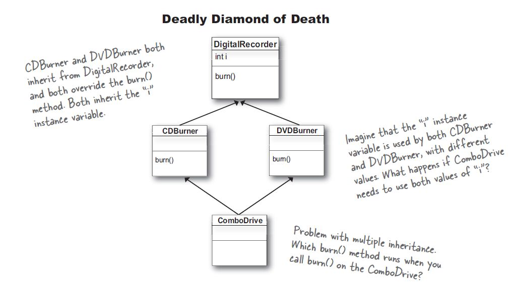

.. _OOP Advanced:

************
OOP Advanced
************

What should be in the class and what not?
=========================================
* Jeżeli metoda w swoim ciele ma ``self`` i z niego korzysta to powinna być w klasie
* Jeżeli metoda nie ma w swoim ciele ``self`` to nie powinna być w klasie
* Jeżeli metoda nie ma w swoim ciele ``self`` ale wybitnie pasuje do klasy, to można ją tam zamieścić oraz dodać dekorator ``@staticmethod``

``@staticmethod``
-----------------
* Using class as namespace
* Will not pass instance as a first argument
* ``self`` is not required

.. code-block:: python
    :caption: Functions on a high level of a module lack namespace

    def add(a, b):
        return a + b

    def sub(a, b):
        return a - b

    add(1, 2)
    sub(8, 4)

.. code-block:: python
    :caption: When ``add`` and ``sub`` are in ``Calculator`` class (namespace) they get instance (``self``) as a first argument. Instantiating Calculator is not needed, as of functions do not read or write to instance variables.

    class Calculator:

        def add(self, a, b):
            return a + b

        def sub(self, a, b):
            return a - b

    Calculator.add(10, 20)  # TypeError: add() missing 1 required positional argument: 'b'
    Calculator.sub(8, 4)    # TypeError: add() missing 1 required positional argument: 'b'

    calc = Calculator()
    calc.add(1, 2)          # 3
    calc.sub(8, 4)          # 4

.. code-block:: python
    :caption: Class ``Calculator`` is a namespace for functions. ``@staticmethod`` remove instance (``self``) argument to method.

    class Calculator:

        @staticmethod
        def add(a, b):
            return a + b

        @staticmethod
        def sub(a, b):
            return a - b

    Calculator.add(1, 2)
    Calculator.sub(8, 4)

``@classmethod``
----------------
.. code-block:: python
    :emphasize-lines: 7-10,21,24,30,31

    import json

    class JSONSerializable:
        def to_json(self):
            return json.dumps(self.__dict__)

        @classmethod
        def from_json(cls, data):
            data = json.loads(data)
            return cls(**data)

    class User:
        def __init__(self, first_name, last_name):
            self.first_name = first_name
            self.last_name = last_name

        def __str__(self):
            return f'{self.first_name} {self.last_name}'

    class Guest(User, JSONSerializable):
        pass

    class Admin(User, JSONSerializable):
        pass

    DATA = '{"first_name": "Jan", "last_name": "Twardowski"}'

    guest = Guest.from_json(DATA)
    admin = Admin.from_json(DATA)

    type(guest)     # <class '__main__.Guest'>
    type(admin)      # <class '__main__.Admin'>

Hash
====
* Funkcja hash zwraca ``int``
* ``set()`` można zrobić z dowolnego hashowalnego obiektu
* ``dict()`` może mieć klucze, które są dowolnym hashowalnym obiektem

* User-defined classes have ``__eq__()`` and ``__hash__()`` methods by default.
* All objects compare unequal (except with themselves)
* ``x.__hash__()`` returns an appropriate value such that ``x == y`` implies both that ``x is y`` and ``hash(x) == hash(y)``

.. code-block:: python
    :caption: ``dict()`` może mieć klucze, które są dowolnym hashowalnym obiektem

    key = 'last_name'

    my_dict = {
        'fist_name': 'key can be ``str``',
        key: 'key can be ``str``',
        1: 'key can be ``int``',
        1.5: 'key can be ``float``',
        (1, 2): 'key can be ``tuple``',
    }

.. code-block:: python
    :caption: ``set()`` można zrobić z dowolnego hashowalnego obiektu

    class Astronaut:
        def __init__(self, name):
            self.name = name

    {1, 1, 2}
    # {1, 2}

    jose = Astronaut(name='Jose Jimenez')
    data = {jose, jose}
    len(data)
    # 1

    data = {Astronaut(name='Jose Jimenez'), Astronaut(name='Jose Jimenez')}
    len(data)
    # 2

.. literalinclude:: src/oop-hash-generate-bad.py
    :language: python
    :caption: Generating hash and object comparision

.. literalinclude:: src/oop-hash-generate-good.py
    :language: python
    :caption: Generating hash and object comparision

.. note:: Since Python 3.7 ``dict`` has fixed order and using ``OrderedDict`` is not necessary

``is``
======
* ``is`` porównuje czy dwa obiekty są tożsame
* Sprawdzenie odbywa się przez porównanie wartości ``id()`` dla obiektu
* Najczęściej służy do sprawdzania czy coś jest ``None``

Good
----
.. code-block:: python

    if name is None:
        print('Name is not set')
    else:
        print('You have set your name')

Not good
--------
.. warning:: In Python 3.8 the compiler produces a ``SyntaxWarning`` when identity checks (``is`` and ``is not``) are used with certain types of literals (e.g. ``str``, ``int``). These can often work by accident in *CPython*, but are not guaranteed by the language spec. The warning advises users to use equality tests (``==`` and ``!=``) instead.

 .. code-block:: python

     if name is 'Mark Watney':
        print('You are Space Pirate!')
     else:
        print('You are not pirate at all!')

Using ``is`` in script
----------------------
* ``id()`` will change every time you execute script
* both objects has the same ``id``.

 .. code-block:: python
    :caption: Using this code in script.

    a = 'Jan Twardowski'
    b = 'Jan Twardowski'

    print(a)        # Jan Twardowski
    print(b)        # Jan Twardowski

    print(a == b)   # True
    print(a is b)   # True

    print(id(a))    # 4430933296
    print(id(b))    # 4430933296

Using ``is`` in REPL (evaluated line by line)
---------------------------------------------
.. code-block:: python
    :caption: Evaluated in REPL line by line.

    a = 'Jan Twardowski'
    b = 'Jan Twardowski'

    print(a)        # Jan Twardowski
    print(b)        # Jan Twardowski

    print(a == b)   # True
    print(a is b)   # False

    print(id(a))    # 4784790960
    print(id(b))    # 4784791408

Using ``is`` in REPL (evaluated at once)
----------------------------------------
.. code-block:: python
    :caption: Evaluated in REPL at once.

    a = 'Jan Twardowski'
    b = 'Jan Twardowski'

    print(a)        # Jan Twardowski
    print(b)        # Jan Twardowski

    print(a == b)   # True
    print(a is b)   # True

    print(id(a))    # 4784833072
    print(id(b))    # 4784833072

Inheritance Method Resolution
=============================

Method Resolution Order
-----------------------

.. code-block:: python
    :caption: Method Resolution Order

    class A:
        def show(self):
            print('a')

    class B:
        def show(self):
            print('b')

    class C:
        def show(self):
            print('c')

    class D(A, B, C):
        pass

    obj = D()

    obj.show()
    # a

    print(D.__mro__)
    # (<class '__main__.D'>,
    #  <class '__main__.A'>,
    #  <class '__main__.B'>,
    #  <class '__main__.C'>,
    #  <class 'object'>)

Inheritance Diamond
-------------------
.. figure:: img/inheritance-diamond-1.jpg
    :scale: 75%
    :align: center

    Inheritance Diamond

    Inheritance Diamond

.. code-block:: python
    :caption: Inheritance Diamond

    class A:
        def show(self):
            print('a')

    class B(A):
        def show(self):
            print('b')

    class C(A):
        def show(self):
            print('c')

    class D(B, C):
        pass

    obj = D()

    obj.show()
    # b

    print(D.__mro__)
    # (<class '__main__.D'>,
    #  <class '__main__.B'>,
    #  <class '__main__.C'>,
    #  <class '__main__.A'>,
    #  <class 'object'>)

Objects and instances
=====================
.. code-block:: python
    :caption: Implicit passing instance to class as ``self``.

    text = 'Jan,Twardowski'

    text.split(',')                     # ['Jan', 'Twardowski']

.. code-block:: python
    :caption: Explicit passing instance to class overriding ``self``.

    text = 'Jan,Twardowski'

    str.split(text, ',')                # ['Jan', 'Twardowski']

.. code-block:: python
    :caption: Passing anonymous objects as instances.

    'Jan,Twardowski'.split(',')         # ['Jan', 'Twardowski']
    str.split('Jan,Twardowski', ',')    # ['Jan', 'Twardowski']

Assignments
===========

Dragon (version release candidate)
----------------------------------
* Filename: ``oop/dragon_rc.py``
* Lines of code to write: 50 lines
* Estimated time of completion: 30 min

.. figure:: img/dragon.gif
    :scale: 100%
    :align: center

    Firkraag dragon from game Baldur's Gate II: Shadows of Amn

#. Dodaj możliwość poruszania się smoka i bohatera w 3 wymiarach
#. Bohater może należeć do drużyny, który może składać się maks z 6 postaci (różnych klas)
#. Żadna z istot na planszy nie może wyjść poza zakres ekranu
#. Bohater może dodatkowo założyć ekwipunek i może być to wiele obiektów na raz
#. Każdy z przedmiotów ma swoją nazwę, typ oraz modyfikator

    * zbroję (dodatkowe punkty obrony, np. +10%)
    * tarczę (dodatkowe punkty obrony, np. +5%)
    * miecz (dodatkowe punkty ataku, np. +5%)

#. Zbroja i tarcza chroni przed uderzeniami obniżając ilość obrażeń o wartość obrony
#. Miecz zwiększa ilość zadawanych obrażeń
#. Obrażenia smoka maleją z sześcianem odległości (zianie ogniem)
#. Bohater nie może zadawać obrażeń jak jest dalej niż 50 punktów od przeciwnika
#. Wszystkie istoty mogą levelować a bazowe punty życia i obrażeń się zmieniają z poziomem
#. Przeprowadź symulację walki. Kto zginie pierwszy?
