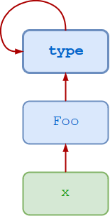

.. _OOP Metaclass:

*********
Metaclass
*********

Rationale
=========
.. epigraph::
    "Metaclasses are deeper magic than 99% of users should ever worry about. If you wonder whether you need them, you don’t (the people who actually need them know with certainty that they need them, and don’t need an explanation about why)." -- Tim Peters

.. highlights::
    * Object is an instance of a class
    * Class is an instance of a Metaclass

.. figure:: img/metaclass-instances.png
    :width: 50%
    :align: center

    Class is an instance of a metaclass.

Class Definition
----------------
.. code-block:: python

    class MyClass:
        pass

.. code-block:: python

    MyClass = type('MyClass', (), {})

Class Attributes
----------------
.. code-block:: python

    class MyClass:
        myattr = 1

.. code-block:: python

    MyClass = type('MyClass', (), {'myattr': 1})

Class Methods
-------------
.. code-block:: python

    class MyClass:
        def mymethod(self):
            pass

.. code-block:: python

    def mymethod(self):
        pass

    MyClass = type('MyClass', (), {'mymethod': mymethod})

Class Inheritance
-----------------
.. code-block:: python

    class Parent:
        pass

    class MyClass(Parent):
        pass

.. code-block:: python

    MyClass = type('MyClass', (Parent,), {})

Recap
-----
.. code-block:: python

    class Parent:
        pass

    class MyClass(Parent):
        myattr = 1

        def mymethod(self):
            pass

.. code-block:: python

    MyClass = type('MyClass', (Parent,), {'myattr': 1, 'mymethod': mymethod})

Metaclasses
===========
.. highlights::
    * Instances are created by calling the class
    * Classes are created by calling the metaclass (when it executes the ``class`` statement)
    * Combined with the normal ``__init__`` and ``__new__`` methods
    * Class defines how an object behaves
    * Metaclass defines how a class behaves

.. code-block:: python

    class MyClass:
        pass

.. code-block:: python

    class MyClass(object):
        pass

.. code-block:: python

    class MyMetaclass(type):
        pass

    class MyClass(metaclass=MyMetaclass):
        pass

.. code-block:: python

    class MyMetaclass(type):
        def __new__(self, class_name, bases, attrs):
            return type(class_name, bases, attrs)

    class MyClass(metaclass=MyMetaclass):
        pass

Usage
=====
.. highlights::
    * Metaclasses allow you to do 'extra things' when creating a class
    * Allow customization of class instantiation
    * Most commonly used as a class-factory
    * Registering the new class with some registry
    * Replace the class with something else entirely
    * Inject logger instance
    * Injecting static fields
    * Metaclasses run when Python defines class (even if no instance is created)

.. code-block:: python

    class MyMetaclass(type):
        def __new__(self, class_name, bases, attrs):
            print(locals())
            return type(class_name, bases, attrs)

    class MyClass(metaclass=MyMetaclass):
        myattr = 1

        def mymethod(self):
            pass

    # {'self': <class '__main__.MyMetaclass'>,
    #  'class_name': 'MyClass',
    #  'bases': (),
    #  'attrs': {'__module__': '__main__',
    #            '__qualname__': 'MyClass',
    #            'myattr': 1,
    #            'mymethod': <function MyClass.mymethod at 0x10ae39ca0>}}

Example
=======
.. code-block:: python

    import logging

    class Logger(type):
        def __init__(cls, *args, **kwargs):
            cls._logger = logging.getLogger(cls.__name__)

    class Astronaut(metaclass=Logger):
        pass

    class Cosmonaut(metaclass=Logger):
        pass

    print(Astronaut._logger)
    # <Logger Astronaut (WARNING)>

    print(Cosmonaut._logger)
    # <Logger Cosmonaut (WARNING)>

Type Metaclass
==============
.. code-block:: python

    type(1)           # <class 'int'>
    type(int)         # <class 'type'>
    type(type)        # <class 'type'>

.. code-block:: python

    type(float)       # <class 'type'>
    type(bool)        # <class 'type'>
    type(str)         # <class 'type'>
    type(bytes)       # <class 'type'>
    type(list)        # <class 'type'>
    type(tuple)       # <class 'type'>
    type(set)         # <class 'type'>
    type(frozenset)   # <class 'type'>
    type(dict)        # <class 'type'>

.. code-block:: python

    type(object)      # <class 'type'>
    type(type)        # <class 'type'>

    Class is an instance of a metaclass.

.. code-block:: python

    class MyClass:
        pass

    my = MyClass()

    MyClass.__class__.__bases__
    # (<class 'object'>,)

    my.__class__.__bases__
    # (<class 'object'>,)

.. code-block:: python

    class MyClass(object):
        pass

    my = MyClass()

    MyClass.__class__.__bases__
    # (<class 'object'>,)

    my.__class__.__bases__
    # (<class 'object'>,)

.. code-block:: python

    class MyMetaclass(type):
        pass

    class MyClass(metaclass=MyMetaclass):
        pass

    my = MyClass()

    MyClass.__class__.__bases__
    # (<class 'type'>,)

    my.__class__.__bases__
    # (<class 'object'>,)

.. code-block:: python

    class MyMetaclass(type):
        def __new__(self, class_name, bases, attrs):
            return type(class_name, bases, attrs)

    class MyClass(metaclass=MyMetaclass):
        pass

Method Resolution Order
=======================
.. code-block:: python

    class Astronaut:
        pass

    astro = Astronaut()

    isinstance(astro, Astronaut)
    # True

    isinstance(astro, object)
    # True

    Astronaut.__mro__
    # (<class '__main__.Astronaut'>, <class 'object'>)

.. code-block:: python

    class AstroMeta(type):
        pass

    class Astronaut(metaclass=AstroMeta):
        pass

    astro = Astronaut()

    isinstance(astro, Astronaut)
    # True

    isinstance(astro, object)
    # True

    isinstance(astro, AstroMeta)
    # False

    isinstance(Astronaut, AstroMeta)
    # True

    Astronaut.__mro__
    # (<class '__main__.Astronaut'>, <class 'object'>)

Example
=======
.. code-block:: python

    import logging

    def new(cls):
        obj = super().__new__(cls)
        obj._logger = logging.getLogger(cls.__name__)
        return obj

    class Astronaut:
        pass

    Astronaut.__new__ = new

    mark = Astronaut()
    melissa = Astronaut()

    print(mark._logger)
    # <Logger Astronaut (WARNING)>

    print(melissa._logger)
    # <Logger Astronaut (WARNING)>

.. code-block:: python

    import logging

    def new(cls):
        obj = super().__new__(cls)
        obj._logger = logging.getLogger(cls.__name__)
        return obj

    str.__new__ = new
    # Traceback (most recent call last):
    # TypeError: can't set attributes of built-in/extension type 'str'

.. code-block:: python

    import logging

    def new(cls):
        obj = super().__new__(cls)
        obj._logger = logging.getLogger(cls.__name__)
        return obj

    type.__new__ = new
    # Traceback (most recent call last):
    # TypeError: can't set attributes of built-in/extension type 'type'

Use Case
========
.. code-block:: python
    :caption: Injecting logger instance

    import logging

    class Logger(type):
        def __init__(cls, *args, **kwargs):
            cls._logger = logging.getLogger(cls.__name__)

    class Astronaut(metaclass=Logger):
        pass

    class Cosmonaut(metaclass=Logger):
        pass

    print(Astronaut._logger)
    # <Logger Astronaut (WARNING)>

    print(Cosmonaut._logger)
    # <Logger Cosmonaut (WARNING)>

.. code-block:: python
    :caption: Abstract Base Class

    from abc import ABCMeta, abstractmethod

    class Astronaut(metaclass=ABCMeta):

        @abstractmethod
        def say_hello(self):
            pass

    astro = Astronaut()
    # Traceback (most recent call last):
    # TypeError: Can't instantiate abstract class Astronaut with abstract methods say_hello

Metaclass replacements
======================
.. highlights::
    * Effectively accomplish the same thing

.. code-block:: python
    :caption: Inheritance and ``__init__()`` method

    import logging

    class Logger:
        def __init__(self):
            self._logger = logging.getLogger(self.__class__.__name__)

    class Astronaut(Logger):
        pass

    astro = Astronaut()
    print(astro._logger)
    # <Logger Astronaut (WARNING)>

.. code-block:: python
    :caption: Inheritance and ``__new__()`` method

    import logging

    class Logger:
        def __new__(cls, *args, **kwargs):
            obj = super().__new__(cls)
            obj._logger = logging.getLogger(obj.__class__.__name__)
            return obj

    class Astronaut(Logger):
        pass

    astro = Astronaut()
    print(astro._logger)
    # <Logger Astronaut (WARNING)>

.. code-block:: python
    :caption: Inheritance for abstract base class validation

    from abc import ABC, abstractmethod

    class Astronaut(ABC):

        @abstractmethod
        def say_hello(self):
            pass

    astro = Astronaut()
    # Traceback (most recent call last):
    # TypeError: Can't instantiate abstract class Astronaut with abstract methods hello

.. code-block:: python
    :caption: Class Decorator

    import logging

    def add_logger(cls):
        class Wrapper(cls):
            _logger = logging.getLogger(cls.__name__)
        return Wrapper

    @add_logger
    class Astronaut:
        pass

    print(Astronaut._logger)
    # <Logger Astronaut (WARNING)>

Assignments
===========
.. todo:: Create assignments
