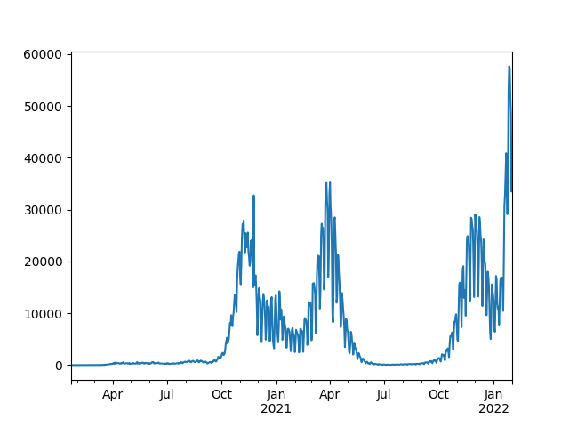
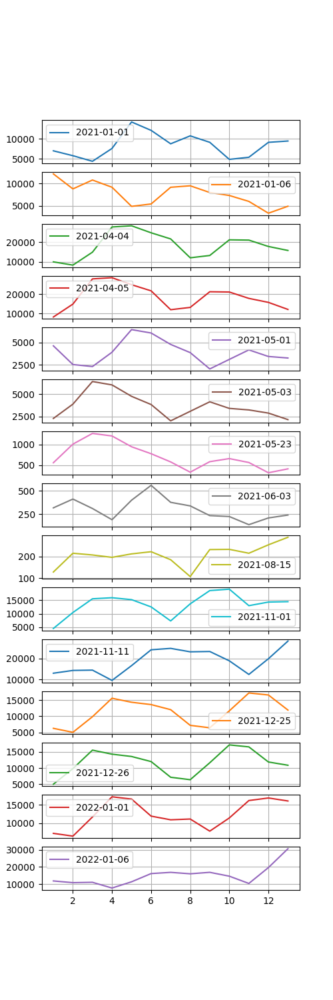
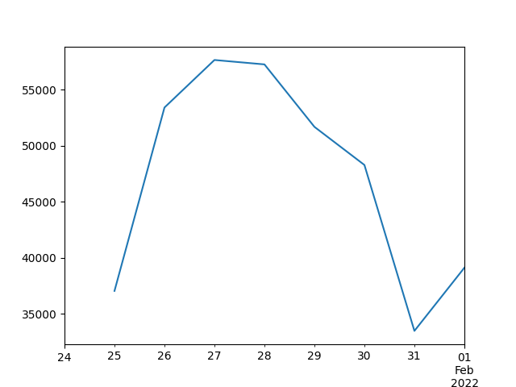
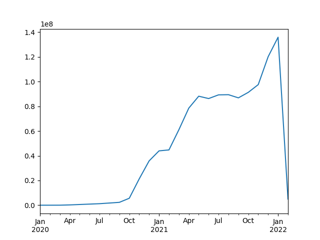
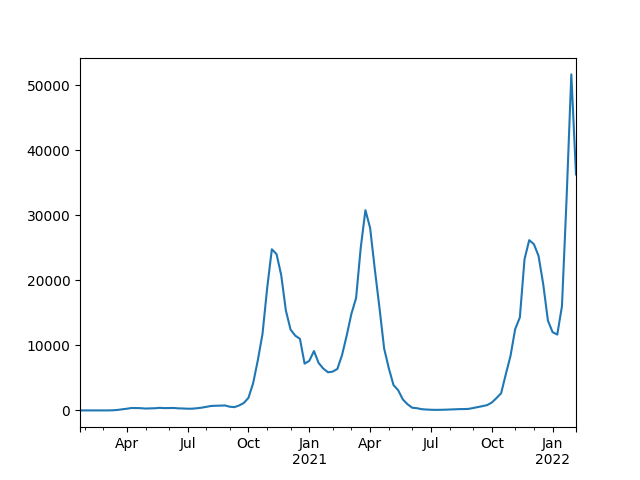
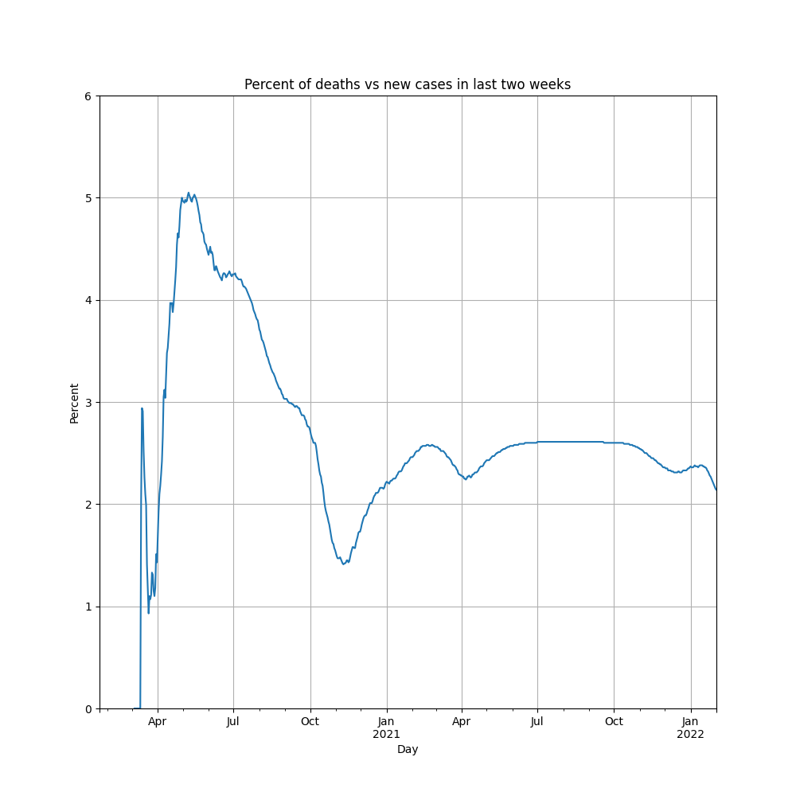
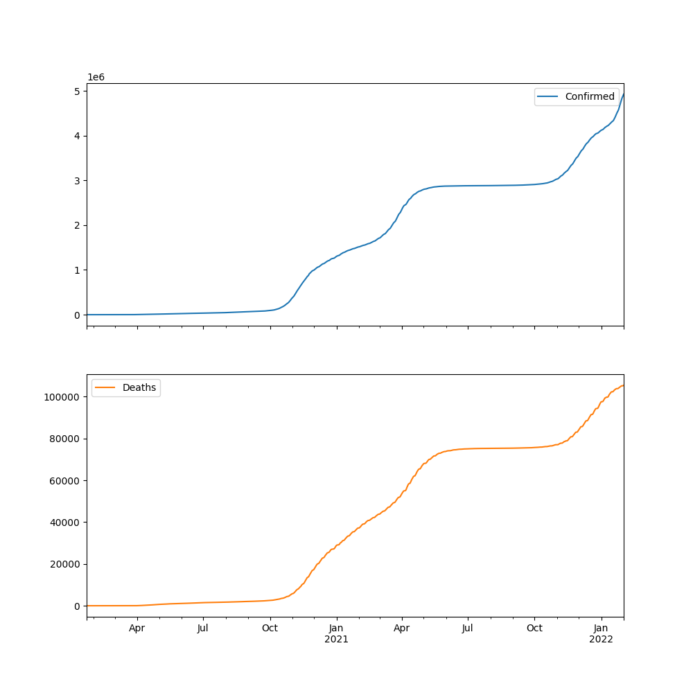

CSV COVID-19
============
* Data Source: https://github.com/CSSEGISandData/COVID-19/tree/master/csse_covid_19_data/csse_covid_19_time_series
* https://www.youtube.com/watch?v=54XLXg4fYsc
* https://github.com/CSSEGISandData/COVID-19/tree/master/csse_covid_19_data/csse_covid_19_time_series
* https://aatishb.com/covidtrends/?location=Poland
* https://aatishb.com/covidtrends/?location=Brazil&location=China&location=India&location=Poland&location=Russia&location=US
* https://youtu.be/xtZYKcOdJp0?t=168

Code
----
.. literalinclude:: src/csv-covid19-a.py
    :language: python

.. literalinclude:: src/csv-covid19-b.py
    :language: python

Plots
-----

    Confirmed daily plot for COVID19 pandemy in Poland.

    Confirmed holidays plot for COVID19 pandemy in Poland.

    Confirmed last plot for COVID19 pandemy in Poland.

    Confirmed monthly plot for COVID19 pandemy in Poland.

    Confirmed waves plot for COVID19 pandemy in Poland.

    Fatalities plot for COVID19 pandemy in Poland.

    Trendline plot for COVID19 pandemy in Poland.
