DataFrame Plotting
==================

Rationale
---------
* https://pandas.pydata.org/pandas-docs/stable/user_guide/visualization.html

.. figure:: img/matplotlib-figure-anatomy.png

Plot kinds
----------
* ``line`` - Line Plot
* ``bar`` - Vertical Bar Plot
* ``barh`` - Horizontal Bar Plot
* ``hist`` - Histogram
* ``box`` - Boxplot
* ``density``, ``kde`` - Kernel Density Estimation Plot
* ``area`` - Area Plot
* ``pie`` - Pie Plot
* ``scatter`` - Scatter Plot
* ``hexbin`` - Hexbin Plot

Parameters
----------
.. csv-table:: Parameters
    :header: "Parameter", "Default value"

    "x", ``None``
    "y", ``None``
    "kind", "line"
    "ax", ``None``
    "subplots", ``False``
    "sharex", ``None``
    "sharey", ``False``
    "layout", ``None``
    "figsize", ``None``
    "use_index", ``True``
    "title", ``None``
    "grid", ``None``
    "legend", ``True``
    "style", ``None``
    "logx", ``False``
    "logy", ``False``
    "loglog", ``False``
    "xticks", ``None``
    "yticks", ``None``
    "xlim", ``None``
    "ylim", ``None``
    "rot", ``None``
    "fontsize", ``None``
    "colormap", ``None``
    "table", ``False``
    "yerr", ``None``
    "xerr", ``None``
    "secondary_y", ``False``
    "sort_columns", ``False``
    "xlabel", ``None``
    "ylabel", ``None``

.. list-table:: Parameters
    :header-rows: 1
    :widths: 5, 15, 15, 65

    * - Parameter
      - Type
      - Default
      - Description

    * - ``data``
      - Series or DataFrame
      - None
      - The object for which the method is called

    * - ``x``
      - label or position
      - None
      - Only used if data is a DataFrame

    * - ``y``
      - label, position or list of label, positions
      - None
      - Allows plotting of one column versus another. Only used if data is
        a DataFrame.

    * - ``kind``
      - str
      - ``line``
      - ``line``, ``bar``, ``barh``, ``hist``, ``box``, ``kde``, ``density``,
        ``area``, ``pie``, ``scatter``, ``hexbin``

    * - ``figsize``
      - tuple
      - None
      - (width, height) in inches

    * - ``use_index``
      - bool
      - True
      - Use index as ticks for x axis

    * - ``title``
      - str or list
      - None
      - Title to use for the plot. If a string is passed, print the string at
        the top of the figure. If a list is passed and `subplots` is True,
        print each item in the list above the corresponding subplot.

    * - ``grid``
      - bool
      - None
      - (matlab style default) Axis grid lines

    * - ``legend``
      - bool or 'reverse'
      - None
      - Place legend on axis subplots

    * - ``style``
      - list or dict
      - None
      - matplotlib line style per column

    * - ``logx``
      - bool or 'sym'
      - False
      - Use log scaling or symlog scaling on x axis

    * - ``logy``
      - bool or 'sym'
      - False
      - Use log scaling or symlog scaling on y axis

    * - ``loglog``
      - bool or 'sym'
      - False
      - Use log scaling or symlog scaling on both x and y axes

    * - ``xticks``
      - sequence
      - None
      - Values to use for the xticks

    * - ``yticks``
      - sequence
      - None
      - Values to use for the yticks

    * - ``xlim``
      - 2-tuple/list
      - None
      -

    * - ``ylim``
      - 2-tuple/list
      - None
      -

    * - ``rot``
      - int
      - None
      - Rotation for ticks (xticks for vertical, yticks for horizontal plots)

    * - ``fontsize``
      - int
      - None
      - Font size for xticks and yticks

    * - ``colormap``
      - str or matplotlib colormap object
      - default None
      - Colormap to select colors from. If string, load colormap with that
        name from matplotlib.

    * - ``colorbar``
      - bool
      - None
      - If True, plot colorbar (only relevant for 'scatter' and 'hexbin' plots)

    * - ``position``
      - float
      - 0.5 (center)
      - Specify relative alignments for bar plot layout. From 0
        (left/bottom-end) to 1 (right/top-end).

    * - ``table``
      - bool, Series or DataFrame
      - False
      - If True, draw a table using the data in the DataFrame and the data
        will be transposed to meet matplotlib's default layout. If a Series
        or DataFrame is passed, use passed data to draw a table.

    * - ``yerr``
      - DataFrame, Series, array-like, dict or str
      - None
      - Equivalent to xerr.

    * - ``xerr``
      - DataFrame, Series, array-like, dict or str
      - None
      - Equivalent to yerr.

    * - ``mark_right``
      - bool
      - True
      - When using a secondary_y axis, automatically mark the column labels
        with "(right)" in the legend.

    * - ``**kwds``
      - keywords
      - None
      - Options to pass to matplotlib plotting method.

SetUp
-----
>>> import pandas as pd
>>> import numpy as np
>>> import matplotlib.pyplot as plt
>>>
>>>
>>> DATA = 'https://python.astrotech.io/_static/iris-clean.csv'
>>>
>>> df = pd.read_csv(DATA)

Line Plot
---------
* default

>>> plot = df.plot(kind='line')
>>> plt.show()

.. figure:: img/pandas-dataframe-plot-line.png

    Line Plot

>>> plot = df.plot(kind='line', subplots=True)
>>> plt.show()

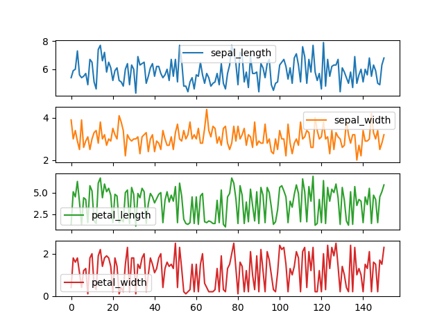

    Line Plot with Subplots

>>> plot = df.plot(kind='line',
...                subplots=True,
...                layout=(2,2),
...                sharex=True,
...                sharey=True)
>>> plt.show()

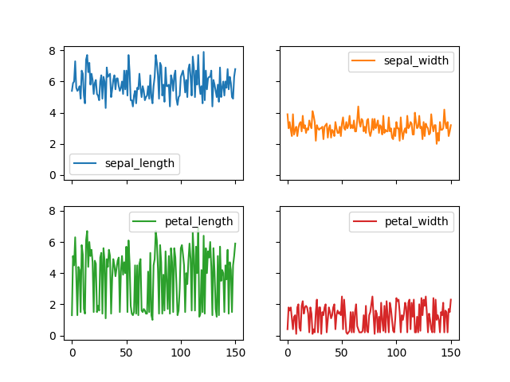

    Line Plot with Subplots and Layout

Vertical Bar Plot
-----------------
>>> plot = df.plot(kind='bar', subplots=True, layout=(2,2))
>>> plt.show()

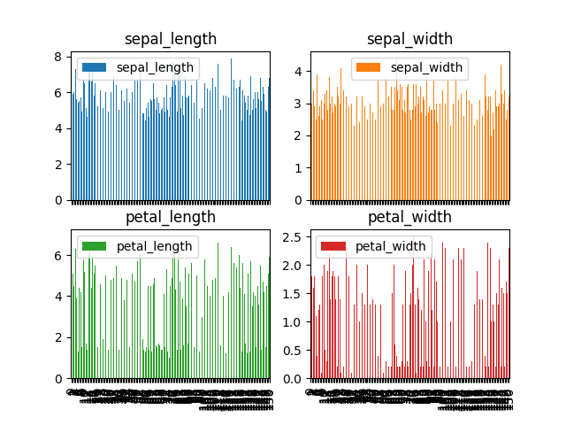

    Vertical Bar Plot

Horizontal Bar Plot
-------------------
>>> plot = df.plot(kind='barh',
...                title='Iris',
...                ylabel='centimeters',
...                xlabel='iris',
...                subplots=True,
...                layout=(2,2),
...                sharex=True,
...                sharey=True,
...                legend='upper right',
...                grid=True,
...                figsize=(10,10))
>>> plt.show()

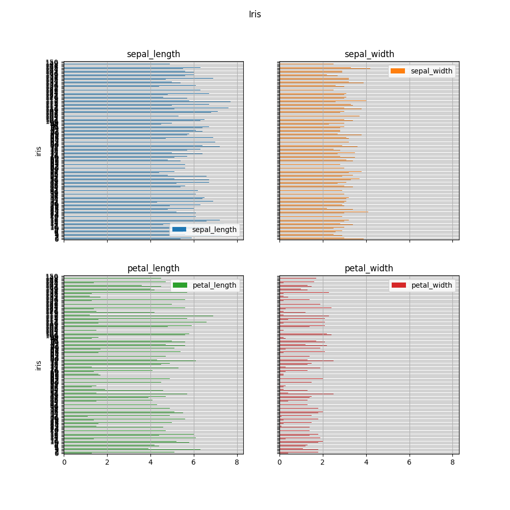

    Horizontal Bar Plot

Histogram
---------
>>> plot = df.plot(kind='hist',
...                rwidth=0.8,
...                xlabel='centimeters',
...                title='Iris Dimensions Frequency')
>>> plt.show()

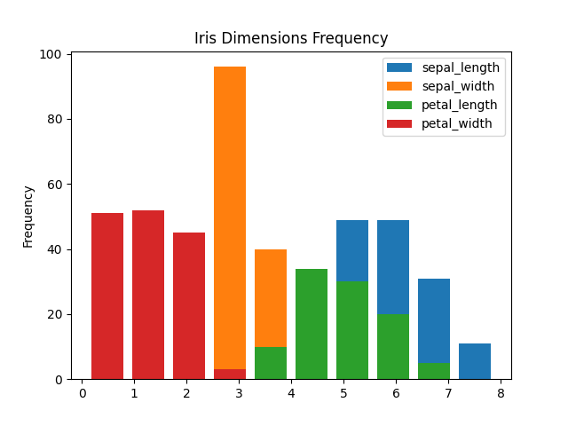

    Histogram

>>> plot = df.plot(kind='hist',
...                rwidth=0.8,
...                xlabel='centimeters',
...                title='Iris Dimensions Frequency',
...                subplots=True,
...                layout=(2,2),
...                sharex=True,
...                sharey=True)
>>> plt.show()

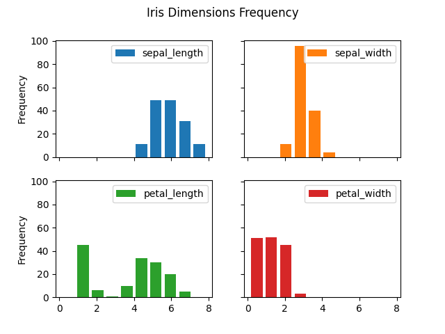

    Histogram

>>> plot = df.hist()
>>> plt.show()

    Visualization using hist

>>> plot = df['sepal_length'].hist(bins=3, rwidth=0.8, legend=None, grid=False)
>>> plot.xaxis.set_ticks(ticks=[4.9, 6.1, 7.3], labels=['small', 'medium', 'large'])
>>> plt.show()

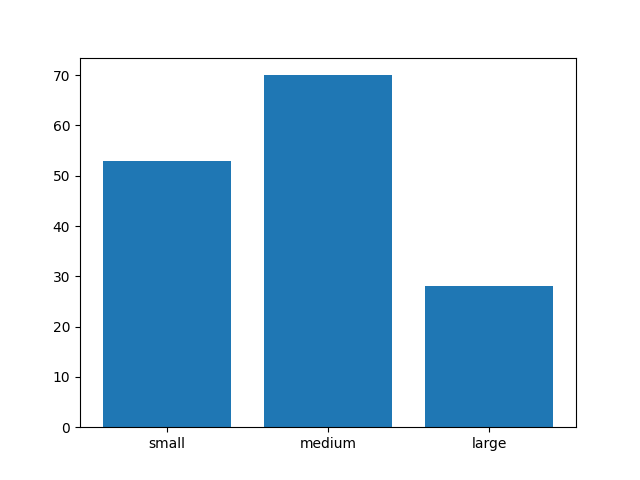

    Visualization using hist

Boxplot
-------
>>> plot = df.plot(kind='box')
>>> plt.show()

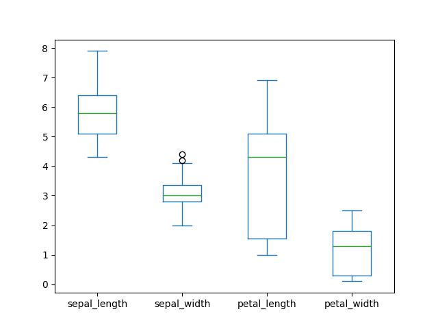

    Boxplot

>>> plot = df.plot(kind='box',
...                subplots=True,
...                layout=(2,2),
...                sharex=False,
...                sharey=False)
>>>
>>> plt.show()

.. figure:: img/pandas-dataframe-plot-box-layout.png

    Boxplot with layout

Kernel Density Estimation Plot
------------------------------
* Also known as ``kind='kde'`` - Kernel Density Estimation

>>> plot = df.plot(kind='density')
>>> plt.show()

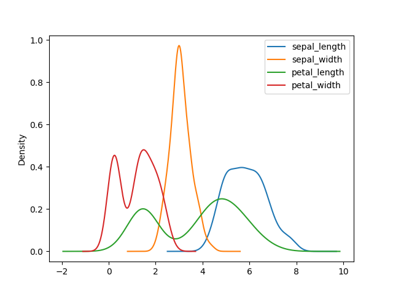

    Kernel Density Estimation Plot

>>> plot = df.plot(kind='density',
...                subplots=True,
...                layout=(2,2),
...                sharex=False)
>>> plt.subplots_adjust(hspace=0.5, wspace=0.5)  # margins between charts
>>> plt.show()

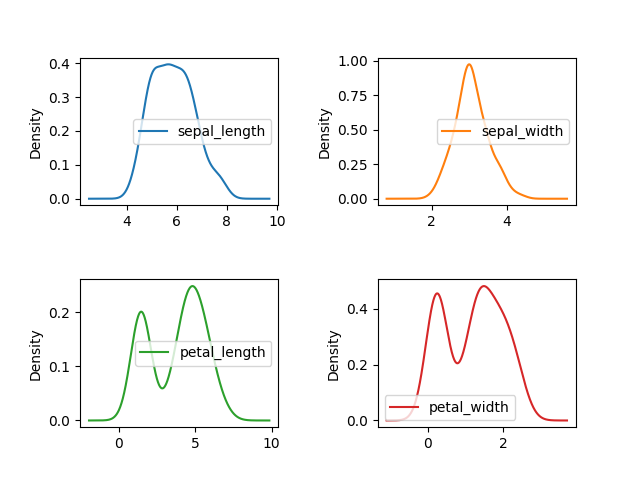

    Density plot with margins

Area Plot
---------
>>> plot = df.plot(kind='area')
>>> plt.show()

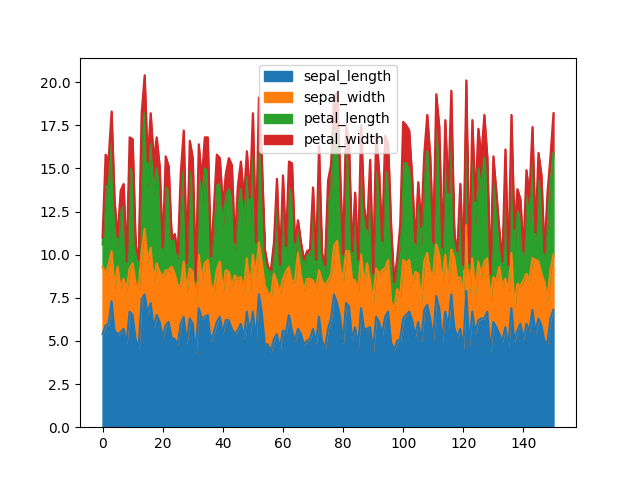

    Area Plot

.. figure:: img/pandas-dataframe-plot-cumulative-flow-diagram.png

    Cumulative Flow Diagram in Atlassian Jira

Pie Plot
--------
* List of Matplotlib color names [#matplotlibColors]_

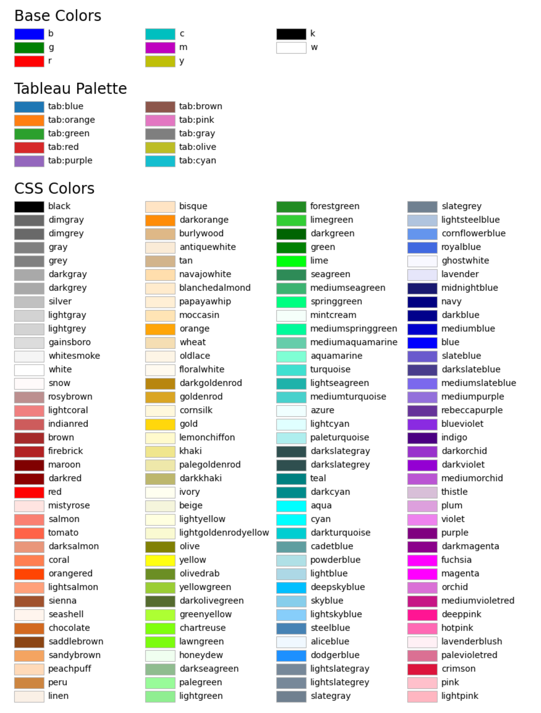

    List of Matplotlib color names [#matplotlibColors]_

>>> data = pd.cut(df['sepal_length'],
...          bins=[3, 5, 7, np.inf],
...          labels=['small', 'medium', 'large'],
...          include_lowest=True).value_counts()
>>>
>>> data.plot(kind='pie',
...           autopct='%1.0f%%',
...           colors=['plum', 'violet', 'magenta'],
...           explode=[0.1, 0, 0],
...           shadow=True,
...           startangle=-215,
...           xlabel=None,
...           ylabel=None,
...           title='Sepal Length\nsmall: 0.0 to 3.0\nmedium: 3.0 to 5.0\nlarge: 7.0 to inf',
...           figsize=(10,10))
>>>
>>> plt.show()

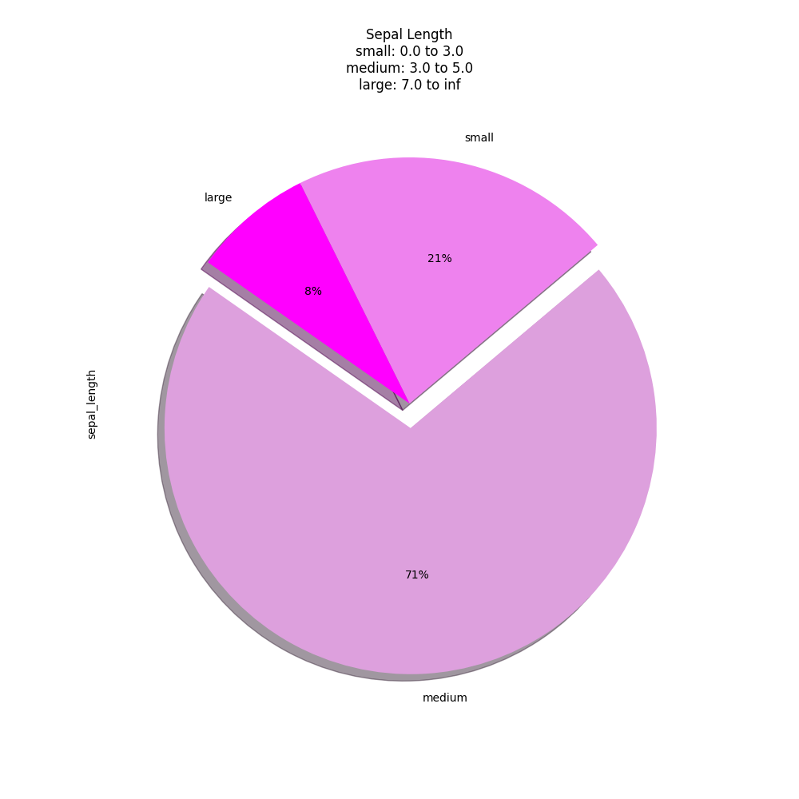

    Pie Plot

Scatter Plot
------------
>>> plot = df.plot(kind='scatter', x='sepal_length', y='sepal_width')
>>> plt.show()

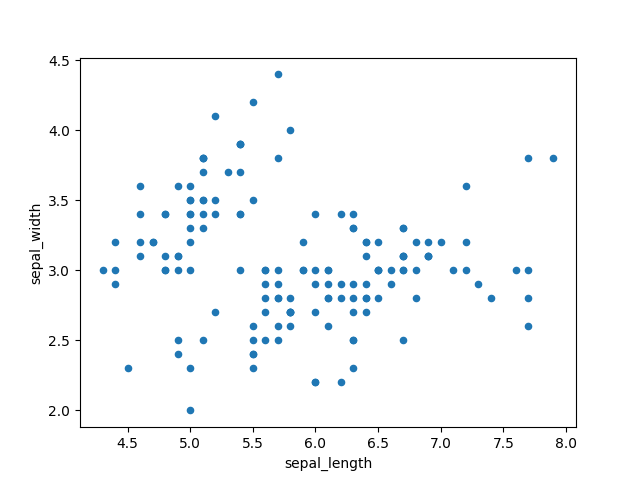

    Scatter plot: Sepal Length vs Sepal Width

>>> plot = df.plot(kind='scatter', x='petal_length', y='petal_width')
>>> plt.show()

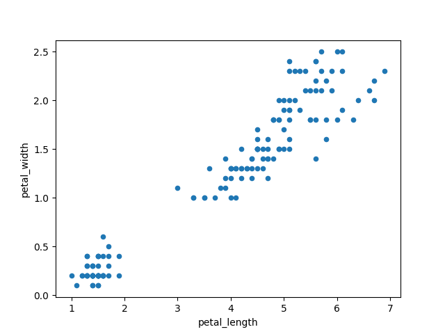

    Scatter plot: Petal Length vs Petal Width

>>> data = df.replace({
...     'setosa': 0,
...     'virginica': 1,
...     'versicolor': 2})
>>>
>>> plot = data.plot(kind='scatter',
...                  x='sepal_length',
...                  y='sepal_width',
...                  colormap='viridis',
...                  c='species')
>>> plt.show()

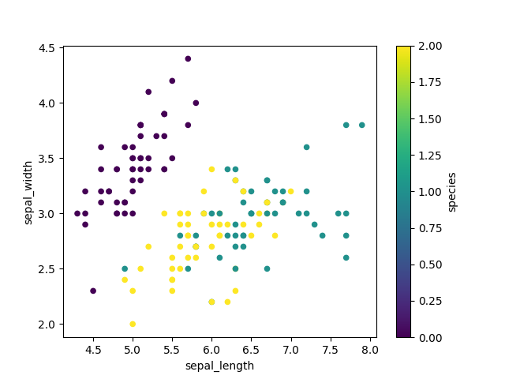

    Scatter plot using viridis colormap

Hexbin Plot
-----------
>>> df.plot(kind='hexbin', x='petal_length', y='petal_width')
>>> plt.show()

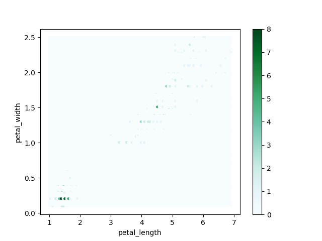

    Hexbin Plot

Scatter matrix
--------------
* The in ``pandas`` version ``0.22`` plotting module has been moved from ``pandas.tools.plotting`` to ``pandas.plotting``
* As of version ``0.19``, the ``pandas.plotting`` library did not exist

>>> from pandas.plotting import scatter_matrix
>>>
>>> plot = scatter_matrix(df)
>>> plt.show()

.. figure:: img/pandas-dataframe-plot-scattermatrix.png

    Scatter Matrix

>>> data = df[['sepal_length', 'sepal_width', 'petal_length', 'petal_width']]
>>> colors = df['species'].replace({'setosa': 0, 'virginica': 1, 'versicolor': 2})  # colors must be numerical
>>>
>>> plot = scatter_matrix(data, c=colors)
>>> plt.show()

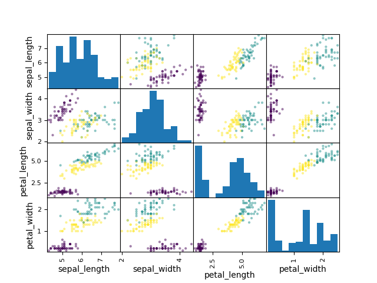

    Scatter Matrix with colors

Actinograms
-----------
.. figure:: img/pandas-dataframe-actinogram-1.png
.. figure:: img/pandas-dataframe-actinogram-2.png

Further Reading
---------------
* https://www.data-to-viz.com/#explore
* https://www.data-to-viz.com/img/poster/poster_big.png

References
----------
.. [#matplotlibColors] https://matplotlib.org/stable/gallery/color/named_colors.html

Assignments
-----------
.. literalinclude:: assignments/pandas_df_plot_a.py
    :caption: :download:`Solution <assignments/pandas_df_plot_a.py>`
    :end-before: # Solution
