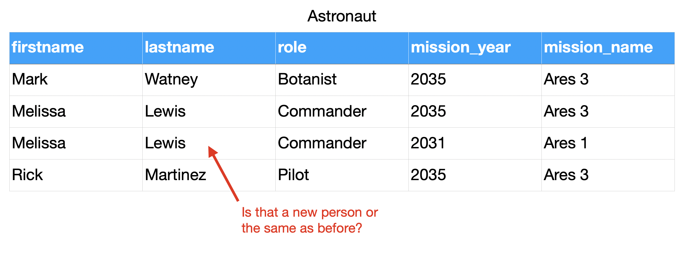
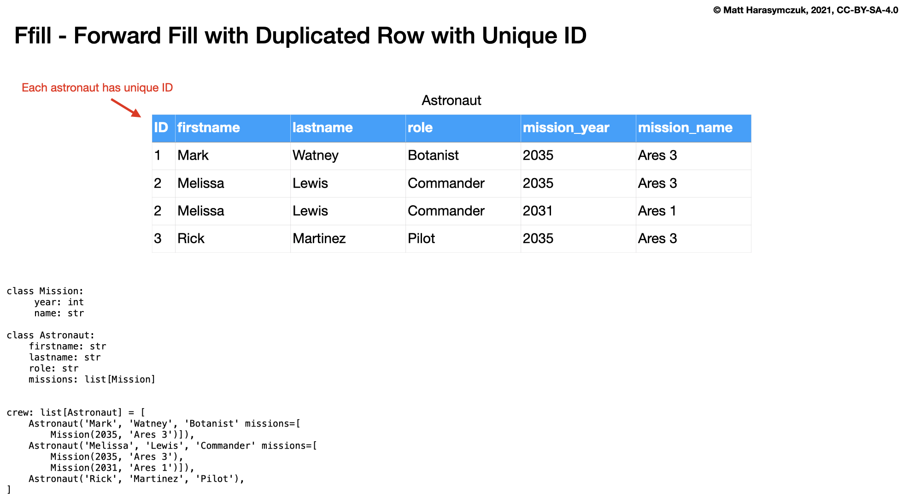
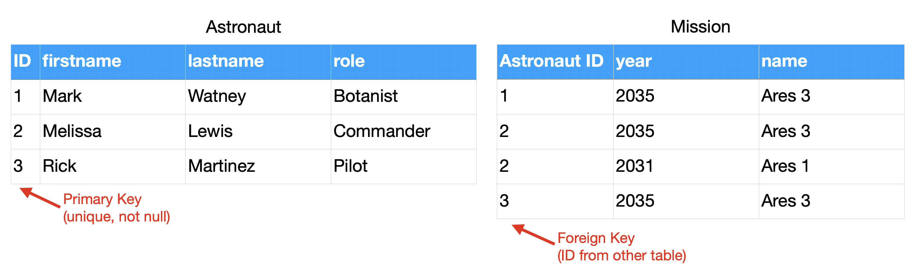
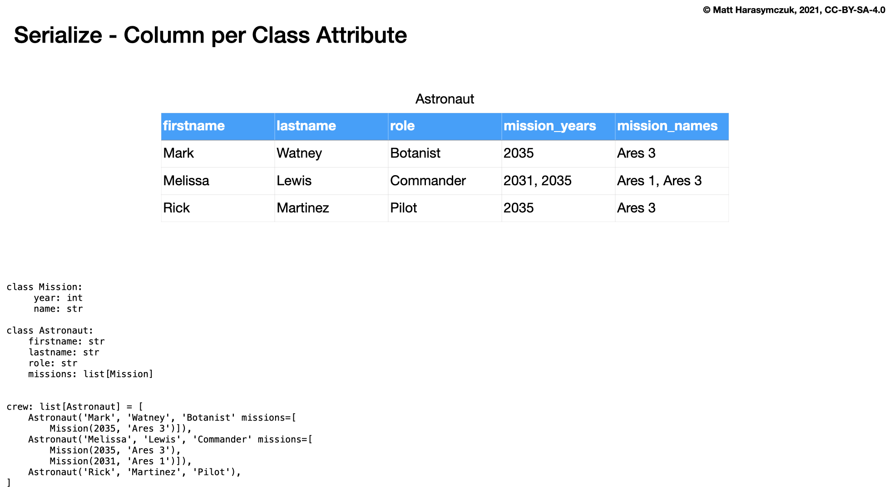

CSV Relations
=============

Base
----
>>> class Astronaut:
...     firstname: str
...     lastname: str
>>>
>>>
>>> CREW = [
...     Astronaut('Mark', 'Watney'),
...     Astronaut('Melissa', 'Lewis'),
...     Astronaut('Rick', 'Martinez')]

.. figure:: img/csv-relations-base.png

Extend
------
>>> class Astronaut:
...     firstname: str
...     lastname: str
...     role: str
>>>
>>>
>>> CREW = [
...     Astronaut('Mark', 'Watney', 'Botanist'),
...     Astronaut('Melissa', 'Lewis', 'Commander'),
...     Astronaut('Rick', 'Martinez', 'Pilot')]

.. figure:: img/csv-relations-extend1.png

>>> class Astronaut:
...     firstname: str
...     lastname: str
...     role: str
...     mission_year: int
...     missions_name: str
>>>
>>>
>>> CREW = [
...     Astronaut('Mark', 'Watney', 'Botanist,' 2035, 'Ares 3'),
...     Astronaut('Melissa', 'Lewis', 'Commander', 2035, 'Ares 3'),
...     Astronaut('Rick', 'Martinez', 'Pilot', 2035, 'Ares 3')]

.. figure:: img/csv-relations-extend2.png

Boolean Vector
--------------
>>> class Mission:
...     year: int
...     name: str
>>>
>>>
>>> class Astronaut:
...     firstname: str
...     lastname: str
...     role: str
...     missions: list[Mission]
>>>
>>>
>>> CREW = [
...     Astronaut('Mark', 'Watney', 'Botanist', missions=[
...         Mission(2035, 'Ares 3')]),
...     Astronaut('Melissa', 'Lewis', 'Commander', missions=[
...         Mission(2035, 'Ares 3'),
...         Mission(2031, 'Ares 1')]),
...     Astronaut('Rick', 'Martinez', 'Pilot')]

.. figure:: img/csv-relations-boolvector.png

FFill
-----
>>> class Mission:
...     year: int
...     name: str
>>>
>>>
>>> class Astronaut:
...     firstname: str
...     lastname: str
...     role: str
...     missions: list[Mission]
>>>
>>>
>>> CREW = [
...     Astronaut('Mark', 'Watney', 'Botanist', missions=[
...         Mission(2035, 'Ares 3')]),
...     Astronaut('Melissa', 'Lewis', 'Commander', missions=[
...         Mission(2035, 'Ares 3'),
...         Mission(2031, 'Ares 1')]),
...     Astronaut('Rick', 'Martinez', 'Pilot')]

.. figure:: img/csv-relations-ffill-empty.png
.. figure:: img/csv-relations-ffill-dash.png

Relations
---------
>>> class Mission:
...     year: int
...     name: str
>>>
>>>
>>> class Astronaut:
...     firstname: str
...     lastname: str
...     role: str
...     missions: list[Mission]
>>>
>>>
>>> CREW = [
...     Astronaut('Mark', 'Watney', 'Botanist', missions=[
...         Mission(2035, 'Ares 3')]),
...     Astronaut('Melissa', 'Lewis', 'Commander', missions=[
...         Mission(2035, 'Ares 3'),
...         Mission(2031, 'Ares 1')]),
...     Astronaut('Rick', 'Martinez', 'Pilot')]

.. figure:: img/csv-relations-rel-m2m.png

Serialization
-------------
>>> class Mission:
...     year: int
...     name: str
>>>
>>>
>>> class Astronaut:
...     firstname: str
...     lastname: str
...     role: str
...     missions: list[Mission]
>>>
>>>
>>> CREW = [
...     Astronaut('Mark', 'Watney', 'Botanist', missions=[
...         Mission(2035, 'Ares 3')]),
...     Astronaut('Melissa', 'Lewis', 'Commander', missions=[
...         Mission(2035, 'Ares 3'),
...         Mission(2031, 'Ares 1')]),
...     Astronaut('Rick', 'Martinez', 'Pilot')]

.. figure:: img/csv-relations-serialize-cls.png
.. figure:: img/csv-relations-serialize-obj.png
.. figure:: img/csv-relations-serialize-objattr.png

Assignments
-----------
.. literalinclude:: assignments/csv_relations_a.py
    :caption: :download:`Solution <assignments/csv_relations_a.py>`
    :end-before: # Solution
