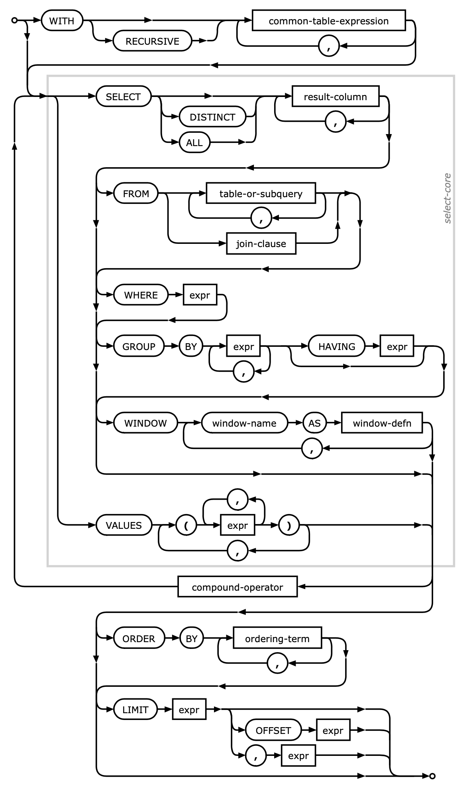

Select Examples
===============

Rationale
---------

Use Case
--------
.. code-block:: python

    import sqlite3

    DATABASE = ':memory:'

    SQL_CREATE_TABLE = """
        CREATE TABLE IF NOT EXISTS astronauts (
            id INTEGER PRIMARY KEY AUTOINCREMENT,
            pesel INTEGER UNIQUE,
            firstname TEXT,
            lastname TEXT)"""

    SQL_INSERT = 'INSERT INTO astronauts VALUES (NULL, :pesel, :firstname, :lastname)'

    DATA = {'pesel': '61041200001',
            'firstname': 'Mark',
            'lastname': 'Watney'}

    with sqlite3.connect(DATABASE) as db:
        db.execute(SQL_CREATE_TABLE)

Fetch as ``list[tuple]``
------------------------
.. code-block:: python

    import sqlite3

    DATABASE = ':memory:'
    DATA = [{'pesel': '61041200001', 'firstname': 'José', 'lastname': 'Jiménez'},
            {'pesel': '61041200002', 'firstname': 'Jan', 'lastname': 'Twardowski'},
            {'pesel': '61041200003', 'firstname': 'Melissa', 'lastname': 'Lewis'},
            {'pesel': '61041200004', 'firstname': 'Alex', 'lastname': 'Vogel'},
            {'pesel': '61041200005', 'firstname': 'Ryan', 'lastname': 'Stone'}]

    SQL_CREATE_TABLE = """
        CREATE TABLE IF NOT EXISTS astronauts (
            id INTEGER PRIMARY KEY AUTOINCREMENT,
            pesel INTEGER UNIQUE,
            firstname TEXT,
            lastname TEXT)"""

    SQL_INSERT = """
        INSERT INTO astronauts
        VALUES (NULL, :pesel, :firstname, :lastname)"""

    SQL_SELECT = 'SELECT * FROM astronauts'

    with sqlite3.connect(DATABASE) as db:
        db.execute(SQL_CREATE_TABLE)
        db.executemany(SQL_INSERT, DATA)

        for row in db.execute(SQL_SELECT):
            print(row)

    # (1, 61041200001, 'José', 'Jiménez')
    # (2, 61041200002, 'Jan', 'Twardowski')
    # (3, 61041200003, 'Melissa', 'Lewis')
    # (4, 61041200004, 'Alex', 'Vogel')
    # (5, 61041200005, 'Ryan', 'Stone')

Fetch as ``list[dict]``
-----------------------
.. code-block:: python

    import sqlite3

    DATABASE = ':memory:'
    DATA = [{'pesel': '61041200001', 'firstname': 'José', 'lastname': 'Jiménez'},
            {'pesel': '61041200002', 'firstname': 'Jan', 'lastname': 'Twardowski'},
            {'pesel': '61041200003', 'firstname': 'Melissa', 'lastname': 'Lewis'},
            {'pesel': '61041200004', 'firstname': 'Alex', 'lastname': 'Vogel'},
            {'pesel': '61041200005', 'firstname': 'Ryan', 'lastname': 'Stone'}]

    SQL_CREATE_TABLE = """
        CREATE TABLE IF NOT EXISTS astronauts (
            id INTEGER PRIMARY KEY AUTOINCREMENT,
            pesel INTEGER UNIQUE,
            firstname TEXT,
            lastname TEXT)"""

    SQL_INSERT = """
        INSERT INTO astronauts
        VALUES (NULL, :pesel, :firstname, :lastname)"""

    SQL_SELECT = 'SELECT * FROM astronauts'

    with sqlite3.connect(DATABASE) as db:
        db.execute(SQL_CREATE_TABLE)
        db.executemany(SQL_INSERT, DATA)

        db.row_factory = sqlite3.Row

        for row in db.execute(SQL_SELECT):
            print(dict(row))

    # {'id': 1, 'pesel': 61041200001, 'firstname': 'José', 'lastname': 'Jiménez'}
    # {'id': 2, 'pesel': 61041200002, 'firstname': 'Jan', 'lastname': 'Twardowski'}
    # {'id': 3, 'pesel': 61041200003, 'firstname': 'Melissa', 'lastname': 'Lewis'}
    # {'id': 4, 'pesel': 61041200004, 'firstname': 'Alex', 'lastname': 'Vogel'}
    # {'id': 5, 'pesel': 61041200005, 'firstname': 'Ryan', 'lastname': 'Stone'}

