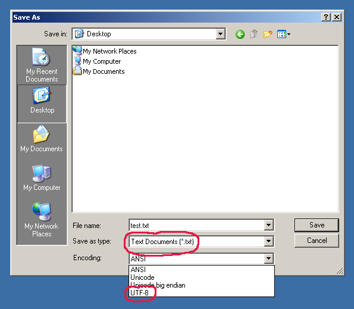
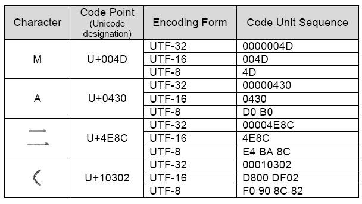

File Encoding
=============

.. testsetup::

    from pathlib import Path
    Path('/tmp/myfile.txt').unlink(missing_ok=True)

Rationale
---------
* ``utf-8`` - a.k.a. Unicode - international standard (should be always used!)
* ``iso-8859-1`` - ISO standard for Western Europe and USA
* ``iso-8859-2`` - ISO standard for Central Europe (including Poland)
* ``cp1250`` or ``windows-1250`` - Polish encoding on Windows
* ``cp1251`` or ``windows-1251`` - Russian encoding on Windows
* ``cp1252`` or ``windows-1252`` - Western European encoding on Windows
* ``ASCII`` - ASCII characters only

    Windows 2000 Notepad "Save As" window with possibility to select encoding. UTF-8 is not selected by default... Source: [#Windows2000]_

.. figure:: img/files-windows10-notepad-saveas.png

    Windows 10 Notepad "Save As" window with possibility to select encoding. Since Windows 10.1903 (May 2019) notepad writes files in UTF-8 by default! Source: [#Windows10]_ [#Microsoft]_

.. figure:: img/files-encoding-ascii2.jpg

    ASCII table. Source: [#Spinall2015]_

.. figure:: img/files-encoding-unicode2.png

    Unicode. Source: [#gammon]_

.. figure:: img/files-encoding-unicode3.png

    Unicode. Source: [#ilovefreesoftware]_

Str vs Bytes
------------
* That was a big change in Python 3
* In Python 2, str was bytes
* In Python 3, str is unicode (UTF-8)

>>> text = 'Księżyc'
>>> text
'Księżyc'

>>> text = b'Księżyc'
Traceback (most recent call last):
SyntaxError: bytes can only contain ASCII literal characters.

Default encoding is ``UTF-8``. Encoding names are case insensitive.
``cp1250`` and ``windows-1250`` are aliases the same codec:

>>> text = 'Księżyc'
>>>
>>> text.encode()
b'Ksi\xc4\x99\xc5\xbcyc'
>>> text.encode('utf-8')
b'Ksi\xc4\x99\xc5\xbcyc'
>>> text.encode('iso-8859-2')
b'Ksi\xea\xbfyc'
>>> text.encode('cp1250')
b'Ksi\xea\xbfyc'
>>> text.encode('windows-1250')
b'Ksi\xea\xbfyc'

Note the length change while encoding:

>>> text = 'Księżyc'
>>> text
'Księżyc'
>>> len(text)
7

>>> text = 'Księżyc'.encode()
>>> text
b'Ksi\xc4\x99\xc5\xbcyc'
>>> len(text)
9

Note also, that those characters produce longer output:

>>> 'ó'.encode()
b'\xc3\xb3'

But despite being several "characters" long, the length is different:

>>> len(b'\xc3\xb3')
2

Here's the output of all Polish diacritics (accented characters) with their encoding:

>>> 'ą'.encode()
b'\xc4\x85'
>>> 'ć'.encode()
b'\xc4\x87'
>>> 'ę'.encode()
b'\xc4\x99'
>>> 'ł'.encode()
b'\xc5\x82'
>>> 'ń'.encode()
b'\xc5\x84'
>>> 'ó'.encode()
b'\xc3\xb3'
>>> 'ś'.encode()
b'\xc5\x9b'
>>> 'ż'.encode()
b'\xc5\xbc'
>>> 'ź'.encode()
b'\xc5\xba'

Note also a different way of iterating over ``bytes``:

>>> text = 'Księżyc'
>>>
>>> for character in text:
...     print(character)
K
s
i
ę
ż
y
c
>>>
>>> for character in text.encode():
...     print(character)
75
115
105
196
153
197
188
121
99

UTF-8
-----
    >>> FILE = r'/tmp/myfile.txt'
    >>>
    >>> with open(FILE, mode='w', encoding='utf-8') as file:
    ...     file.write('Иван Иванович')
    13
    >>>
    >>> with open(FILE, encoding='utf-8') as file:
    ...     print(file.read())
    Иван Иванович

.. figure:: img/files-encoding-utf.png

    UTF-8. Source: [#unicode1]_

    UTF-8. Source: [#unicode2]_

Unicode Encode Error
--------------------
    >>> FILE = r'/tmp/myfile.txt'
    >>>
    >>> with open(FILE, mode='w', encoding='cp1250') as file:
    ...     file.write('Иван Иванович')
    Traceback (most recent call last):
    UnicodeEncodeError: 'charmap' codec can't encode characters in position 0-3: character maps to <undefined>

Unicode Decode Error
--------------------
    >>> FILE = r'/tmp/myfile.txt'
    >>>
    >>> with open(FILE, mode='w', encoding='utf-8') as file:
    ...     file.write('Иван Иванович')
    13
    >>>
    >>> with open(FILE, encoding='cp1250') as file:
    ...     print(file.read())
    Traceback (most recent call last):
    UnicodeDecodeError: 'charmap' codec can't decode byte 0x98 in position 1: character maps to <undefined>

Escape Characters
-----------------
* ``\r\n`` - is used on windows
* ``\n`` - is used everywhere else
* More information in `Builtin Printing`
* Learn more at https://en.wikipedia.org/wiki/List_of_Unicode_characters

.. figure:: img/type-machine.jpg

    Why we have '\\r\\n' on Windows?

Frequently used escape characters:

    * ``\n`` - New line (ENTER)
    * ``\t`` - Horizontal Tab (TAB)
    * ``\'`` - Single quote ``'`` (escape in single quoted strings)
    * ``\"`` - Double quote ``"`` (escape in double quoted strings)
    * ``\\`` - Backslash ``\`` (to indicate, that this is not escape char)

Less frequently used escape characters:

    * ``\a`` - Bell (BEL)
    * ``\b`` - Backspace (BS)
    * ``\f`` - New page (FF - Form Feed)
    * ``\v`` - Vertical Tab (VT)
    * ``\uF680`` - Character with 16-bit (2 bytes) hex value ``F680``
    * ``\U0001F680`` - Character with 32-bit (4 bytes) hex value ``0001F680``
    * ``\o755`` - ASCII character with octal value ``755``
    * ``\x1F680`` - ASCII character with hex value ``1F680``

Emoticons:

    >>> print('\U0001F680')
    🚀

    >>> a = '\U0001F9D1'  # 🧑
    >>> b = '\U0000200D'  # ''
    >>> c = '\U0001F680'  # 🚀
    >>>
    >>> astronaut = a + b + c
    >>> print(astronaut)
    🧑‍🚀

References
----------
.. [#Windows2000] redhotwords.com. Windows 2000 Notepad. http://redhotwords.com/assets/Uninotepadunicode.png
.. [#Windows10] digitalcitizen.life. Windows 10 Notepad. https://www.digitalcitizen.life/sites/default/files/gdrive/windows_notepad/notepad_10.png
.. [#Microsoft] https://docs.microsoft.com/en-us/windows/whats-new/whats-new-windows-10-version-1903
.. [#Spinall2015] Briana Spinall. Better Ascii Table. 2015. http://brianaspinall.com/wp-content/uploads/2015/11/better_ascii_table.jpg
.. [#gammon] http://www.gammon.com.au/unicode/gbk.svg.png
.. [#ilovefreesoftware] http://cdn.ilovefreesoftware.com/wp-content/uploads/2016/10/unicode-Character-list-1.png
.. [#unicode1] https://camo.githubusercontent.com/7806142e30089cac76da9fe9fb1c5bbd0521cde6/68747470733a2f2f692e696d6775722e636f6d2f7a414d74436a622e706e67
.. [#unicode2] https://i.pinimg.com/736x/12/e2/37/12e237271c063313762fcafa1cf58e39--web-development-tools.jpg
