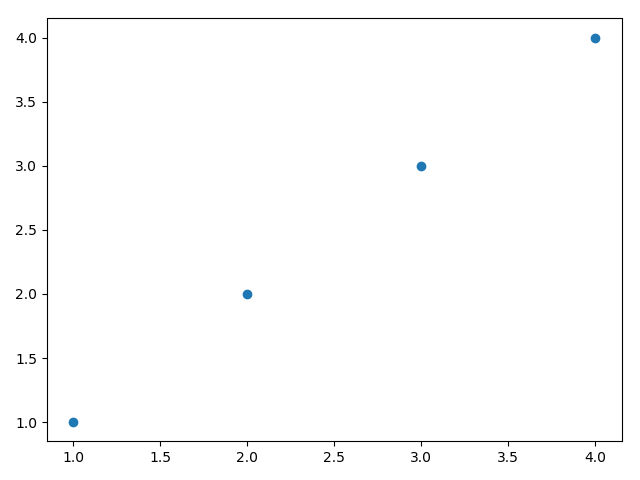

.. _Mathematics:

***********
Mathematics
***********

``complex``
===========
* Complex number with real and imaginary parts
* Engineering notation ``j`` not mathematical ``i``
* No space inside the expression

Defining ``complex``
--------------------
.. code-block:: python

    complex()               # 0j

.. code-block:: python

    complex(1)              # (1+0j)
    complex(1, 2)           # (1+2j)
    complex(1.12, 2.34)     # (1.12+2.34j)
    complex(1, 2.34)        # (1+2.34j)

.. code-block:: python

    complex(1+2j)           # (1+2j)
    complex(1+2j, 3+4j)     # (-3+5j)

.. code-block:: python

    complex('1+2j')         # (1+2j)
    complex('1 + 2j')       # ValueError: complex() arg is a malformed string

Builtin
=======
* ``abs()``
* ``round()``
* ``pow()``

``math``
========

Constants
---------
.. code-block:: python

    import math

    math.pi
    math.e

Degree/Radians Conversion
-------------------------
.. code-block:: python

    import math

    math.degrees(x)
    math.radians(x)

Rounding to lower
-----------------
.. code-block:: python

    import math

    math.floor(3.14)                # 3
    math.floor(3.00000000000001)    # 3
    math.floor(3.00000000000000)    # 3

Rounding to higher
------------------
.. code-block:: python

    import math

    math.ceil(3.14)                 # 4
    math.ceil(3.00000000000001)     # 4
    math.ceil(3.00000000000000)     # 3

Logarithms
----------
.. code-block:: python

    import math

    math.log(x)
    math.log(x, base=2)
    math.log10()

    math.exp(x)

Linear Algebra
--------------
.. code-block:: python

    import math

    math.sqrt()
    math.pow(x, y)

Trigonometry
------------
.. code-block:: python

    import math

    math.sin()
    math.cos()
    math.tan()

    math.atan(x)
    math.asin(x)
    math.acos(x)

Other functions
---------------
.. code-block:: python

    import math

    math.isinf(x)
    math.fabs(x)

    # Return the Euclidean distance, sqrt(x*x + y*y).
    math.hypot(x, y)

``fractions``
=============
.. code-block:: python

    from fractions import Fraction

    a = Fraction(1, 3)
    b = Fraction(1, 9)

    a + b
    # Fraction(4, 9)

``statistics``
==============
.. csv-table:: Averages and measures of central location
    :header-rows: 1

    "Function", "Description"
    "``statistics.mean()``", "Arithmetic mean ('average') of data"
    "``statistics.harmonic_mean()``", "Harmonic mean of data"
    "``statistics.median()``", "Median (middle value) of data"
    "``statistics.median_low()``", "Low median of data"
    "``statistics.median_high()``", "High median of data"
    "``statistics.median_grouped()``", "Median, or 50th percentile, of grouped data"
    "``statistics.mode()``", "Mode (most common value) of discrete data"

.. csv-table:: Measures of spread
    :header-rows: 1

    "Function", "Description"
    "``statistics.pstdev()``", "Population standard deviation of data"
    "``statistics.pvariance()``", "Population variance of data"
    "``statistics.stdev()``", "Sample standard deviation of data"
    "``statistics.variance()``", "Sample variance of data"

.. code-block:: python

    from statistics import mean

    mean([1, 2, 3, 4, 4])           # 2.8
    mean([-1.0, 2.5, 3.25, 5.75])   # 2.625

.. code-block:: python

    from statistics import harmonic_mean

    harmonic_mean([2.5, 3, 10])     # 3.6

.. code-block:: python

    from statistics import median

    median([1, 3, 5])               # 3
    median([1, 3, 5, 7])            # 4.0

The low median is always a member of the data set. When the number of data points is odd, the middle value is returned. When it is even, the smaller of the two middle values is returned.

.. code-block:: python

    from statistics import median_low

    median_low([1, 3, 5])           # 3
    median_low([1, 3, 5, 7])        # 3

The high median is always a member of the data set. When the number of data points is odd, the middle value is returned. When it is even, the larger of the two middle values is returned.

.. code-block:: python

    from statistics import median_high

    median_high([1, 3, 5])          # 3
    median_high([1, 3, 5, 7])       # 5

Return the median of grouped continuous data, calculated as the 50th percentile, using interpolation.

.. code-block:: python

    from statistics import median_grouped

    median_grouped([52, 52, 53, 54])              # 52.5
    median_grouped([1, 3, 3, 5, 7], interval=1)   # 3.25
    median_grouped([1, 3, 3, 5, 7], interval=2)   # 3.5

.. code-block:: python

    from statistics import mode

    mode([1, 1, 2, 3, 3, 3, 3, 4])                                  # 3
    mode(["red", "blue", "blue", "red", "green", "red", "red"])     # 'red'

Return the population standard deviation (the square root of the population variance).

.. code-block:: python

    from statistics import pstdev

    pstdev([1.5, 2.5, 2.5, 2.75, 3.25, 4.75])
    # 0.986893273527251

.. code-block:: python

    from statistics import pvariance

    pvariance([0.0, 0.25, 0.25, 1.25, 1.5, 1.75, 2.75, 3.25])
    # 1.25

.. code-block:: python

    from statistics import stdev

    stdev([1.5, 2.5, 2.5, 2.75, 3.25, 4.75])
    # 1.0810874155219827

.. code-block:: python

    from statistics import variance

    variance([2.75, 1.75, 1.25, 0.25, 0.5, 1.25, 3.5])
    # 1.3720238095238095

``random``
==========
.. csv-table:: ``random``
    :header-rows: 1

    "Function", "Description"
    "``random.random()``", "Random float:  0.0 <= x < 1.0"
    "``random.randint(min, max)``", "Return a random integer N such that ``min <= N <= max``. Max is included"
    "``random.gauss(mu, sigma)``", "Gaussian distribution. mu is the mean, and sigma is the standard deviation"
    "``random.shuffle(list)``", "Randomize order of list (in place)"
    "``random.choice(list)``", "Single random element from a sequence"
    "``random.sample(list, k)``", "k random elements from list without replacement"
    "``random.seed(a=None, version=2)``", "Initialize the random number generator. If a is omitted or None, the current system time is used"

``collections.Counter``
=======================
.. code-block:: python

    import random

    random_numbers = [random.randint(0, 10) for a in range(0, 50)]
    counter = dict()

    for number in random_numbers:
        if number in counter:
            counter[number] += 1
        else:
            counter[number] = 1

    counter.items()
    # [(7, 12), (4, 8), (9, 6), (1, 5), (2, 4)]

.. code-block:: python

    import random
    from collections import Counter

    random_numbers = [random.randint(0, 10) for a in range(0, 50)]
    counter = Counter(random_numbers)

    counter.most_common(5)
    # [(7, 12), (4, 8), (9, 6), (1, 5), (2, 4)]

``matplotlib``
==============
* biblioteka zewnętrzna ``pip install matplotlib``

.. note:: Moduł jest szczegółowo opisany w :ref:`Matplotlib`.

Moduł ``matplotlib`` pozwala na rysowanie wykresów i diagramów. Jest to bardzo rozbudowana biblioteka z setkami opcji konfiguracyjnych. Najczęściej używanym modułem biblioteki ``matplotlib`` jest moduł ``pyplot``, który implementuje szereg funkcji umożliwiających rysowanie wykresów 2d.

``Matplotlib`` and ``Jupyter``
------------------------------
* To display ``matplotlib`` figures inline, you have run at least once per kernel run:

    .. code-block:: text

        %matplotlib inline

Points
------

    Points chart

.. literalinclude:: src/matplotlib-01.py
    :language: python
    :caption: Matplotlib example

Sinusoid on grid
----------------
.. figure:: img/matplotlib-02.png
    :scale: 50%
    :align: center

    Sinusoid on grid

.. literalinclude:: src/matplotlib-02.py
    :language: python
    :caption: Matplotlib example

Multiple charts
---------------
.. figure:: img/matplotlib-03.png
    :scale: 50%
    :align: center

    Multiple charts

.. literalinclude:: src/matplotlib-03.py
    :language: python
    :caption: Matplotlib example

Assignments
===========

Sum of inner elements
---------------------
* Filename: ``math_inner_sum.py``
* Lines of code to write: 5 lines
* Estimated time of completion: 10 min

#. Za pomocą biblioteki ``random`` wygeneruj ``List[List[int]]``
#. Tablica ma mieć 16 wierszy i 16 kolumn
#. Policz sumę środkowych 4x4 elementów
#. Ustaw ``random.seed()``

Euclidean distance 2D
---------------------
* Filename: ``math_euclidean_2d.py``
* Lines of code to write: 5 lines
* Estimated time of completion: 15 min
* Input data: :numref:`listing-math-euclidean-distance-2D`

#. Dane są dwa punkty :math:`A` i :math:`B` o podanych koordynatach ``tuple``
#. Punkty :math:`A` i :math:`B` są dwuwymiarowe ``(x, y)``
#. Oblicz odległość między nimi
#. Wykorzystaj algorytm Euklidesa
#. Funkcja musi przechodzić ``doctest`` :numref:`listing-math-euclidean-distance-2D`

.. code-block:: python
    :name: listing-math-euclidean-distance-2D
    :caption: Euclidean distance 2D

    def euclidean_distance(A, B):
        """
        >>> A = (1, 0)
        >>> B = (0, 1)
        >>> euclidean_distance(A, B)
        1.4142135623730951

        >>> euclidean_distance((0,0), (1,0))
        1.0

        >>> euclidean_distance((0,0), (1,1))
        1.4142135623730951

        >>> euclidean_distance((0,1), (1,1))
        1.0

        >>> euclidean_distance((0,10), (1,1))
        9.055385138137417
        """
        return

.. figure:: ../machine-learning/img/k-nearest-neighbors-euclidean-distance.png
    :scale: 100%
    :align: center

    Wyliczanie odległości w celu oszacowania przynależności do zbioru. Zwróć uwagę, że bez względu na ilość wymiarów wzór się niewiele różni.

Euclidean distance ``n`` dimensions
-----------------------------------
* Filename: ``math_euclidean_multi_dim.py``
* Lines of code to write: 10 lines
* Estimated time of completion: 15 min
* Input data: :numref:`listing-math-euclidean-distance-n-dimensions`

#. Dane są dwa punkty :math:`A` i :math:`B` o podanych koordynatach ``tuple``
#. Punkty :math:`A` i :math:`B` są na :math:`N`-wymiarowej przestrzeni ``(x, y, ...)``
#. Punkty :math:`A` i :math:`B` muszą być równo-wymiarowe
#. Funkcja musi przechodzić ``doctest`` :numref:`listing-math-euclidean-distance-n-dimensions`

.. code-block:: python
    :name: listing-math-euclidean-distance-n-dimensions
    :caption: Euclidean distance N-dimension

    def euclidean_distance(A, B):
        """
        >>> A = (0,1,0,1)
        >>> B = (1,1,0,0)
        >>> euclidean_distance(A, B)
        1.4142135623730951

        >>> euclidean_distance((0,0,0), (0,0,0))
        0.0

        >>> euclidean_distance((0,0,0), (1,1,1))
        1.7320508075688772

        >>> euclidean_distance((0,1,0,1), (1,1,0,0))
        1.4142135623730951

        >>> euclidean_distance((0,0,1,0,1), (1,1,0,0,1))
        1.7320508075688772

        >>> euclidean_distance((0,0,1,0,1), (1,1))
        Traceback (most recent call last):
            ...
        ValueError: Punkty muszą być w przestrzeni tylu-samo wymiarowej
        """
        return

Matrix multiplication
---------------------
* Filename: ``math_matrix_multiplication.py``
* Lines of code to write: 6 lines
* Estimated time of completion: 20 min

#. Napisz program mnożący macierze wykorzystując zagnieżdżone pętle ``for``

.. code-block:: python

    A = [
        [1, 0],
        [0, 1]
    ]

.. code-block:: python

    def matrix_multiplication(A, B):
        """
        >>> A = [[1, 0], [0, 1]]
        >>> B = [[4, 1], [2, 2]]
        >>> matrix_multiplication(A, B)
        [[4, 1], [2, 2]]

        >>> A = [[1,0,1,0], [0,1,1,0], [3,2,1,0], [4,1,2,0]]
        >>> B = [[4,1], [2,2], [5,1], [2,3]]
        >>> matrix_multiplication(A, B)
        [[9, 2], [7, 3], [21, 8], [28, 8]]
        """
        return

:Hints:
    * macierz zerowa
    * trzy pętle

Trigonometry
------------
* Filename: ``math_trigonometry.py``
* Lines of code to write: 10 lines
* Estimated time of completion: 10 min

#. Program wczytuje od użytkownika wielkość kąta w stopniach
#. Użytkownik zawsze podaje ``int`` albo ``float``
#. Wyświetl wartość funkcji trygonometrycznych (sin, cos, tg, ctg)
#. Jeżeli funkcja trygonometryczna nie istnieje dla danego kąta wypisz "For this angle function does not exist." i zakończ program

Random numbers
--------------
* Filename: ``math_random_numbers.py``
* Lines of code to write: 5 lines
* Estimated time of completion: 10 min

#. Napisz program, który wyświetli 6 losowych i nie powtarzających się liczb z zakresu od 1 do 49.
#. Czym sa liczby pseudolosowe?
#. Czy da się stworzyć program czysto losowy?
#. Dlaczego?

:Hints:
    * ``random.randrange()``
    * ``random.sample()``
    * Czytelny cod obu przykładów wraz z białymi liniami nie powinien zająć więcej niż 10 linii.

:The whys and wherefores:
    * Umiejętność wykorzystania gotowych funkcji w zewnętrznej bibliotece
    * Umiejętność wyszukania informacji na temat API funkcji w dokumentacji języka i jego odpowiedniej wersji
    * Stworzenie dwóch alternatywnych podejść do rozwiązania zadania
    * Porównanie czytelności obu rozwiązań
    * Umiejętność sprawdzania czy coś znajduje się w liście oraz ``continue``

Triangle
--------
* Filename: ``math_triangle.py``
* Lines of code to write: 5 lines
* Estimated time of completion: 10 min

#. Napisz program, który obliczy pole trójkąta.
#. Użytkownik poda wysokość i długość podstawy tego trójkąta. Uwzględnij, że wysokość i długość podstawy mogą być liczbami niecałkowitymi. Wykorzystaj doctest do przetestowania funkcji.

:The whys and wherefores:
    * Umiejętność wykorzystania gotowych funkcji w zewnętrznej bibliotece
    * Umiejętność wyszukania informacji na temat API funkcji w dokumentacji języka i jego odpowiedniej wersji
    * Stworzenie dwóch alternatywnych podejść do rozwiązania zadania
    * Porównanie czytelności obu rozwiązań

Random points
-------------
* Filename: ``math_random_points.py``
* Lines of code to write: 15 lines
* Estimated time of completion: 20 min

#. Wygeneruj 100 losowych punktów (rozkład gaussa o średniej 0, dowolnym odchyleniu standardowym(np. 0.2))
#. Punkty muszą być wylosowane wokół dwóch dowolnie wybranych punktów (np. A=[0, 1], B=[2, 4]).
#. Funkcja musi przechodzić ``doctest``

.. code-block:: python

    def random_point(center, std: int = 0.2):
        """
        >>> random.seed(1); random_point((0,0), std=0.2)
        (0.2576369506310926, 0.2898891217399542)

        >>> random.seed(1); random_point((0,0))
        (0.2576369506310926, 0.2898891217399542)

        >>> random.seed(1); random_point((2,5), std=10)
        (14.881847531554628, 19.494456086997708)

        >>> random.seed(1); random_point((2,5), std=(0.1, 12))
        (2.1288184753155464, 22.393347304397253)
        """
        pass

Wyrysuj te punkty na wykresie (możesz użyć funkcji ``plt.axis('equal')`` żeby osie wykresu były w tej samej skali). Punkt A i punkty wygenerowane na jego podstawie wyrysuj kolorem czerwonym (argument ``color='red'`` w funkcji ``plt.plot``), a punkt B i punkty wygenerowane na jego podstawie wyrysuj kolorem niebieskim. Możesz do tego celu napisać funkcję ``plot_point(point, color)``, która przyjmuje punkt (dwuelementowy tuple, lub listę, z czego pierwszy element to współrzędna x, a druga to y), i kolor i doda ten punkt do aktualnie aktywnego rysunku.

Korzystając z funkcji napisanej w ćwiczeniu powyżej oblicz odległość od każdego z punktów do punktów A i B oraz na podstawie tej odległości zaklasyfikuj te punkty (jeżeli punkt jest bliżej punktu A to należy do zbioru A, jeżeli jest bliżej do zbioru B to należy do zbioru B). Narysuj nowy wykres, na którym punkty ze zbioru A będą narysowane kolorem czerwonym, a punkty ze zbioru B kolorem niebieskim.

Czy dwa wykresy są takie same? Co się stanie jeżeli będziemy zwiększali odchylenie standardowe przy generacji punktów? Albo przybliżymy do siebie punkty A i B?
