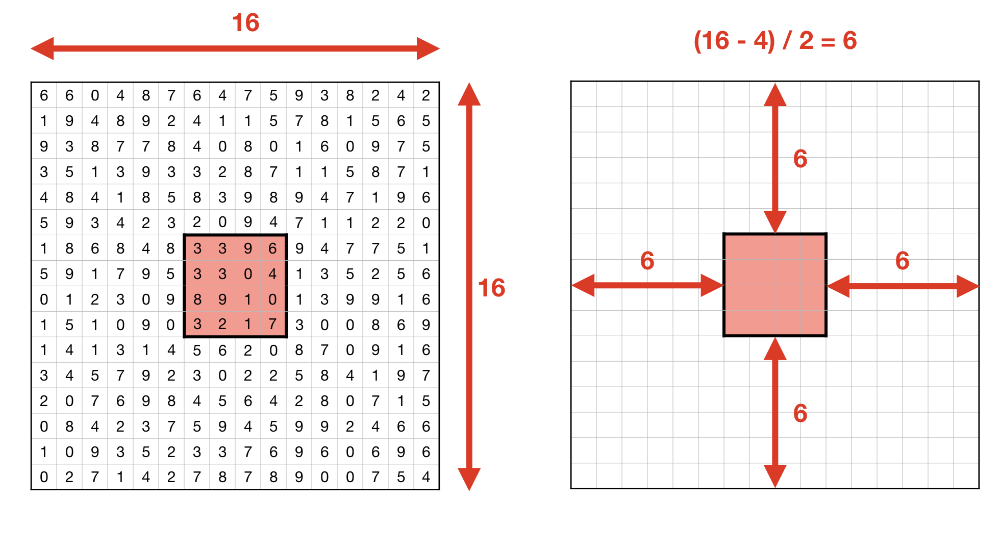

.. _Math Random:

***********
Math Random
***********

``random``
==========
.. csv-table:: ``random``
    :header-rows: 1

    "Function", "Description"
    "``random.random()``", "Random float:  0.0 <= x < 1.0"
    "``random.randint(min, max)``", "Return a random integer N such that ``min <= N <= max``. Max is included"
    "``random.gauss(mu, sigma)``", "Gaussian distribution. mu is the mean, and sigma is the standard deviation"
    "``random.shuffle(list)``", "Randomize order of list (in place)"
    "``random.choice(list)``", "Single random element from a sequence"
    "``random.sample(list, k)``", "k random elements from list without replacement"
    "``random.seed(a=None, version=2)``", "Initialize the random number generator. If a is omitted or None, the current system time is used"

Pseudo and Pure random numbers
==============================
* What are pseudorandom numbers?
* Why it is not possible to generate a pure random number?
* What is ``random.seed(0)``?

Assignments
===========
.. todo:: Convert assignments to literalinclude

Random numbers
--------------
* Assignment: Random numbers
* Complexity: easy
* Lines of code: 5 lines
* Time: 13 min

English:
    1. Print 6 random integers without repetition in range from 1 to 49

Polish:
    1. Wyświetl 6 losowych i nie powtarzających się liczb całkowitych z zakresu od 1 do 49.

Sum of inner elements
---------------------
* Assignment: Sum of inner elements
* Complexity: medium
* Lines of code: 5 lines
* Time: 13 min

English:
    1. Use only ``random`` module
    2. Set ``random.seed(0)``
    3. Generate ``outer: list[list[int]]`` with 16x16 random digits (0-9 inclusive)
    4. Calculate sum of inner 4x4 elements
    5. Inner matrix is exactly in the middle of outer

Polish:
    1. Używaj tylko modułu ``random``
    2. Ustaw ``random.seed(0)``
    3. Wygeneruj ``outer: list[list[int]]`` z 16x16 losowych cyfr (0-9 włącznie)
    4. Policz sumę środkowych 4x4 elementów
    5. Środkowa macierz jest dokładnie w środku większej

    Sum of inner elements
