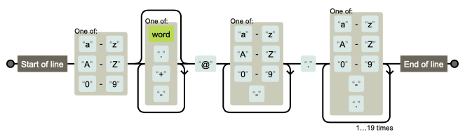

Regex About
===========

Rationale
---------
Regular Expressions are also known as:

    * ``Regular Expressions``
    * ``Regular Expr``
    * ``regexp``
    * ``regex``
    * ``re``

Syntax
------
* Identifiers - what to find (single character)
* Qualifiers - range to find (range)
* Quantifiers - how many occurrences of preceding qualifier or identifier

Escape characters
-----------------
* Escape characters
* ``\n`` - newline
* ``\r\n`` - windows newline
* ``\r`` - carriage return
* ``\b`` - backspace
* ``\s`` - whitespace (space, tab, newline, non-breaking space)
* ``\t`` - tab
* ``\v`` - vertical space
* ``\f`` - form feed

Raw Strings
-----------
* Recall information about raw strings ``r'...'``
* ``'hello\nworld'`` - text ``hello`` and then ``world`` in a new line
* ``'hello\\nworld'`` - text ``hello``, then ``\n`` and ``world``
* ``r'hello\nworld'`` - text ``hello``, then ``\n`` and ``world``

String
------
.. code-block:: python

    import string

    string.punctuation
    # '!"#$%&\'()*+,-./:;<=>?@[\\]^_`{|}~'

    string.whitespace
    # ' \t\n\r\x0b\x0c'

    string.ascii_lowercase
    # 'abcdefghijklmnopqrstuvwxyz'

    string.ascii_uppercase
    # 'ABCDEFGHIJKLMNOPQRSTUVWXYZ'

    string.ascii_letters
    # 'abcdefghijklmnopqrstuvwxyzABCDEFGHIJKLMNOPQRSTUVWXYZ'

    string.digits
    # '0123456789'

    string.hexdigits
    # '0123456789abcdefABCDEF'

    string.octdigits
    # '01234567'

    string.printable
    # '0123456789abcdefghijklmnopqrstuvwxyzABCDEFGHIJKLMNOPQRSTUVWXYZ!"#$%&\'()*+,-./:;<=>?@[\\]^_`{|}~ \t\n\r\x0b\x0c'

Examples
--------
* ISO Date: ``r'^\d{4}-\d{2}-\d{2}$'``
* US Long Date: ``r'^\w+ \d{2}, \d{4}$'``
* US Short Date: ``r'^\d{2}/\d{2}/\d{2}$'``
* Email [#rfc3696]_: ``r'^[a-zA-Z0-9][\w.+-]*@[a-zA-Z0-9-]+\.[a-zA-Z0-9-.]{2,20}$'``

Visualization
-------------
* https://regexper.com/
* https://regex101.com/

    Visualization for pattern ``r'^[a-zA-Z0-9][\w.+-]*@[a-zA-Z0-9-]+\.[a-zA-Z0-9-.]{2,20}$'`` [#rfc3696]_

Further Reading
---------------
* Kinsley, Harrison "Sentdex". Python 3 Programming Tutorial - Regular Expressions / Regex with re. Year: 2014. Retrieved: 2021-04-11. URL: https://www.youtube.com/watch?v=sZyAn2TW7GY
* https://www.rexegg.com/regex-trick-conditional-replacement.html
* https://www.rexegg.com/regex-lookarounds.html
* https://www.rexegg.com/regex-anchors.html#z

References
----------
.. [#rfc3696] Klensin, J. RFC-3696: Application Techniques for Checking and Transformation of Names. The Internet Society Network Working Group. Year: 2004. Retrieved: 2021-05-12. https://datatracker.ietf.org/doc/html/rfc3696#section-3
