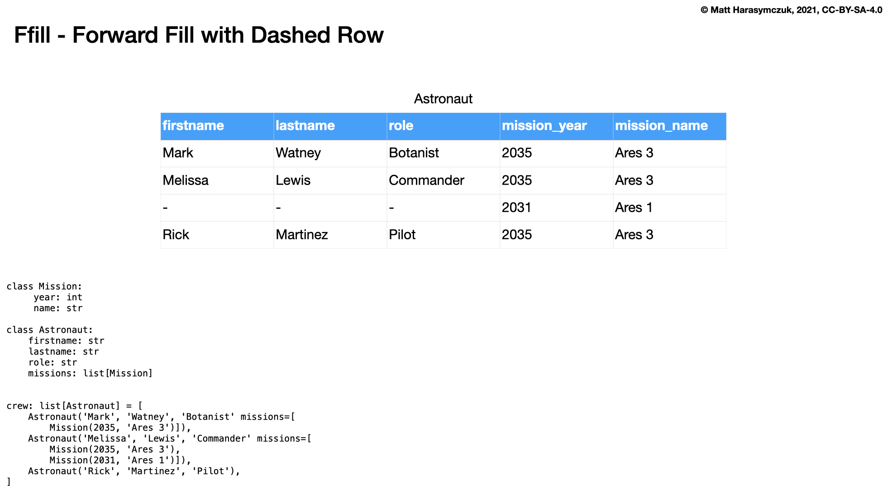
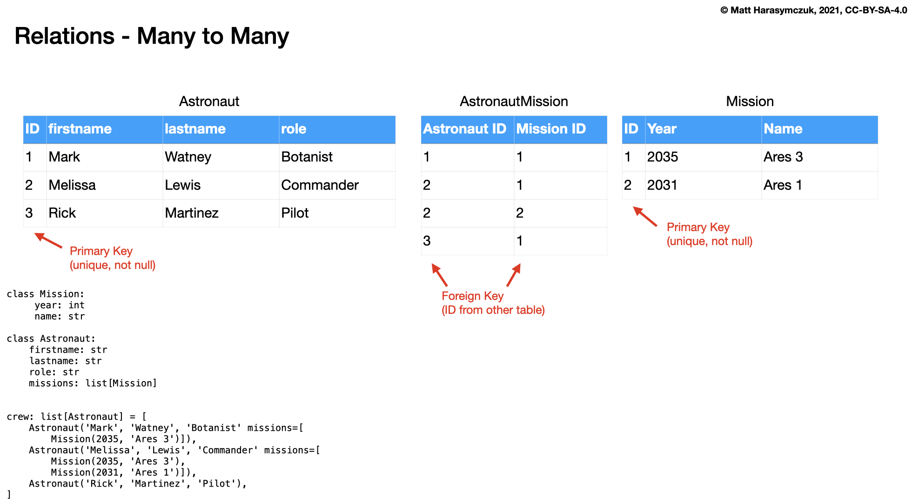

CSV Read/Write
==============

Reader Object
-------------
Read data from CSV file using ``csv.reader()``:

.. code-block:: python

    import csv

    FILE = r'_temporary.csv'
    # sepal_length,sepal_width,petal_length,petal_width,species
    # 5.4,3.9,1.3,0.4,setosa
    # 5.9,3.0,5.1,1.8,virginica
    # 6.0,3.4,4.5,1.6,versicolor

    with open(FILE) as file:
        result = csv.reader(file)

        for line in result:
            print(line)

    # ['sepal_length', 'sepal_width', 'petal_length', 'petal_width', 'species']
    # ['5.4', '3.9', '1.3', '0.4', 'setosa']
    # ['5.9', '3.0', '5.1', '1.8', 'virginica']
    # ['6.0', '3.4', '4.5', '1.6', 'versicolor']

Writer Object
-------------
Writing data to CSV file using ``csv.writer()``:

.. code-block:: python

    import csv

    FILE = r'_temporary.csv'

    DATA = [('Sepal length', 'Sepal width', 'Petal length', 'Petal width', 'Species'),
            (5.8, 2.7, 5.1, 1.9, 'virginica'),
            (5.1, 3.5, 1.4, 0.2, 'setosa'),
            (5.7, 2.8, 4.1, 1.3, 'versicolor')]

    with open(FILE, mode='w') as file:
        result = csv.writer(file)
        result.writerows(DATA)

    # Sepal length,Sepal width,Petal length,Petal width,Species
    # 5.8,2.7,5.1,1.9,virginica
    # 5.1,3.5,1.4,0.2,setosa
    # 5.7,2.8,4.1,1.3,versicolor

DictReader
----------
Read data from CSV file using ``csv.DictReader()``:

.. code-block:: python

    import csv

    FILE = r'_temporary.csv'
    # sepal_length,sepal_width,petal_length,petal_width,species
    # 5.4,3.9,1.3,0.4,setosa
    # 5.9,3.0,5.1,1.8,virginica
    # 6.0,3.4,4.5,1.6,versicolor

    with open(FILE) as file:
        result = csv.DictReader(file)

        for line in result:
            print(line)

    # {'sepal_length': '5.4', 'sepal_width': '3.9', 'petal_length': '1.3', 'petal_width': '0.4', 'species': 'setosa'}
    # {'sepal_length': '5.9', 'sepal_width': '3.0', 'petal_length': '5.1', 'petal_width': '1.8', 'species': 'virginica'}
    # {'sepal_length': '6.0', 'sepal_width': '3.4', 'petal_length': '4.5', 'petal_width': '1.6', 'species': 'versicolor'}

Read data from CSV file using ``csv.DictReader()``:

.. code-block:: python

    import csv

    FILE = r'_temporary.csv'
    # 'sepal_length';'sepal_width';'petal_length';'petal_width';'species'
    # '5,4';'3,9';'1,3';'0,4';'setosa'
    # '5,9';'3,0';'5,1';'1,8';'virginica'
    # '6,0';'3,4';'4,5';'1,6';'versicolor'

    def isnumeric(value):
        try:
            float(value)
            return True
        except ValueError:
            return False

    def clean(line):
        return {key: float(v) if isnumeric(v) else v
                for key, value in line.items()
                if (v := value.replace(',', '.'))}

    with open(FILE) as file:
        result = csv.DictReader(file, delimiter=';', quotechar="'")

        for line in result:
            print(clean(line))

    # {'sepal_length': 5.4, 'sepal_width': 3.9, 'petal_length': 1.3, 'petal_width': 0.4, 'species': 'setosa'}
    # {'sepal_length': 5.9, 'sepal_width': 3.0, 'petal_length': 5.1, 'petal_width': 1.8, 'species': 'virginica'}
    # {'sepal_length': 6.0, 'sepal_width': 3.4, 'petal_length': 4.5, 'petal_width': 1.6, 'species': 'versicolor'}

Read data from CSV file using ``csv.DictReader()``. While giving custom names note, that first line (typically a header) will be treated like normal data. Therefore we skip it using ``header = file.readline()``:

.. code-block:: python

    import csv

    FILE = r'_temporary.csv'
    # sepal_length,sepal_width,petal_length,petal_width,species
    # 5.4,3.9,1.3,0.4,setosa
    # 5.9,3.0,5.1,1.8,virginica
    # 6.0,3.4,4.5,1.6,versicolor

    FIELDNAMES = [
        'Sepal Length',
        'Sepal Width',
        'Petal Length',
        'Petal Width',
        'Species',
    ]

    with open(FILE) as file:
        result = csv.DictReader(file, fieldnames=FIELDNAMES, delimiter=',')
        file.readline()  # skip first line

        for line in result:
            print(line)

    # {'Sepal Length': '5.4', 'Sepal Width': '3.9', 'Petal Length': '1.3', 'Petal Width': '0.4', 'Species': 'setosa'}
    # {'Sepal Length': '5.9', 'Sepal Width': '3.0', 'Petal Length': '5.1', 'Petal Width': '1.8', 'Species': 'virginica'}
    # {'Sepal Length': '6.0', 'Sepal Width': '3.4', 'Petal Length': '4.5', 'Petal Width': '1.6', 'Species': 'versicolor'}

DictWriter
----------
* Remember to add ``mode='w'`` to ``open()`` function
* Default encoding is ``encoding='utf-8'``

.. code-block:: python

    import csv

    FILE = r'_temporary.csv'

    DATA = [{'Sepal Length': 5.4, 'Sepal Width': 3.9, 'Petal Length': 1.3, 'Petal Width': 0.4, 'Species': 'setosa'},
            {'Sepal Length': 5.9, 'Sepal Width': 3.0, 'Petal Length': 5.1, 'Petal Width': 1.8, 'Species': 'virginica'},
            {'Sepal Length': 6.0, 'Sepal Width': 3.4, 'Petal Length': 4.5, 'Petal Width': 1.6, 'Species': 'versicolor'}]

    header = DATA[0].keys()

    with open(FILE, mode='w') as file:
        result = csv.DictWriter(file, fieldnames=header)
        result.writeheader()
        result.writerows(DATA)

    # Sepal Length,Sepal Width,Petal Length,Petal Width,Species
    # 5.4,3.9,1.3,0.4,setosa
    # 5.9,3.0,5.1,1.8,virginica
    # 6.0,3.4,4.5,1.6,versicolor

Write data to CSV file using ``csv.DictWriter()``:

.. code-block:: python

    import csv

    FILE = r'_temporary.csv'

    DATA = [{'sepal_length': 5.4, 'sepal_width': 3.9, 'petal_length': 1.3, 'petal_width': 0.4, 'species': 'setosa'},
            {'sepal_length': 5.9, 'sepal_width': 3.0, 'petal_length': 5.1, 'petal_width': 1.8, 'species': 'virginica'},
            {'sepal_length': 6.0, 'sepal_width': 3.4, 'petal_length': 4.5, 'petal_width': 1.6, 'species': 'versicolor'}]

    FIELDNAMES = ['sepal_length', 'sepal_width', 'petal_length',
                  'petal_width', 'species']

    with open(FILE, mode='w', encoding='utf-8') as file:
        result = csv.DictWriter(
            f=file,
            fieldnames=FIELDNAMES,
            delimiter=',',
            quotechar='"',
            quoting=csv.QUOTE_ALL,
            lineterminator='\n')

        result.writeheader()
        result.writerows(DATA)

    # "sepal_length","sepal_width","petal_length","petal_width","species"
    # "5.4","3.9","1.3","0.4","setosa"
    # "5.9","3.0","5.1","1.8","virginica"
    # "6.0","3.4","4.5","1.6","versicolor"

Parsing Non-CSV Files
---------------------
Parsing ``/etc/passwd`` file with ``csv.DictReader()``:

.. code-block:: python

    import csv

    FILE = r'_temporary.txt'
    # root:x:0:0:root:/root:/bin/bash
    # watney:x:1000:1000:Mark Watney:/home/watney:/bin/bash
    # lewis:x:1001:1001:José Jiménez:/home/lewis:/bin/bash
    # twardowski:x:1002:1002:Jan Twardowski:/home/twardowski:/bin/bash

    with open(FILE) as file:
        result = csv.DictReader(
            file,
            fieldnames=['username', 'password', 'uid', 'gid', 'fullname', 'home', 'shell'],
            delimiter=':',
            lineterminator='\n',
            quoting=csv.QUOTE_NONE)

        for line in result:
            print(line)

    # {'username': 'root', 'password': 'x', 'uid': '0',...}
    # {'username': 'watney', 'password': 'x', 'uid': '1000',...}
    # {'username': 'lewis', 'password': 'x', 'uid': '1001',...}
    # {'username': 'twardowski', 'password': 'x', 'uid': '1002',...}

Parsing Java properties file with ``csv.DictReader()``:

.. code-block:: python

    import csv

    FILE = r'_temporary.properties'
    # sonar.projectKey=habitatOS
    # sonar.projectName=habitatOS
    # sonar.language=py
    # sonar.sourceEncoding=UTF-8
    # sonar.verbose=true

    with open(FILE) as file:
        result = csv.DictReader(
            file,
            fieldnames=['property', 'value'],
            delimiter='=',
            lineterminator='\n',
            quoting=csv.QUOTE_NONE)

        for line in result:
            print(line)

    # {'property': 'sonar.projectKey', 'value': 'habitatOS'}
    # {'property': 'sonar.projectName', 'value': 'habitatOS'}
    # {'property': 'sonar.language', 'value': 'py'}
    # {'property': 'sonar.sourceEncoding', 'value': 'UTF-8'}
    # {'property': 'sonar.verbose', 'value': 'true'}

Use Cases
---------
.. code-block:: python

    import csv

    FILE = r'_temporary.csv'

    total = 0
    count = 0

    with open(FILE) as file:
        data = csv.reader(file)
        next(data)

        for line in data:
            total += float(line[1])
            count += 1

    mean = total / count
    print(mean)

Serialization
-------------
.. figure:: img/csv-relations-flat-attrs.png
.. figure:: img/csv-relations-flat-norel.png

.. figure:: img/csv-relations-ffill-duplicate.png
.. figure:: img/csv-relations-ffill-empty.png
.. figure:: img/csv-relations-ffill-uniqid.png
.. figure:: img/csv-relations-rel-has.png

.. figure:: img/csv-relations-rel-m2o.png
.. figure:: img/csv-relations-serialize-cls.png
.. figure:: img/csv-relations-serialize-clsattr.png
.. figure:: img/csv-relations-serialize-obj.png
.. figure:: img/csv-relations-serialize-objattr.png

Good Practices
--------------
* Always specify:

    * ``delimiter=','`` to  ``csv.DictReader()`` object
    * ``quotechar='"'`` to ``csv.DictReader()`` object
    * ``quoting=csv.QUOTE_ALL`` to ``csv.DictReader()`` object
    * ``lineterminator='\n'`` to ``csv.DictReader()`` object
    * ``encoding='utf-8'`` to ``open()`` function (especially when working with Microsoft Excel)

Assignments
-----------
.. literalinclude:: assignments/serialization_csv_a.py
    :caption: :download:`Solution <assignments/serialization_csv_a.py>`
    :end-before: # Solution

.. literalinclude:: assignments/serialization_csv_b.py
    :caption: :download:`Solution <assignments/serialization_csv_b.py>`
    :end-before: # Solution

.. literalinclude:: assignments/serialization_csv_c.py
    :caption: :download:`Solution <assignments/serialization_csv_c.py>`
    :end-before: # Solution

.. literalinclude:: assignments/serialization_csv_d.py
    :caption: :download:`Solution <assignments/serialization_csv_d.py>`
    :end-before: # Solution

.. literalinclude:: assignments/serialization_csv_e.py
    :caption: :download:`Solution <assignments/serialization_csv_e.py>`
    :end-before: # Solution
