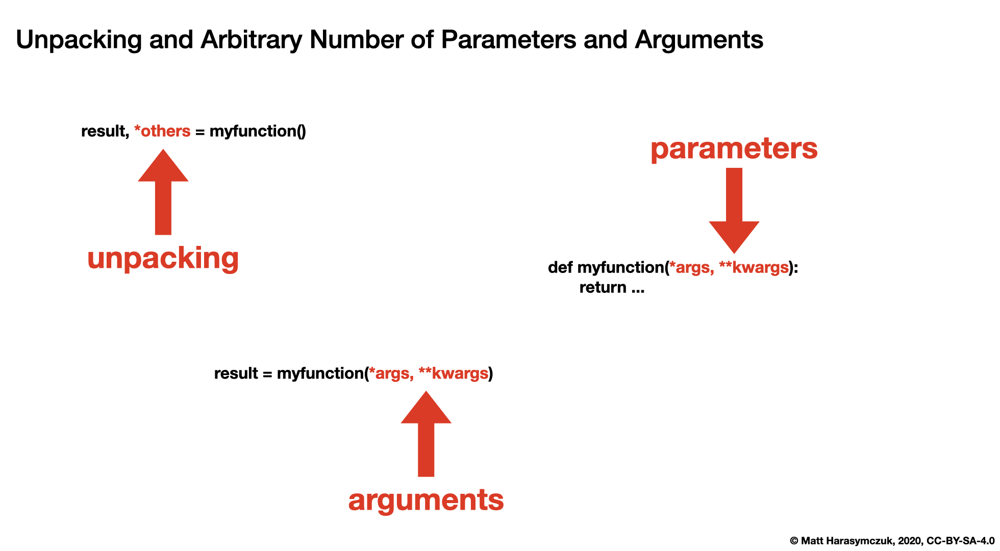

Unpacking Assignment
====================

Recap
-----
.. code-block:: python

    a = 1
    a, b = 1, 2
    a, b, c = 1, 2, 3
    a, b, c = (1, 2, 3)
    a, b, c = [1, 2, 3]
    a, b, c = {1, 2, 3}

.. code-block:: python

    (a, b, c) = (1, 2, 3)
    (a, b, c) = [1, 2, 3]
    [a, b, c] = [1, 2, 3]
    [a, b, c] = (1, 2, 3)

Rationale
---------
* Unpacking and Arbitrary Number of Parameters and Arguments

Errors
------
Note, that ``set`` is unordered collection:

.. code-block:: python

    {a, b, c} = {1, 2, 3}
    # Traceback (most recent call last):
    # SyntaxError: can't assign to literal

Too many values to unpack:

.. code-block:: python

    a, b, c = [1, 2, 3, 4]
    # Traceback (most recent call last):
    # ValueError: too many values to unpack (expected 3)

Not enough values to unpack:

.. code-block:: python

    a, b, c, d = [1, 2, 3]
    # Traceback (most recent call last):
    # ValueError: not enough values to unpack (expected 4, got 3)

Arbitrary Number of Arguments
-----------------------------
Unpacking values at the right side:

.. code-block:: python

    a, b, *c = [1, 2, 3, 4]

    a               # 1
    b               # 2
    c               # [3, 4]

Unpacking values at the left side:

.. code-block:: python

    *a, b, c = [1, 2, 3, 4]

    a               # [1, 2]
    b               # 3
    c               # 4

Unpacking values from both sides at once:

.. code-block:: python

    a, *b, c = [1, 2, 3, 4]

    a               # 1
    b               # [2, 3]
    c               # 4

Unpacking from variable length:

.. code-block:: python

    a, *b, c = [1, 2]

    a               # 1
    b               # []
    c               # 2

Cannot unpack from both sides at once:

.. code-block:: python

    *a, b, *c = [1, 2, 3, 4]
    # Traceback (most recent call last):
    # SyntaxError: two starred expressions in assignment

Unpacking requires values for required arguments:

.. code-block:: python

    a, *b, c = [1]
    # Traceback (most recent call last):
    # ValueError: not enough values to unpack (expected at least 2, got 1)

Nested
------
.. code-block:: python

    a, (b, c) = [1, (2, 3)]

    a               # 1
    b               # 2
    c               # 3

Convention
----------
.. code-block:: python

    first, *middle, last = [1, 2, 3, 4]

    first           # 1
    middle          # [2, 3]
    last            # 4

.. code-block:: python

    first, second, *others = [1, 2, 3, 4]

    first               # 1
    second              # 2
    others              # [3, 4]

Skipping Values
---------------
* ``_`` is regular variable name, not a special Python syntax
* ``_`` by convention is used for data we don't want to access in future

.. code-block:: python

    _ = 'Jan Twardowski'

    print(_)
    # Jan Twardowski

.. code-block:: python

    line = 'Jan,Twardowski,44'

    firstname, lastname, _ = line.split(',')

    print(firstname)        # Jan
    print(lastname)         # Twardowski

.. code-block:: python

    a, _, c = 1, 2, 3

    print(a)                # 1
    print(c)                # 3

.. code-block:: python

    _, b, _ = 1, 2, 3

    print(b)                # 2

.. code-block:: python

    line = '4.9,3.1,1.5,0.1,setosa'

    *_, label = line.split(',')

    label                   # setosa

.. code-block:: python

    line = 'twardowski:x:1001:1001:Jan Twardowski:/home/twardowski:/bin/bash'

    username, _, _, _, fullname, *_ = line.split(':')

    username                # twardowski
    fullname               # Jan Twardowski

.. code-block:: python

    line = 'twardowski:x:1001:1001:Jan Twardowski:/home/twardowski:/bin/bash'

    username, *_, home, _ = line.split(':')

    username                # twardowski
    home                    # /home/twardowski

.. code-block:: python

    _, (interesting, _) = [1, (2, 3)]

    interesting             # 2

Examples
--------
.. code-block:: python

    import sys

    sys.version_info
    # sys.version_info(major=3, minor=9, micro=5, releaselevel='final', serial=0)

    major, minor, *_ = sys.version_info
    print(major, minor)
    # 3.9

.. code-block:: python

    *features, label = (5.8, 2.7, 5.1, 1.9, 'virginica')

    features                # [5.8, 2.7, 5.1, 1.9]
    label                   # 'virginica'

.. code-block:: python

    *features, label = (5.8, 2.7, 5.1, 1.9, 'virginica')
    avg = sum(features) / len(features)

    print(label, avg)
    # virginica 3.875

.. code-block:: python

    line = 'ares3,watney,lewis,vogel,johanssen'
    mission, *crew = line.split(',')

    mission                 # ares3
    crew                    # ['watney', 'lewis', 'vogel', 'johanssen']

.. code-block:: python

    def parse(line):
        mission, *crew = line.split(',')
        crew = ' and '.join(name.title() for name in crew)
        print(mission.upper(), crew)

    parse('ares3,watney,lewis,vogel,johanssen')
    # ARES3 Watney and Lewis and Vogel and Johanssen

    parse('apollo18,twardowski,ivanovic')
    # APOLLO18 Twardowski and Ivanovic

.. code-block:: python

    first, second, *others = range(10)

    first                   # 0
    second                  # 1
    others                  # [2, 3, 4, 5, 6, 7, 8, 9]

Using in a Loop
---------------
.. code-block:: python

    *features, label = (5.8, 2.7, 5.1, 1.9, 'virginica')

    features                # [5.8, 2.7, 5.1, 1.9]
    label                   # 'virginica'

.. code-block:: python

    DATA = [(5.8, 2.7, 5.1, 1.9, 'virginica'),
            (5.1, 3.5, 1.4, 0.2, 'setosa'),
            (5.7, 2.8, 4.1, 1.3, 'versicolor')]

    for *features, label in DATA:
        avg = sum(features) / len(features)
        print(label, avg)

    # virginica 3.875
    # setosa 2.55
    # versicolor 3.475

.. code-block:: python

    DATA = [(5.8, 2.7, 5.1, 1.9, 'virginica'),
            (5.1, 3.5, 1.4, 0.2, 'setosa'),
            (5.7, 2.8, 4.1, 1.3, 'versicolor')]

    for *_, label in DATA:
        print(label)

    # virginica
    # setosa
    # versicolor

Assignments
-----------
.. literalinclude:: assignments/unpacking_assignment_nested.py
    :caption: :download:`Solution <assignments/unpacking_assignment_nested.py>`
    :end-before: # Solution

.. literalinclude:: assignments/unpacking_assignment_flat.py
    :caption: :download:`Solution <assignments/unpacking_assignment_flat.py>`
    :end-before: # Solution

.. literalinclude:: assignments/unpacking_assignment_loop.py
    :caption: :download:`Solution <assignments/unpacking_assignment_loop.py>`
    :end-before: # Solution
